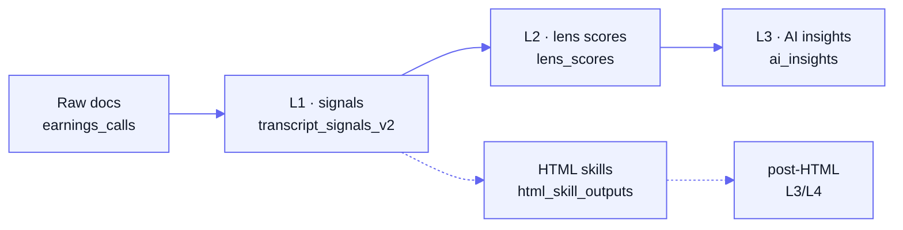

# QuantCase Backend


[](./docs/README.md)

QuantCase is a Node.js API that turns Indian-market earnings calls, investor presentations,
and annual reports into structured intelligence. It runs a multi-layer LLM pipeline
(signal extraction → lens scoring → narrative insights) and serves screener, portfolio,
journal, billing, and broker-integration APIs.

**Stack:** Express · BullMQ + Redis · PostgreSQL via Prisma · LLMs via OpenRouter (default)
and Google Vertex AI / Gemini (opt-in for L1).

> [!NOTE]
> **Full documentation lives in [`docs/`](./docs/).** Start with the
> [documentation index](./docs/README.md), the [architecture overview](./docs/architecture.md),
> or the [local setup guide](./docs/setup.md). Not sure a flow is documented? Check the
> [coverage matrix](./docs/coverage.md).

## Architecture at a glance

The system runs as **four long-running processes** (all defined in
[`ecosystem.config.js`](./ecosystem.config.js)):

| Process | Entry point | Role |
|---------|-------------|------|
| API server | [`server.js`](./server.js) | Express HTTP API (port 8000); enqueues jobs. |
| Worker | [`worker.js`](./worker.js) | BullMQ workers that run the LLM pipeline. |
| Scheduler | [`scheduler.js`](./scheduler.js) | DB-driven cron dispatch (internal, port 8001). |
| Bull Board | [`lib/admin.js`](./lib/admin.js) | Queue-monitoring dashboard (port 9000). |

See [docs/architecture.md](./docs/architecture.md) for the request/enqueue/worker flow.

## The three-layer pipeline

Documents are enriched through progressive layers, each cached on a content hash so
unchanged inputs skip repeat LLM calls:



| Layer | Output table | What it produces |
|-------|--------------|------------------|
| Raw | `earnings_calls` | Ingested transcripts / PPTs / annual reports. |
| **L1** | `transcript_signals_v2` | Structured signals (metric, impact, severity, statement) per document. |
| **L2** | `lens_scores` | Aggregated per-lens z-scores per ticker for cross-company comparison. |
| **L3** | `ai_insights` | Narrative insights by type (`management`, `opportunity`, `deal`, …). |

Live coverage is available at `GET /api/monitoring/pipeline/coverage`. Full details,
including the HTML-skills / post-HTML branch and admin bulk dispatch, are in
[docs/pipeline.md](./docs/pipeline.md).

## Quick start

Prerequisites: Node.js (via nvm), PostgreSQL, and Redis. There is no `.env.example` yet —
see [docs/configuration.md](./docs/configuration.md) for every variable.

```bash
npm install
npm run db:generate        # generate the Prisma client
npm run db:push            # sync schema to PostgreSQL
# create a .env (DATABASE_URL, DIRECT_DATABASE_URL, REDIS_*, OPENROUTER_API_KEY, …)

# run the processes (separate terminals, or via PM2 in production)
npm run dev                # API server  → http://localhost:8000  (health: GET /health)
npm run worker             # BullMQ worker
npm run scheduler          # cron scheduler (127.0.0.1:8001)
npm run admin              # Bull Board   → http://localhost:9000
```

The full step-by-step is in [docs/setup.md](./docs/setup.md); production deployment
(PM2 + nginx + Certbot on GCP) is in [docs/deployment.md](./docs/deployment.md).

## Documentation map

- **Core:** [architecture](./docs/architecture.md) ·
  [pipeline](./docs/pipeline.md) ·
  [LLM integration](./docs/llm-integration.md) ·
  [data model](./docs/data-model.md) ·
  [API reference](./docs/api-reference.md) ·
  [coverage matrix](./docs/coverage.md)
- **Operate:** [setup](./docs/setup.md) ·
  [configuration](./docs/configuration.md) ·
  [deployment](./docs/deployment.md) ·
  [runbooks](./docs/runbooks/)
- **Subsystems:** [auth & invites](./docs/subsystems/auth-invites-google.md) ·
  [smallcase](./docs/subsystems/smallcase-gateway.md) ·
  [journal](./docs/subsystems/unified-journal.md) ·
  [investor dashboard](./docs/subsystems/investor-dashboard.md) ·
  [billing](./docs/subsystems/billing-razorpay.md) ·
  [screener & KPIs](./docs/subsystems/screener-kpi-registry.md) ·
  [technicals & Wyckoff](./docs/subsystems/technicals-wyckoff.md) ·
  [industry intelligence](./docs/subsystems/industry-intelligence.md) ·
  [mutual funds](./docs/subsystems/mutual-funds.md) ·
  [private equity / DRHP](./docs/subsystems/private-equity-drhp.md) ·
  [Prowess](./docs/subsystems/prowess-ingestion.md) ·
  [BSE discovery](./docs/subsystems/bse-discovery.md) ·
  [scheduler](./docs/subsystems/scheduler.md) ·
  [monitoring](./docs/subsystems/monitoring.md) ·
  [error reporting](./docs/subsystems/error-reporting.md) ·
  [WealthOS](./docs/subsystems/wealthos.md)
- **Frontend integration:** [docs/frontend/](./docs/frontend/)

## Repository layout

| Path | Contents |
|------|----------|
| `server.js`, `worker.js`, `scheduler.js` | Process entry points. |
| `routes/`, `controllers/`, `middleware/` | HTTP layer (routers, handlers, auth/validation). |
| `services/` | Business logic (pipeline dispatch, journal, prowess, wealthos, dashboard, …). |
| `workers/` | BullMQ processors — the L1/L2/L3 pipeline + HTML skills + WealthOS. |
| `lib/`, `utils/` | Cross-cutting helpers (`jobQueue`, `mailer`, `smallcaseGateway`, `workerUtils`, …). |
| `config/` | `env`, `prisma`, `redis`, `auth`, `llm`, `vertexLlm`. |
| `prisma/` | `schema.prisma` (~92 models) + seed scripts. |
| `prompts/`, `outputSchemas/` | LLM prompt builders and structured-output JSON schemas. |
| `scripts/` | Seeders, backfills, ingestion, and one-off tooling. |
| `docs/` | Project documentation (this map). |
| `extras/` | Non-doc artifacts: data dumps, exports, bulk OHLCV CSVs, archived scripts. |
