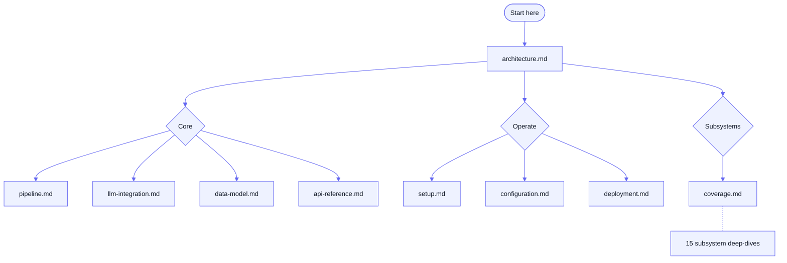

# QuantCase Backend — Documentation

This folder is the documentation hub for the QuantCase backend — a Node.js/Express +
BullMQ/Redis + PostgreSQL (Prisma) service that ingests Indian-market earnings calls,
PPTs, and annual reports, runs a multi-layer LLM extraction → scoring → synthesis pipeline,
and serves screener, portfolio, journal, billing, and broker-integration APIs.

> [!TIP]
> New here? Read [architecture.md](./architecture.md), then [setup.md](./setup.md). Want to know
> whether a given flow is documented? See the [coverage matrix](./coverage.md).

## Documentation map

## Core docs

| Doc | What it covers |
|-----|----------------|
| [architecture.md](./architecture.md) | System overview: the 4-process topology (API, worker, scheduler, Bull Board), request lifecycle, job queue, graceful shutdown. |
| [pipeline.md](./pipeline.md) | The L1 → L2 → L3 enrichment pipeline (signal extraction → lens scoring → AI insights) plus the HTML-skills / post-HTML branch and admin bulk dispatch. |
| [llm-integration.md](./llm-integration.md) | The `llmStream` choke point, OpenRouter-vs-Vertex/Gemini routing, PDF handling, and DB-backed per-skill config. |
| [data-model.md](./data-model.md) | The Prisma schema by domain (~92 models), pipeline table lineage, enums, and deprecated tables. |
| [api-reference.md](./api-reference.md) | Full HTTP endpoint map grouped by feature area, with auth requirements. |
| [coverage.md](./coverage.md) | **Living subsystem → code → doc matrix** — the answer to "is everything documented?" |
| [setup.md](./setup.md) | Local development setup: prerequisites, `.env`, Redis, Prisma, seeds, and running all 4 processes. |
| [configuration.md](./configuration.md) | Environment-variable reference grouped by concern, with defaults, security notes, and file-upload limits. |
| [deployment.md](./deployment.md) | Bare-metal GCP deployment via PM2 + nginx + Certbot; links the ops runbooks. |

## Subsystems

Feature deep-dives in [subsystems/](./subsystems/):

| Doc | Subsystem |
|-----|-----------|
| [auth-invites-google.md](./subsystems/auth-invites-google.md) | JWT auth, invite-only registration, Google Sign-In. |
| [smallcase-gateway.md](./subsystems/smallcase-gateway.md) | smallcase broker integration (connect, holdings, orders, webhooks). |
| [unified-journal.md](./subsystems/unified-journal.md) | The unified `/api/journal` (watchlist + notes + thesis + AI health). |
| [investor-dashboard.md](./subsystems/investor-dashboard.md) | Investor dashboard (discover / research-library / market) + user & shadow portfolio. |
| [billing-razorpay.md](./subsystems/billing-razorpay.md) | Products, plans, subscriptions, coupons, and Razorpay webhooks. |
| [screener-kpi-registry.md](./subsystems/screener-kpi-registry.md) | Screener endpoints, baskets, tickers/models, and the KPI / formula registry. |
| [technicals-wyckoff.md](./subsystems/technicals-wyckoff.md) | The technicals / Wyckoff / decision-intelligence backend stack. |
| [industry-intelligence.md](./subsystems/industry-intelligence.md) | The Industry Intelligence Tracker (IIT) weekly scoring & ranking engine. |
| [mutual-funds.md](./subsystems/mutual-funds.md) | Mutual-fund scheme listing/search and MF-basket screening. |
| [private-equity-drhp.md](./subsystems/private-equity-drhp.md) | The DRHP analyser (PDF upload → section-by-section LLM analysis). |
| [prowess-ingestion.md](./subsystems/prowess-ingestion.md) | Prowess (CMIE) batch API + bulk OHLCV CSV ingestion. |
| [bse-discovery.md](./subsystems/bse-discovery.md) | Crawling BSE for transcript/PPT/annual-report document URLs. |
| [scheduler.md](./subsystems/scheduler.md) | The DB-driven cron scheduler process and its handlers. |
| [monitoring.md](./subsystems/monitoring.md) | The `/api/monitoring` operational API (queue stats, coverage, failures). |
| [error-reporting.md](./subsystems/error-reporting.md) | The "Report Error" submit + admin-triage flow. |
| [wealthos.md](./subsystems/wealthos.md) | The WealthOS relationship-manager / advisory module. |

## Existing reference material

- **Frontend integration guides** — [frontend/](./frontend/): Technicals, Wyckoff,
  Technicals Management, Journal, Error Reporting, Razorpay, smallcase, and the WealthOS API.
- **Admin guides** — [admin-guides/](./admin-guides/): company groups, HTML incremental
  skills, L1-multi pipeline dispatch.
- **Specs & design** — [specs/](./specs/): journal backend spec, WealthOS PRD, technicals
  guide, deal-lenses UI fixes.
- **Runbooks** — [runbooks/](./runbooks/): [JOB_QUEUE_GUIDE.md](./runbooks/JOB_QUEUE_GUIDE.md),
  [deploy-qc-gcp.md](./runbooks/deploy-qc-gcp.md), [scheduler-monitoring.md](./runbooks/scheduler-monitoring.md).
- **Assets** — [assets/](./assets/): the three-layer architecture diagram.

> [!NOTE]
> Non-documentation artifacts (data dumps, exports, one-off scripts, raw logs, archived
> prompt text, and the bulk OHLCV CSVs) live in [`../extras/`](../extras/), not here.
