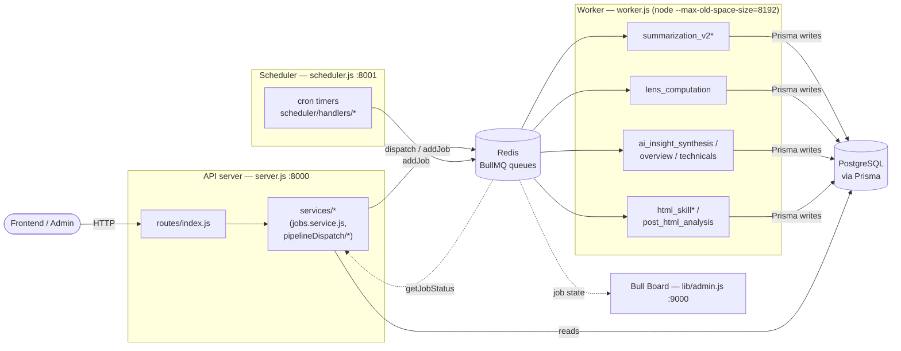
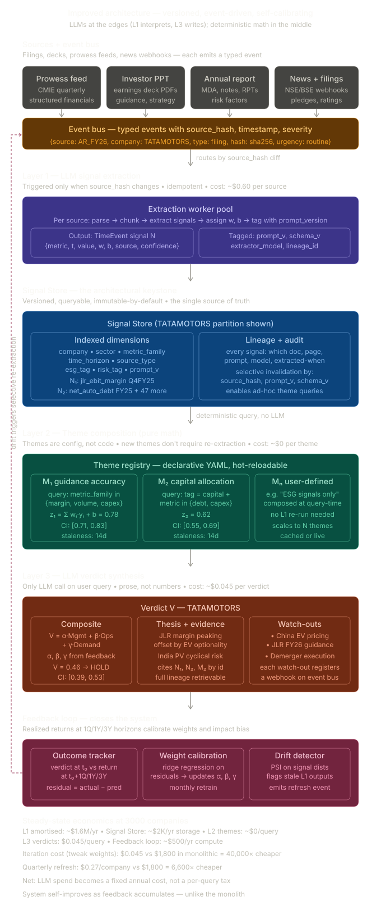
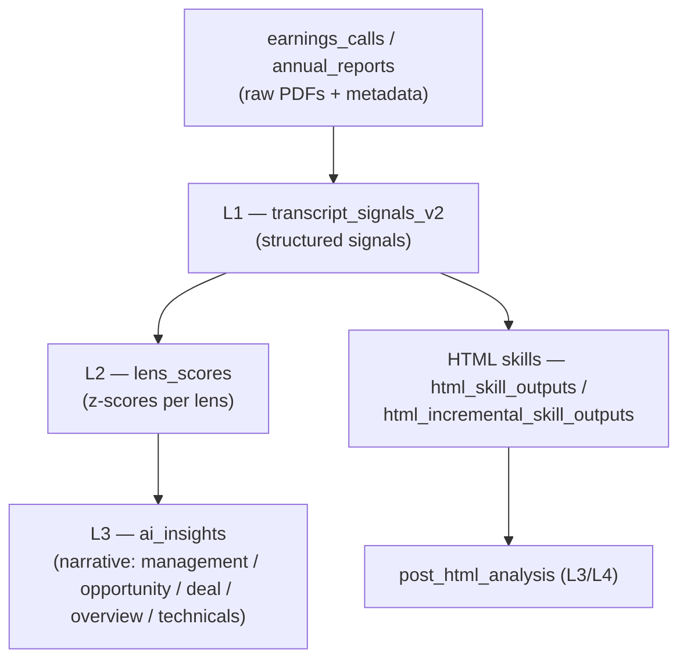

# Architecture

QuantCase Backend is a Node.js system that turns raw earnings-call documents (transcripts, investor PPTs, annual reports) into structured, layered intelligence using LLMs. It runs as **four independent long-running processes** that share one PostgreSQL database and one Redis instance; heavy LLM work is pushed onto BullMQ queues so HTTP requests stay fast.

## Process topology

All four processes are declared in [`ecosystem.config.js`](../ecosystem.config.js) (PM2) and each installs `uncaughtException` / `unhandledRejection` handlers plus a graceful `SIGTERM` / `SIGINT` shutdown that closes queues, Redis, and Prisma before exiting.

| Process | Entry file | Port | Role |
|---------|-----------|------|------|
| **API server** | [`server.js`](../server.js) | `8000` (`PORT`) | Express HTTP API. Validates requests, serves reads, and **enqueues** jobs. Never runs an LLM call itself. |
| **Worker** | [`worker.js`](../worker.js) | — | BullMQ consumer. `require()`s every worker module; runs under `node --max-old-space-size=8192` because `pdf-lib` expands PDFs 3–5× in heap. |
| **Scheduler** | [`scheduler.js`](../scheduler.js) | `8001` (`SCHEDULER_PORT`, bound to `127.0.0.1`) | Cron-style timers that fire scheduled work (BSE discovery, Prowess ingestion, bulk pipeline dispatch). Exposes a small **unauthenticated** internal HTTP API (`/reload`, `/trigger/:slug`, `/status`) for the admin API to poke. |
| **Bull Board** | [`lib/admin.js`](../lib/admin.js) | `9000` (`ADMIN_PORT`) | Read/ops dashboard over the BullMQ queues (`@bull-board/express`). |

Because the queue and DB are the only coupling, the worker (and scheduler) can run on a different host from the API server — set `SCHEDULER_BIND_HOST` / network rules accordingly. See [deployment.md](./deployment.md).

## Request → enqueue → worker flow

1. **HTTP in.** [`server.js`](../server.js) wires `cors`, a JSON body parser, static `/uploads`, then mounts [`routes/index.js`](../routes/index.js), a `notFound` handler, and an `errorHandler`.
   - **Raw-body carve-out:** requests to `WEBHOOK_PATHS = ['/api/billing/webhook', '/api/smallcase/webhook']` skip `express.json()` so the raw bytes survive for HMAC/checksum verification (those routes attach `express.raw()` themselves).
   - On boot the server calls `prisma.$connect()` and `warmRegistryCache()` (pre-warms the screener's KPI-formula cache — non-fatal if it fails).
2. **Controller → service.** A controller delegates to a service such as [`services/jobs.service.js`](../services/jobs.service.js) or the bulk [`services/pipelineDispatch/`](../services/pipelineDispatch) modules.
3. **Enqueue.** The service calls `jobQueue.addJob(queueName, jobData, opts)` on the [`lib/jobQueue.js`](../lib/jobQueue.js) singleton. For document pipelines the service first **splits the source PDF into page-range chunks** and enqueues one job per chunk (see [pipeline.md](./pipeline.md)).
4. **Consume.** A BullMQ `Worker` in the worker process picks the job up, runs the (usually LLM-backed) work, and writes results to Postgres via Prisma.
5. **Status.** The frontend polls back through `GET /api/jobs/:jobId`, which reads job state **straight from BullMQ** (`jobQueue.getJobStatus`).

## Job queue: Redis-only

[`lib/jobQueue.js`](../lib/jobQueue.js) is a singleton that wraps a set of BullMQ `Queue`s over **one shared `ioredis` connection**. Its own docstring is explicit: queues are *"backed only by Redis (no Postgres Job table)."*

- `addJob(queueName, jobData, opts)` — the BullMQ *job name* is taken from `jobData.type`; the payload is `jobData`.
- `getJobStatus(queueName, jobId)` — returns BullMQ state (`waiting`/`active`/`completed`/`failed`/…), progress, `returnvalue`, `failedReason`.
- `defaultJobOptions`: `attempts: 1` (no automatic retries), keep completed **7 days / 25 000**, keep failed **7 days**. (The inline "24 hours" comment is stale — the value is `7 * 24 * 3600`.)
- Workers import the **same** connection from [`config/redis.js`](../config/redis.js).

**Where does status live, then?** L1 (`summarization_v2*`) and L2 (`lens_computation`) and the HTML-skill workers keep *all* state in BullMQ. Only the **synthesis** workers additionally mirror status into the Postgres `jobs` table (Prisma model `Job`, keyed by `bullmqId`): `ai_insight_synthesis`, `overview_synthesis`, `technicals_analysis`, and `post_html_analysis`. Terminal failures for the L1 chunk workers are recorded separately in `pipeline_job_failures` (`PipelineJobFailure`) for retry tooling. Full operational detail: [runbooks/JOB_QUEUE_GUIDE.md](./runbooks/JOB_QUEUE_GUIDE.md).

## Workers wired into `worker.js`

`worker.js` `require()`s each worker module; importing the module registers its BullMQ `Worker`. The queue name (BullMQ queue) maps 1:1 to a worker, except `htmlSkill.js` which registers **two** (`html_skill` + `html_skill_preview`).

| Queue | Worker module | Layer / purpose |
|-------|---------------|-----------------|
| `summarization_v2` | [`workers/summarization_v2.js`](../workers/summarization_v2.js) | L1 signal extraction — transcript |
| `summarization_v2_ppt` | [`workers/summarization_v2_ppt.js`](../workers/summarization_v2_ppt.js) | L1 — investor PPT |
| `summarization_v2_annual_report` | [`workers/summarization_v2_annual_report.js`](../workers/summarization_v2_annual_report.js) | L1 — annual report |
| `lens_computation` | [`workers/lensComputation.js`](../workers/lensComputation.js) | L2 lens scoring |
| `ai_insight_synthesis` | [`workers/aiInsightSynthesis.js`](../workers/aiInsightSynthesis.js) | L3 narrative insights |
| `overview_synthesis` | [`workers/overviewSynthesis.js`](../workers/overviewSynthesis.js) | L3 sibling — company overview |
| `technicals_analysis` | [`workers/technicals.js`](../workers/technicals.js) | L3 sibling — technical decision intelligence |
| `html_skill` / `html_skill_preview` | [`workers/htmlSkill.js`](../workers/htmlSkill.js) | HTML-report skills (alternate pipeline) |
| `html_skill_incremental` | [`workers/htmlIncrementalSkill.js`](../workers/htmlIncrementalSkill.js) | Per-call incremental HTML skills |
| `post_html_analysis` | [`workers/postHtmlAnalysis.js`](../workers/postHtmlAnalysis.js) | L3/L4 synthesis over HTML outputs |
| `wealthos_suggestion` | [`workers/wealthos.suggestion.js`](../workers/wealthos.suggestion.js) | WealthOS advisory suggestions |
| `wealthos_message` | [`workers/wealthos.message.js`](../workers/wealthos.message.js) | WealthOS message generation |

> `workers/fundamentalsIntelligence.js` (queue `fundamentals_analysis`) exists but is **not** required by `worker.js`, so it does not run.

## LLM access is a single choke point

No worker talks to an LLM provider directly. They all call `llmStream(params, opts)` from [`utils/workerUtils.js`](../utils/workerUtils.js), which always streams `chat.completions` and returns `{ text, usage }`. Routing is:

- **Default → OpenRouter** ([`config/llm.js`](../config/llm.js), OpenAI SDK pointed at `openrouter.ai`, routed Anthropic-native for PDF support).
- **Vertex/Gemini** ([`config/vertexLlm.js`](../config/vertexLlm.js)) only when the caller passes `{ vertex: true }` **and** the model is Gemini **and** `VERTEX_GEMINI_ENABLED=true` (+ `GCP_PROJECT_ID`). Only the three L1 summarization workers opt in.

Per-skill model / token / prompt / schema come from the DB at runtime via `loadSkillConfig(slug)` ([`utils/skillConfig.js`](../utils/skillConfig.js), backed by the `skills` table and [`lib/skillsRegistry.js`](../lib/skillsRegistry.js)). Full detail: [llm-integration.md](./llm-integration.md).

## Data flow at a glance

The models behind each stage are documented in [data-model.md](./data-model.md); the processing logic in [pipeline.md](./pipeline.md).

## See also

- [pipeline.md](./pipeline.md) — the L1 → L2 → L3 processing pipeline in depth
- [llm-integration.md](./llm-integration.md) — `llmStream`, OpenRouter vs Vertex routing, per-skill config
- [data-model.md](./data-model.md) — Prisma models for each pipeline stage
- [api-reference.md](./api-reference.md) — HTTP endpoints and job-status polling
- [deployment.md](./deployment.md) — PM2 process layout and host topology
- [configuration.md](./configuration.md) — environment variables
- [subsystems/scheduler.md](./subsystems/scheduler.md) — the scheduler process and its handlers
- [runbooks/JOB_QUEUE_GUIDE.md](./runbooks/JOB_QUEUE_GUIDE.md) — queue operations and failure recovery
