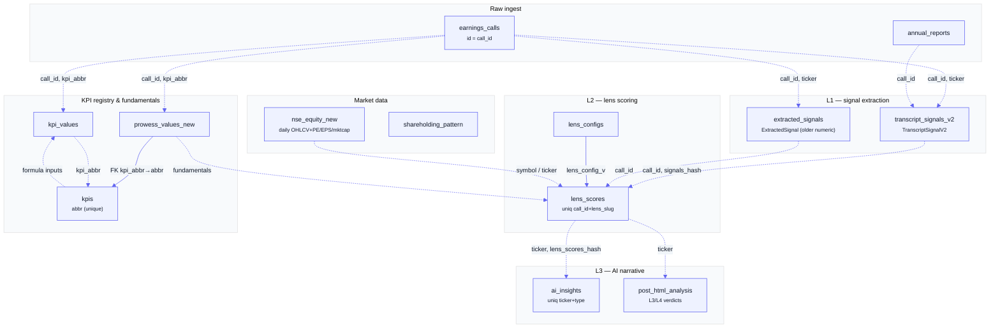

[Docs](./README.md) · Data Model

# Data Model

Reference for every table QuantCase Backend persists in PostgreSQL. The schema is defined in [`../prisma/schema.prisma`](../prisma/schema.prisma) (~2,300 lines) and accessed through the Prisma client. Tables are grouped by **domain** below; a lineage diagram and the full enum catalogue follow.

<b>Contents</b>

- [Conventions](#conventions)
- [Pipeline table lineage](#pipeline-table-lineage)
- [Core Pipeline](#core-pipeline)
- [KPI & Prowess](#kpi--prowess)
- [Signals & Lenses](#signals--lenses)
- [Skills & Plugins](#skills--plugins)
- [Market Data](#market-data)
- [Industry Intelligence (IIT)](#industry-intelligence-iit)
- [WealthOS](#wealthos)
- [User & Auth](#user--auth)
- [Portfolio](#portfolio)
- [Unified Journal](#unified-journal)
- [Billing](#billing)
- [Error Reporting](#error-reporting)
- [Smallcase](#smallcase)
- [BSE Discovery](#bse-discovery)
- [Scheduler](#scheduler)
- [Curated Screens](#curated-screens)
- [Deprecated tables (retained, no active callers)](#deprecated-tables-retained-no-active-callers)
- [Enum catalogue](#enum-catalogue)

## Conventions

- **Datasource** — `postgresql`, `url = env("DATABASE_URL")` for the pooled runtime connection and `directUrl = env("DIRECT_DATABASE_URL")` for migrations / long-running index builds. Generator is `prisma-client-js`.
- **Model name vs. table name** — Prisma model names are `PascalCase`; the physical table is whatever `@@map(...)` says (e.g. model `Job` → table `jobs`, model `User` → table `qc_users`). Models with **no** `@@map` use the model name verbatim as the table name (e.g. `earnings_calls`, `nse_equity_new`, `shareholding_pattern`, `nse_index`, `nse_equity`).
- **`qc_` prefix** — the current application-owned tables (users, portfolios, journals, billing, smallcase, screens, error reports) are namespaced `qc_*`. Legacy / raw-data / pipeline tables are not.
- **Cross-layer joins are by string keys, not foreign keys.** The pipeline tables (`earnings_calls` → `transcript_signals_v2` → `lens_scores` → `ai_insights`) and the KPI/company tables are stitched together on plain string columns — `call_id`, `ticker`, `lineage_id`, `source_hash`, `kpi_abbr`, `company_group_slug`, `kpi_group_slug` — that carry **no** Prisma relation / DB constraint. This is deliberate (tables are written by independent workers and processes, sometimes cross-process), so referential integrity is enforced in application code, not the database. Real `@relation` foreign keys exist only *inside* a domain (e.g. `User` ↔ its portfolios/subscriptions, `HtmlSkill` ↔ `HtmlSkillOutput`, `WealthClient` ↔ its children).
- **Row-Level Security (RLS)** — `earnings_calls`, `earnings_calls_1/2/test`, `kv_store_abda8bef`, and `users` (the legacy `BigInt`-id table) carry the Prisma RLS docblock and require extra setup for migrations.

## Pipeline table lineage

The three-layer pipeline (raw → L1 → L2 → L3) plus the KPI registry and market-data feeds. Dashed edges are **string-key joins** (no FK); solid edges are real foreign keys.

> [!NOTE]
> **L1 tables.** `transcript_signals_v2` (`TranscriptSignalV2`) is the **current** L1 output — the JSON-rich signal store written by the `summarization_v2*` workers and read by L2/L3 and the HTML skills. `extracted_signals` (`ExtractedSignal`) is the **older** numeric-signal L1 model; it still exists and is what `GET /api/signals` reads to resolve a ticker's latest `call_id`.

---

## Core Pipeline

| Model | Table | Purpose |
|---|---|---|
| `earnings_calls` | `earnings_calls` | Raw ingested earnings calls — transcript, PPT, and quarterly-result text/URLs. Unique on `(company, fiscal_year, quarter)`. `id` is the `call_id` every downstream table joins on. RLS. |
| `annual_reports` | `annual_reports` | Annual-report PDFs queued for L1 extraction (`BigInt` autoincrement id, `annual_report_url`). |
| `Job` | `jobs` | Generic background-job record mirroring a BullMQ job (`bullmq_id` unique). Tracks `status` (pending/processing/completed/failed), `result` JSON, `llm_response`, `prompt`, `error`. |
| `PipelineJobFailure` | `pipeline_job_failures` | Post-mortem row for a failed pipeline chunk — `queue`, `bullmq_job_id`, `call_id`, `source_doc_type`, `chunk_index`/`total_chunks`, `lineage_id`, `error_message`, `attempts_made`. |

## KPI & Prowess

| Model | Table | Purpose |
|---|---|---|
| `Kpi` | `kpis` | Metric registry. `abbr` (unique) is the canonical key; `formula_expression` (nullable) makes a row a computed metric evaluated by `utils/formulaRegistry`, otherwise it is a raw leaf. `frequency` (annual/quarterly/daily), `fallback_abbrs[]`, `prowess_name`, `registry_enabled`, `unit_label`, `display_order`. |
| `KpiRelationship` | `kpi_relationships` | Free-string typed relationships between KPIs (and optionally a company group). Legacy — no `relationship_type` is read by any consumer today; rows kept for reference. |
| `KpiGroup` | `kpi_groups` | Admin-editable **display hierarchy** tree (`parent_id` self-relation). A node is a container (`kpi_abbr` null) or a leaf pointing at one `Kpi.abbr`. Optional `company_group_slug` scoping. |
| `KpiFilter` | `kpi_filters` | One reusable threshold condition on a KPI's resolved value (`operator`, `value`, `value_max` for `between`, optional `frequency`). |
| `CompanyGroupFilter` | `company_group_filters` | Attaches a `KpiFilter` (FK) to a `company_group_slug`; all filters on a group are AND-combined at recompute. |
| `CompanyGroupMember` | `company_group_members` | Materialized membership cache for `kpi_filter`-type company groups (`company_group_slug` + `symbol`, unique). |
| `SubstituteKpi` | `substitute_kpis` | Ordered substitute abbrs to try when a primary KPI resolves null (`primary_kpi_abbr` unique). |
| `KpiValue` | `kpi_values` | Per-call resolved KPI value. Unique on `(call_id, kpi_abbr)`. Carries `value`/`raw_value`/`unit`/`multiplier`, `source` (transcript/QE), `period_type`, `start_date`/`end_date`. |
| `ProwessValueNew` | `prowess_values_new` | Prowess-sourced fundamentals (the live fundamentals store powering the screener). Same shape as `KpiValue` plus `source_type` (`C`/…); `kpi_abbr` is a real FK to `kpis.abbr`. Unique on `(call_id, kpi_abbr)`. |
| `ProwessBatchRequest` | `prowess_batch_requests` | Tracks the async Prowess SendBatch→GetBatch lifecycle by `token` (unique). `mode` (annual/quarterly), `status`, `request_meta`, `result`. Deliberately not BullMQ so it survives restarts and is readable from both server and scheduler. |
| `SummaryNew` | `summary_new` | Structured per-call summary JSON (kpis, entities, milestones, risk/governance/industry/financial-strength/client-traction, tone, confidence). `call_id` unique. |

## Signals & Lenses

| Model | Table | Purpose |
|---|---|---|
| `TranscriptSignalV2` | `transcript_signals_v2` | **L1** signal store (current). JSON-rich `data` payload per signal with `signal_type`, `metric`, `impact`/`severity`, `source_doc_type`, provenance (`source_hash`, `prompt_v`, `extractor_model`, `lineage_id`), `is_invalidated`. Heavily indexed for dispatch/coverage queries. |
| `ExtractedSignal` | `extracted_signals` | Older **L1** numeric-signal model. Typed columns (`value`, `w`, `b`, `confidence`, `metric_family`, `esg_tag`/`risk_tag`, `time_horizon`). Read by `GET /api/signals`. Unique on `(call_id, signal_type, metric, source_hash, prompt_v, start_date)`. |
| `LensConfig` | `lens_configs` | L2 lens definition — `slug` (unique), JSON `config`, `version`, `category`, `is_active`. |
| `LensScore` | `lens_scores` | **L2** output — aggregated `z_score` per `(call_id, lens_slug)` (unique). Confidence bounds, `signal_count`, `signals_snapshot`/`signals_hash`, `is_stale`, `lens_config_v`, `lens_data`. |
| `AiInsight` | `ai_insights` | **L3** narrative insight — one row per `(ticker, type)` (unique). `insight` JSON, `lens_scores_hash`, `prompt_v`. |
| `PostHtmlAnalysisConfig` | `post_html_analysis_configs` | Prompt/schema config for the post-HTML-analysis pipeline, keyed `(layer_id, type)` unique — `layer_id` ∈ `l3`/`l4`, `type` ∈ management/opportunity/deal/summary. |
| `PostHtmlAnalysis` | `post_html_analysis` | Result of running a `PostHtmlAnalysisConfig` for a ticker — one row per `(layer_id, type, ticker)` (unique). `result` JSON, token/cost accounting, FK to its config. |

## Skills & Plugins

| Model | Table | Purpose |
|---|---|---|
| `HtmlSkill` | `html_skills` | An HTML-emitting skill definition — `skill_prompt`, per-source signal-type whitelists (transcript/ppt/annual-report/market-data), window caps, `model`, `max_tokens`, `category` (`PluginCategory`). |
| `HtmlSkillOutput` | `html_skill_outputs` | One generated HTML block per `(skill_id, ticker, fiscal_year, quarter)` (unique) — `raw_html`, `prompt_v`, `model`, token/cost. FK to `HtmlSkill`. |
| `HtmlIncrementalSkill` | `html_incremental_skills` | Incremental variant of `HtmlSkill` — separate incremental vs. historic window caps, `max_base_analyses`, and a global base pin (`pinned_fiscal_year`/`pinned_quarter`/`pinned_historic`). |
| `HtmlIncrementalSkillConfig` | `html_incremental_skill_configs` | Named alternate settings bundle for a skill (`key` unique per skill, e.g. `transcript_only`). Nullable overrides fall back to the parent skill. FK to `HtmlIncrementalSkill`. |
| `HtmlIncrementalSkillOutput` | `html_incremental_skill_outputs` | Generated output per `(skill_id, ticker, fiscal_year, quarter, is_historic)` (unique) — `raw_html`, `text_summary`, `is_historic`, `config_key`. FK to `HtmlIncrementalSkill`. |
| `Skill` | `skills` | Generic (non-HTML) skill — `prompt_key`, `output_schema` JSON, `model`, `prompt_template`, `slug`. |
| `Plugin` | `plugins` | A named grouping of skills with a `category` (`PluginCategory`). |
| `PluginSkill` | `plugin_skills` | Ordered join between `Plugin` and `Skill` (unique `(plugin_id, skill_id)` and `(plugin_id, order)`). Both sides are real FKs. |

## Market Data

| Model | Table | Purpose |
|---|---|---|
| `nse_equity_new` | `nse_equity_new` | Daily OHLCV plus valuation (`pe`, `eps`, `market_cap_cr`, `pct_change`) for equities **and** index rows. Composite PK `(symbol, datetime)`. ~1.2M rows — the primary price/valuation source. |
| `nse_index` | `nse_index` | Index-level OHLCV by `sector` + `datetime` (`Decimal` prices, autoincrement id). |
| `shareholding_pattern` | `shareholding_pattern` | Quarterly shareholding breakdown per company (promoter / non-promoter / institutional / custodian tiers). Unique on `(company, quarter_label)`. |

## Industry Intelligence (IIT)

| Model | Table | Purpose |
|---|---|---|
| `IitWeeklyStockScore` | `iit_weekly_stock_scores` | Weekly per-ticker factor scores (momentum/growth/profitability/balance-sheet/breadth/sentiment/valuation + `composite_score`), `regime`, `factor_weights`. Unique `(week_date, ticker)`. |
| `IitClusterScore` | `iit_cluster_scores` | Weekly per-`basic_industry` cluster scores — median/breadth/composite, `rank`/`rank_prev`/`wow_delta`/`velocity_3w`, `quartile`, `regime`. Unique `(week_date, basic_industry)`. |

## WealthOS

Relationship-manager CRM. `WealthClient` is the hub with real FKs to all its children.

| Model | Table | Purpose |
|---|---|---|
| `WealthRmUser` | `wealth_rm_users` | Relationship manager (`email` unique, `team`, `performance_score`). |
| `WealthClient` | `wealth_clients` | A client — `segment` (`WealthClientSegment`), `risk_profile` (`WealthRiskProfile`), `engagement_score`, `churn_probability`, optional `rm_id`. |
| `WealthPortfolio` | `wealth_portfolios` | One portfolio per client (`client_id` unique) — `total_value`, `risk_score`, `holdings` JSON. |
| `WealthInteraction` | `wealth_interactions` | Logged client touchpoint — `type` (`WealthInteractionType`), `summary`, `sentiment`. |
| `WealthSuggestion` | `wealth_suggestions` | AI-generated next-best-action — `priority`, `status`, `talking_points`, `score`, `job_id`. |
| `WealthAction` | `wealth_actions` | An action taken (optionally against a suggestion) — `action_type`, `content`, `outcome`. |
| `WealthApprovedModel` | `wealth_approved_models` | Approved model portfolio — `model_type` (`WealthModelType`), `data` JSON. |
| `WealthClientModelMapping` | `wealth_client_model_mappings` | Assigns an approved model to a client (unique `(client_id, model_id)`). |
| `WealthAuditLog` | `wealth_audit_logs` | Generic audit trail (`entity_type`/`entity_id`, `action`, `performed_by`, `payload`). |
| `WealthFeatureStore` | `wealth_feature_store` | Per-client named feature values (unique `(client_id, feature_name)`). |

## User & Auth

| Model | Table | Purpose |
|---|---|---|
| `users` | `users` | **Legacy** user table (`BigInt` autoincrement id, `email`/`password`/`role`). RLS. Not the primary user store. |
| `User` | `qc_users` | Primary user — `email`/`mobile`/`google_id` (all unique), `password_hash` (null for Google-only accounts), `account_type` (`AccountType`). Hub for portfolios, subscription, payment methods, transactions, smallcase, journals, error reports. |
| `Team` | `qc_teams` | A team (name). |
| `TeamMember` | `qc_team_members` | User↔Team join (unique `(team_id, user_id)`), both real FKs. |
| `UserProfile` | `qc_user_profiles` | Per-user profile (`user_id` unique) — `full_name`, `risk_profile` (`RiskProfile`), `onboarding_completed`, `onboarding_step` (`OnboardingStep`). |
| `Invite` | `qc_invites` | Invite-only registration token — `token` unique, `status` (`InviteStatus`), `email`, `expires_at`, `accepted_at`. See [`./subsystems/auth-invites-google.md`](./subsystems/auth-invites-google.md). |

## Portfolio

| Model | Table | Purpose |
|---|---|---|
| `PortfolioModel` | `portfolio_models` | Prebuilt model portfolio — `risk_profile`, `capital`, `asset_classes`/`positions`/`why_this_portfolio` JSON. |
| `UserPortfolio` | `qc_user_portfolios` | A user's real portfolio (`user_id` unique) — holds `Holding` rows. |
| `ShadowPortfolio` | `qc_shadow_portfolios` | A user's paper/shadow portfolio (`user_id` unique) — holds `Holding` rows. |
| `Holding` | `qc_holdings` | A position — `ticker`, `amount_invested`, `invested_at`. Belongs to a `UserPortfolio` **or** a `ShadowPortfolio` (both nullable FKs). |

## Unified Journal

Watchlist + notes + thesis, unified. Every user is auto-provisioned two defaults (Holdings, Tracking). See [`./subsystems/unified-journal.md`](./subsystems/unified-journal.md).

| Model | Table | Purpose |
|---|---|---|
| `Journal` | `qc_journals` | Named ticker container. `kind` (holdings/tracking/custom); unique `(user_id, default_kind)` so a user has at most one holdings + one tracking default. FK to `User`. |
| `JournalTicker` | `qc_journal_tickers` | A ticker inside a journal (unique `(journal_id, ticker)`), `source` (manual/holdings_sync). |
| `JournalEntry` | `qc_journal_entries` | A timestamped entry — either a plain `note_text` or a full thesis (`dimension` M/O/D, `sub_factors`, `thesis`, `conviction`, `scores_snapshot`). |
| `JournalEntryHealth` | `qc_journal_entry_health` | AI thesis-health verdict for an entry (`entry_id` unique) — `thesis_health` (intact/partial/broken), `ai_nudge`. |
| `MutualFundScheme` | `mutual_fund_schemes` | Mutual-fund master (`amfi_code` PK) — NAV, returns 1y/3y/5y, rating, expense ratio, AUM, AMC/category. Powers `/api/mutual-funds`. |

## Billing

Razorpay-backed subscriptions. See [`./subsystems/billing-razorpay.md`](./subsystems/billing-razorpay.md).

| Model | Table | Purpose |
|---|---|---|
| `Product` | `qc_products` | A billable product; has many `Price`. |
| `Price` | `qc_prices` | A price point — `plan_type` (`SubscriptionPlan`), `amount`, `currency`, `interval_months`, `razorpay_plan_id` (unique). |
| `Coupon` | `qc_coupons` | Discount coupon — `code` unique, `discount_type` (`DiscountType`), `discount_value`, `max_uses`/`used_count`, `expires_at`. |
| `Discount` | `qc_discounts` | Records a coupon applied by a user (unique `(coupon_id, user_id)`). |
| `PaymentMethod` | `qc_payment_methods` | Saved payment instrument — `type` (`PaymentMethodType`), `razorpay_token_id` (unique), `last4`/`brand`, `is_default`. |
| `UserSubscription` | `qc_user_subscriptions` | One subscription per user (`user_id` unique) — `plan_type`, `status` (`SubscriptionStatus`), trial/period timestamps, `razorpay_subscription_id` (unique). |
| `Transaction` | `qc_transactions` | A payment attempt — `amount`, `status` (`TransactionStatus`), `razorpay_order_id`/`razorpay_payment_id` (both unique), `failure_reason`. |

## Error Reporting

| Model | Table | Purpose |
|---|---|---|
| `ErrorReport` | `qc_error_reports` | Frontend "Report Error" submission. `user_id` nullable (reporter may be logged out); `user_email`/`user_agent`/`page_url`/`error_message`/`metadata` captured verbatim. `category` (`ErrorReportCategory`), `status` (`ErrorReportStatus`), `admin_notes`. |

## Smallcase

Broker connect + holdings + orders via smallcase Gateway. See [`./subsystems/smallcase-gateway.md`](./subsystems/smallcase-gateway.md).

| Model | Table | Purpose |
|---|---|---|
| `SmallcaseUser` | `qc_smallcase_users` | Links a `User` (`user_id` unique) to their smallcase identity — `smallcase_user_id`, encrypted `auth_token`, `broker`, `is_connected`, `last_synced_at`. |
| `SmallcasePortfolio` | `qc_smallcase_portfolios` | Aggregated broker portfolio (`smallcase_user_id` unique) — total value/invested/pnl. |
| `SmallcaseHolding` | `qc_smallcase_holdings` | One imported holding (unique `(smallcase_user_id, ticker)`) — quantity, avg/current price, full smallcase v2 security fields (NSE/BSE tickers, collateral/transactable quantities, suspension flags). |
| `SmallcaseBasket` | `qc_smallcase_baskets` | A smallcase the user holds (unique `(smallcase_user_id, scid)`) — name, `constituents` JSON, stats. |
| `SmallcaseOrder` | `qc_smallcase_orders` | A placed order (`order_id` unique) — `status` (`SmallcaseOrderStatus`), `type` (`SmallcaseOrderType`), `amount`, timestamps. |

## BSE Discovery

Server-2 scraper writes candidate URLs; admin approves on Server 1. See [`./subsystems/bse-discovery.md`](./subsystems/bse-discovery.md).

| Model | Table | Purpose |
|---|---|---|
| `BseDiscoveredUrl` | `bse_discovered_urls` | Discovered document URLs per `(scrip_cd, scrape_date)` (unique) — `transcript_urls[]`, `ppt_urls[]`, `annual_report_urls[]`. |
| `BseUrlMeta` | `bse_url_meta` | Per-URL resolution metadata (`url` PK) — `page_count`, `file_size`, `status` (resolved/pending/non_pdf). |
| `BseDismissedUrl` | `bse_dismissed_urls` | Soft-delete list — a URL here is hidden from the admin discovery listing (`url` PK, `reason`). |

## Scheduler

Cron-driven jobs and their run history. See [`./subsystems/scheduler.md`](./subsystems/scheduler.md).

| Model | Table | Purpose |
|---|---|---|
| `SchedulerJob` | `scheduler_jobs` | A cron job definition — `slug` unique, `job_type`, `cron_expression`, `is_active`, `config` JSON. |
| `SchedulerRun` | `scheduler_runs` | One execution of a `SchedulerJob` (FK) — `status`, `started_at`/`ended_at`, `records_processed`, `error`, `metadata`. |
| `CompanyGroup` | `company_groups` | Reusable named ticker set selectable across L1/L2/L3 dispatch — `slug` unique, `filter_type` (manual/dynamic/kpi_filter), `filter_config` JSON, `config_key` (which skill config the group's tickers run with). |

## Curated Screens

Precomputed screener cards for the investor dashboard. See [`./subsystems/screener-kpi-registry.md`](./subsystems/screener-kpi-registry.md).

| Model | Table | Purpose |
|---|---|---|
| `Screen` | `qc_screens` | A precomputed screener card (`slug` unique) — `title`/`description`/`conditions`/`icon`/`badge_kind`, `sort_order`, `computed_at`. |
| `ScreenTicker` | `qc_screen_tickers` | A ticker in a screen (unique `(screen_id, ticker)`) with denormalized display stats (`market_cap_cr`, `pe`, `qc_score`, `basic_industry`). FK to `Screen`. |
| `ScreenConfig` | `screen_configs` | Admin config for which metrics/rows/series/columns an API response section shows (`key` unique, `kpi_group_slug`, `variant_of_key`/`company_group_slug` for group-scoped variants). |
| `ScreenConfigItem` | `screen_config_items` | One row/series/column within a `ScreenConfig` (unique `(screen_config_id, kpi_abbr)`) — `label`, `display_order`, `highlight`, `expandable`, `series_type`. FK to `ScreenConfig`. |

---

## Deprecated tables (retained, no active callers)

Physical tables kept in PostgreSQL until an end-to-end-tested `DROP`. **Do not build new features on these.**

| Model | Table | Superseded by |
|---|---|---|
| `nse_equity` | `nse_equity` | `nse_equity_new` (added `eps`/`company_name`, Date-based composite PK) |
| `earnings_calls_1` | `earnings_calls_1` | `earnings_calls` (migration clone). RLS |
| `earnings_calls_2` | `earnings_calls_2` | `earnings_calls` (migration clone). RLS |
| `earnings_calls_test` | `earnings_calls_test` | `earnings_calls` (migration clone). RLS |
| `kv_store_abda8bef` | `kv_store_abda8bef` | — (UUID-suffixed KV store, purpose unknown). RLS |
| `Summary` | `summaries` | `SummaryNew` + `TranscriptSignalV2` (V1 summarization output) |
| `MilestoneKpiTarget` | `milestone_kpi_targets` | — (V1 guidance milestone targets) |
| `investor_presentations_ppt` | `investor_presentations_ppt` | `ppt_url`/`ppt_text` columns on `earnings_calls` |
| `prowess_kpi_values` | `prowess_kpi_values` | `prowess_values_new` (intermediate import table) |

---

## Enum catalogue

All PostgreSQL enums defined in the schema.

| Enum | Values | Used by |
|---|---|---|
| `DenominationType` | `rupee`, `percentage`, `ratio`, `other` | `Kpi.denomination` |
| `KpiSource` | `transcript`, `QE` | `Kpi`, `KpiValue`, `ProwessValueNew` |
| `KpiFrequency` | `annual`, `quarterly`, `daily` | `Kpi.frequency`, `KpiFilter.frequency` |
| `KpiTypeCategory` | `assets`, `liabilities`, `equity`, `revenue`, `cogs`, `operating_expenses`, `profit_lines`, `cashflow`, `customer_kpis`, `industry_specific` | `Kpi.kpi_type` |
| `TranscriptSignalTypeV2` | `guidance`, `industry_signal`, `capital_allocation`, `disclosure_quality`, `distribution_customer`, `growth_forecast`, `earnings_quality`, `kpi`, `mgmt_tone`, `analyst_questions`, `guidance_revision`, `pricing_power`, `competitive_position`, `milestone`, `ongoing` | L1 signal typing |
| `SignalSourceType` | `transcript`, `qe`, `management`, `ofactor`, `prowess` | `ExtractedSignal.source_type` |
| `PluginCategory` | `management`, `deal`, `opportunity`, `wealthos`, `technicals`, `private_equity`, `fundamentals` | `HtmlSkill`, `HtmlIncrementalSkill`, `Plugin` |
| `AccountType` | `admin`, `manager`, `investor` | `User.account_type` |
| `WealthClientSegment` | `HNI`, `UHNI`, `Retail`, `Institutional`, `Private` | `WealthClient.segment` |
| `WealthRiskProfile` | `conservative`, `moderate`, `aggressive` | `WealthClient.risk_profile` |
| `WealthInteractionType` | `call`, `email`, `whatsapp`, `meeting`, `sms` | `WealthInteraction.type` |
| `WealthSuggestionPriority` | `HIGH`, `MEDIUM`, `LOW` | `WealthSuggestion.priority` |
| `WealthSuggestionStatus` | `pending`, `used`, `ignored` | `WealthSuggestion.status` |
| `WealthModelType` | `equity`, `debt`, `hybrid`, `structured`, `pms`, `aif` | `WealthApprovedModel.model_type` |
| `SubscriptionPlan` | `trial`, `monthly`, `annual` | `Price.plan_type`, `UserSubscription.plan_type` |
| `SubscriptionStatus` | `trialing`, `active`, `expired`, `cancelled`, `past_due` | `UserSubscription.status` |
| `TransactionStatus` | `pending`, `captured`, `failed`, `refunded` | `Transaction.status` |
| `DiscountType` | `percentage`, `fixed` | `Coupon.discount_type` |
| `PaymentMethodType` | `card`, `upi`, `netbanking`, `wallet` | `PaymentMethod.type` |
| `RiskProfile` | `conservative`, `moderate`, `aggressive` | `UserProfile.risk_profile` |
| `OnboardingStep` | `profile`, `portfolio_setup`, `plan_selection`, `done` | `UserProfile.onboarding_step` |
| `SmallcaseOrderStatus` | `pending`, `placed`, `completed`, `failed`, `cancelled` | `SmallcaseOrder.status` |
| `SmallcaseOrderType` | `buy`, `sell`, `rebalance`, `sip` | `SmallcaseOrder.type` |
| `InviteStatus` | `pending`, `accepted`, `expired` | `Invite.status` |
| `ErrorReportCategory` | `bug`, `data_issue`, `performance`, `ui_ux`, `login_auth`, `payment_billing`, `other` | `ErrorReport.category` |
| `ErrorReportStatus` | `open`, `in_progress`, `resolved`, `wont_fix` | `ErrorReport.status` |

## See also

- [`./pipeline.md`](./pipeline.md) — how L1/L2/L3 data flows through these tables
- [`./api-reference.md`](./api-reference.md) — endpoints that read/write each table
- [`./architecture.md`](./architecture.md) — server/worker/scheduler processes
- [`./subsystems/prowess-ingestion.md`](./subsystems/prowess-ingestion.md) — how `prowess_values_new` / `kpis` are populated
- [`./subsystems/screener-kpi-registry.md`](./subsystems/screener-kpi-registry.md) — KPI registry, formula resolution, screen configs
- [`../prisma/schema.prisma`](../prisma/schema.prisma) — the source of truth
