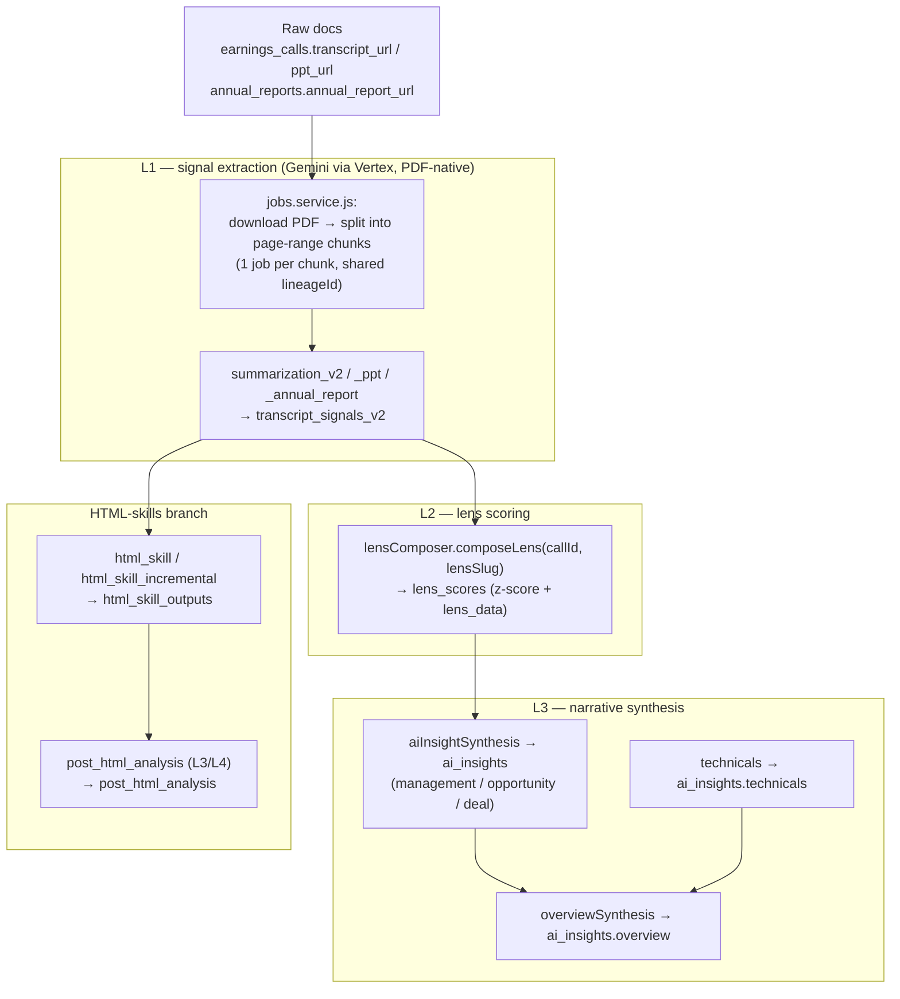

# The Analysis Pipeline

QuantCase processes each earnings-call document through a progressive, cached pipeline: **L1** extracts structured signals from PDFs, **L2** scores those signals through analytical "lenses", and **L3** synthesises lens scores into narrative insights. A parallel **HTML-skills** branch renders per-ticker reports from the same signals. Every stage caches on a content hash so unchanged inputs skip the LLM entirely.

## Queue → worker map

Each layer is one or more BullMQ queues consumed by [`worker.js`](../worker.js). LLM calls all flow through `llmStream` ([llm-integration.md](./llm-integration.md)).

| Layer | Queue(s) | Worker | Writes to |
|-------|----------|--------|-----------|
| L1 | `summarization_v2`, `summarization_v2_ppt`, `summarization_v2_annual_report` | [`summarization_v2*.js`](../workers/summarization_v2.js) | `transcript_signals_v2` |
| L2 | `lens_computation` | [`lensComputation.js`](../workers/lensComputation.js) → [`services/lensComposer.js`](../services/lensComposer.js) | `lens_scores` |
| L3 | `ai_insight_synthesis` | [`aiInsightSynthesis.js`](../workers/aiInsightSynthesis.js) | `ai_insights` |
| L3 (sibling) | `overview_synthesis` | [`overviewSynthesis.js`](../workers/overviewSynthesis.js) | `ai_insights` (type `overview`) |
| L3 (sibling) | `technicals_analysis` | [`technicals.js`](../workers/technicals.js) | `ai_insights` (type `technicals`) |
| HTML | `html_skill`, `html_skill_preview` | [`htmlSkill.js`](../workers/htmlSkill.js) | `html_skill_outputs` |
| HTML | `html_skill_incremental` | [`htmlIncrementalSkill.js`](../workers/htmlIncrementalSkill.js) | `html_incremental_skill_outputs` |
| HTML | `post_html_analysis` | [`postHtmlAnalysis.js`](../workers/postHtmlAnalysis.js) | `post_html_analysis` |

## L1 — signal extraction

**Enqueue (PDF chunking).** [`services/jobs.service.js`](../services/jobs.service.js) does the fan-out. Given a call, it downloads the source PDF with `pdf-lib`, counts pages, and splits it into page-range **chunks**, assigning all chunks a shared `lineageId` (UUID) so their signals can be grouped back to one call. One BullMQ job is enqueued per chunk:

| Doc type | Pages / chunk | Max chunks |
|----------|---------------|------------|
| Transcript | `V2_PAGES_PER_CHUNK = 8` | `V2_MAX_CHUNKS = 20` |
| Investor PPT | `V2_PPT_PAGES_PER_CHUNK = 6` (denser slides) | `V2_MAX_CHUNKS = 20` |
| Annual report | `AR_V2_PAGES_PER_CHUNK = 10` | `AR_V2_MAX_CHUNKS = 150` |

Smaller chunks are a deliberate fix for LLM output truncation (`finish_reason=length`) seen in `pipeline_job_failures` — the model's real output ceiling (~65K tokens) is below the configured skill `maxTokens`, so the answer is fewer pages per call, not a bigger token budget.

**Per-chunk processing** ([`workers/summarization_v2.js`](../workers/summarization_v2.js)):

1. `loadSkillConfig('summarization-v2')` — pull model, `maxTokens`, output schema from the `skills` table.
2. Compute `source_hash` (`utils/sourceHash.js` over `url:pageStart:pageEnd`) and `prompt_v` (`skillSlug@skill.updatedAt`).
3. **Dedup check** — if `transcript_signals_v2` already has rows for this `call_id` + `source_hash` + `prompt_v` (and not invalidated), return `{ cached: true }` without any LLM call.
4. Fetch call metadata + industry-scoped existing KPIs (fed to the prompt so the model reuses canonical KPI abbreviations).
5. `downloadPdfCached` + `extractPageRange` (`pdf-lib`) → base64 PDF; guarded by a 1-at-a-time semaphore because `PDFDocument.load()` expands heap 3–5×.
6. Build a `[{type:'text'}, {type:'file', file:{file_data:'data:application/pdf;base64,…'}}]` message with `transcriptExtractorPromptV2` ([`prompts/`](../prompts/transcript_call_v2.js)).
7. `llmStream(params, { vertex: true })` → `parseJson`.
8. `upsertNewKpis(...)` — any `new_kpis` the model discovered are registered in the KPI registry (see [subsystems/screener-kpi-registry.md](./subsystems/screener-kpi-registry.md)).
9. `writeSignals(...)` — `prisma.transcriptSignalV2.createMany`.

**Output — `transcript_signals_v2` (`TranscriptSignalV2`).** Each row carries `signal_type`, `source_doc_type` (`transcript` / `ppt` / `annual_report`), `metric`, `impact`, `severity`, `statement`, the full extracted `data` JSON, plus lineage/caching columns `lineage_id`, `source_hash`, `prompt_v`, `extractor_model`.

> **Table note:** the current v2 workers write **`transcript_signals_v2`**, read back by L2/HTML via `querySignalsV2` (`services/db/signals.db.js`). An older `extracted_signals` (`ExtractedSignal`) table still exists and is served by `/api/signals`, but is **not** what the v2 pipeline writes. See [data-model.md](./data-model.md).

## L2 — lens scoring

A **lens** is a configurable analytical view (defined in the `lens_configs` table, `LensConfig`). [`services/lensComposer.js`](../services/lensComposer.js) `composeLens(callId, lensSlug)`:

1. Load the `LensConfig` (must be active).
2. Pull the call's signals via `querySignalsV2` (optionally appending the ticker's historical signals; capped at 3000).
3. **Math step** — normalise each signal's value by `metric_family` range, apply per-metric weight/bias overrides, sum into a `z_score`, and derive a confidence interval.
4. **Cache check** — hash the signal ids+values (`signals_hash`); if an existing `lens_scores` row matches `signals_hash` + `lens_config_v` and is not stale, return it without an LLM call.
5. Build a compact text **signal summary** and enrich it with peer metrics ([`services/peerMetrics.js`](../services/peerMetrics.js)), shareholding (Prowess CSV, for `promoter-activity`), and live PE/market-cap context.
6. `llmStream` with `outputSchemas/lens` → `parseJson`.
7. **Upsert `lens_scores`** (`LensScore`): `z_score`, `confidence_lo/hi`, `signal_count`, `signals_snapshot`, `lens_data` (the LLM output), `lens_config_v`, `signals_hash`, `is_stale`.

Helpers on top of `composeLens`:

- `composeAllLenses(callId)` — runs every active lens for a call in parallel.
- `composeIndustryLens(...)` — the `industry-analysis` lens is **industry-shared**: one LLM call scores the whole `basic_industry`, then **fans out** the identical `lens_data` to every peer `call_id` (cache-keyed on a hash of the shared peer data block). This avoids re-scoring the industry once per company.
- `markLensesStale(callId)` / `markLensStaleBySlug(slug)` — flag scores for recomputation when inputs or config change.

## L3 — narrative synthesis

[`workers/aiInsightSynthesis.js`](../workers/aiInsightSynthesis.js) turns lens scores into a narrative insight of a given **type**. The type → lens mapping is the single source of truth in [`lib/insightLenses.js`](../lib/insightLenses.js):

| `insightType` | Lenses fed in |
|---------------|---------------|
| `management` | `guidance-credibility`, `disclosure-honesty`, `capital-allocation`, `promoter-activity` |
| `opportunity` | `industry-analysis`, `competition`, `financial-strength`, `customer-distribution` |
| `deal` | `earnings-forecast`, `earning-quality`, `pe-rerating-potential`, `target-price-matrix` |

Flow:

1. Ensure **fresh lens scores** — if none exist or any are stale, call `composeAllLenses(callId)` first.
2. Filter to the lenses relevant for `insightType`.
3. Hash the relevant lens `z_score`s (`lens_scores_hash`); on a cache hit (and no `forceRefresh`) skip the LLM.
4. `loadSkillConfig('ai-insight-synthesis')` → `aiInsightSynthesisPrompt` → `llmStream` with `outputSchemas/aiInsight`.
5. **Upsert `ai_insights`** (`AiInsight`, unique on `(ticker, type)`) with `insight` JSON + `lens_scores_hash` + `prompt_v`.

This worker (unlike L1/L2) also mirrors its status into the Postgres `jobs` table (`Job`, keyed by `bullmqId`).

**Sibling synthesisers** write into the same `ai_insights` table under other types:

- `overview_synthesis` ([`overviewSynthesis.js`](../workers/overviewSynthesis.js)) — composes an `overview` from the management/opportunity/deal/technicals insights of a ticker.
- `technicals_analysis` ([`technicals.js`](../workers/technicals.js)) — runs `lib/technicalAnalysis.js`, prompts with `prompts/decision_intelligence.js`, and reshapes via `utils/technicalsShape.js` into `ai_insights.technicals`.

## HTML-skills / post-HTML branch

An alternate, DB-configured rendering path produces per-ticker **HTML reports** directly from L1 signals, then synthesises over them:

- `html_skill` / `html_skill_preview` ([`htmlSkill.js`](../workers/htmlSkill.js)) and `html_skill_incremental` ([`htmlIncrementalSkill.js`](../workers/htmlIncrementalSkill.js)) run "skills" defined in the `html_skills` / `html_incremental_skills` tables (services `htmlSkill.service.js`, `htmlIncrementalSkill.service.js`), writing rendered HTML into `html_skill_outputs` / `html_incremental_skill_outputs`. A `context_length_exceeded` error is raised as a BullMQ `UnrecoverableError` so it fails fast without retrying.
- `post_html_analysis` ([`postHtmlAnalysis.js`](../workers/postHtmlAnalysis.js)) runs L3/L4 synthesis **over** those HTML outputs. Configs live in `post_html_analysis_configs` keyed by `layer_id` (`l3` / `l4`) + `type`; results land in `post_html_analysis`. L3 reads lens HTML outputs; L4 reads the L3 analyses.

## Caching & invalidation

Every stage skips the LLM when its input hash matches a stored row:

| Stage | Cache key |
|-------|-----------|
| L1 | `source_hash` (`url:pageStart:pageEnd`) + `prompt_v` |
| L2 | `signals_hash` (signal ids+values, plus shareholding for `promoter-activity`) + `lens_config_v` |
| L2 industry | hash of shared peer data block + config version |
| L3 | `lens_scores_hash` (z-scores of the relevant lenses) + `prompt_v` |
| post-HTML | `input_hash` over source HTML / L3 rows |

`prompt_v` = `skillSlug@skill.updatedAt` — editing a skill's prompt in the DB bumps `updatedAt`, which changes `prompt_v` and transparently invalidates every downstream cache.

## Admin bulk dispatch

To run a whole layer over many tickers at once, [`services/pipelineDispatch/`](../services/pipelineDispatch) provides `preview` / `preview.csv` / `run` for each layer (`l1MultiDispatch.service.js`, `l2MultiDispatch.service.js`, `l3MultiDispatch.service.js`, unified in `index.js`). These resolve a target ticker set, report coverage, and enqueue jobs in bulk. They are exposed under `/admin/pipeline-dispatch` and can be fired on a cron by the scheduler handlers `scheduler/handlers/pipelineDispatchL{1,2,3}Multi.js`. Walkthrough: [admin-guides/pipeline-dispatch-l1-multi-admin-guide.md](./admin-guides/pipeline-dispatch-l1-multi-admin-guide.md).

## Terminal failures

L1 chunk workers record terminal failures (after exhausting `attempts`) into `pipeline_job_failures` (`PipelineJobFailure`) with the queue, `call_id`, chunk index, and `lineage_id`. `services/pipelineJobRetry.service.js` and the `admin.pipelineJobs` controller offer retry and split-retry (re-chunk a too-large PDF into more, smaller jobs). See [runbooks/JOB_QUEUE_GUIDE.md](./runbooks/JOB_QUEUE_GUIDE.md).

## See also

- [llm-integration.md](./llm-integration.md) — how `llmStream` runs, and OpenRouter vs Vertex routing
- [data-model.md](./data-model.md) — `transcript_signals_v2`, `lens_scores`, `ai_insights`, and related tables
- [architecture.md](./architecture.md) — the four processes and queue plumbing
- [subsystems/screener-kpi-registry.md](./subsystems/screener-kpi-registry.md) — the KPI registry that L1 extends via `new_kpis`
- [admin-guides/pipeline-dispatch-l1-multi-admin-guide.md](./admin-guides/pipeline-dispatch-l1-multi-admin-guide.md) — bulk-running a layer
- [runbooks/JOB_QUEUE_GUIDE.md](./runbooks/JOB_QUEUE_GUIDE.md) — queue operations and retrying failures
