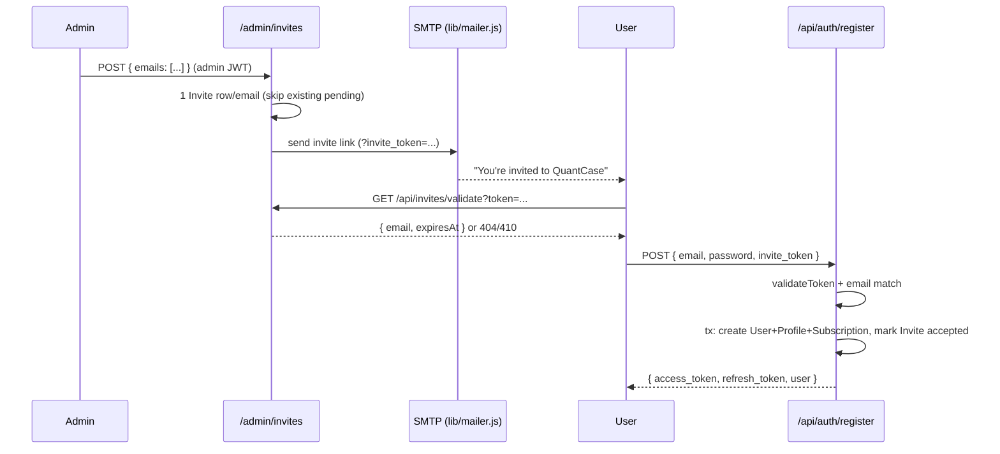

# Auth, Invites & Google Sign-In

JWT bearer authentication for the QuantCase API, plus the **invite-only** registration gate that fronts both email/password signup and Google Sign-In. No one gets an account without an admin-issued invite.

## Purpose

- Issue and verify short-lived JWTs so every `/api/*` (and `/admin/*`) request can be attributed to a user.
- Gate account creation behind an admin-issued `Invite` (7-day TTL) — closed beta, no open signup.
- Support three entry paths: email/password `register`, `signin`, and Google `googleAuth`.
- Provide role gating: `requireAdmin` (super-admins only) and `requireActiveSubscription` (trial/paid access).

## Key files

| Concern | File |
|---------|------|
| JWT verify middleware | [`middleware/authenticate.js`](../../middleware/authenticate.js) |
| Admin-only gate | [`middleware/requireAdmin.js`](../../middleware/requireAdmin.js) |
| Subscription gate | [`middleware/requireActiveSubscription.js`](../../middleware/requireActiveSubscription.js) |
| JWT secrets / TTLs | [`config/auth.js`](../../config/auth.js) |
| Auth business logic | [`services/auth.service.js`](../../services/auth.service.js) |
| Auth HTTP handlers + token issuing | [`controllers/auth.controller.js`](../../controllers/auth.controller.js) |
| Auth routes (`/api/auth`) | [`routes/auth.routes.js`](../../routes/auth.routes.js) |
| Invite create/validate logic | [`services/invite.service.js`](../../services/invite.service.js) |
| Public invite validate handler | [`controllers/invite.controller.js`](../../controllers/invite.controller.js) |
| Public invite route (`/api/invites`) | [`routes/invites.routes.js`](../../routes/invites.routes.js) |
| Admin invite create handler | [`controllers/admin.invites.controller.js`](../../controllers/admin.invites.controller.js) |
| Admin invite route (`/admin/invites`) | [`routes/admin.invites.routes.js`](../../routes/admin.invites.routes.js) |
| SMTP mailer | [`lib/mailer.js`](../../lib/mailer.js) |
| Invite email template | [`utils/emailTemplates/invite.js`](../../utils/emailTemplates/invite.js) |

## Data model

Relevant Prisma models (see [../data-model.md](../data-model.md) and [`prisma/schema.prisma`](../../prisma/schema.prisma)):

- **`User`** (`qc_users`) — `email?`, `mobile?`, `password_hash?` (null for Google-only accounts), `google_id?`, `display_name?`, `display_picture?`, `account_type` (`AccountType`: `admin` / `manager` / `investor`). Has one `UserProfile`, one `UserSubscription`.
- **`UserProfile`** (`qc_user_profiles`) — `full_name`, `phone`, `date_of_birth`, `risk_profile`, `onboarding_completed`, `onboarding_step` (`OnboardingStep` enum). Created 1:1 with the user in the same transaction.
- **`Invite`** (`qc_invites`) — `email`, `token` (unique 64-hex random), `status` (`InviteStatus`: `pending` / `accepted` / `expired`), `invitedBy?`, `acceptedAt?`, `expiresAt`. Indexed on `email` and `token`.

> Note: `register()` / `googleAuth()` also create a `UserSubscription` (`plan_type: 'trial'`, 7-day trial window) in the same transaction — see [./billing-razorpay.md](./billing-razorpay.md).

## Authentication (JWT)

`authenticate` pulls the `Bearer <token>` from the `Authorization` header, `jwt.verify`s it against `jwtSecret`, and sets `req.user` to the decoded payload. Any failure returns `401`.

The token payload (minted in `issueTokens`) is:

```js
{ sub: user.id, email: user.email, accountType: user.account_type }
```

So downstream handlers read `req.user.sub` (user id) and `req.user.accountType` (role).

| Token | Secret (`config/auth.js`) | Default TTL |
|-------|---------------------------|-------------|
| access | `JWT_SECRET` | `JWT_EXPIRES_IN` = `24h` |
| refresh | `JWT_REFRESH_SECRET` | `JWT_REFRESH_EXPIRES_IN` = `7d` |

> **Gotcha:** all four values fall back to hard-coded dev defaults (`qc2026-secret`, …). Set real secrets in every non-local environment. See [../configuration.md](../configuration.md).

### Role gates

- **`requireAdmin`** — runs after `authenticate`; rejects unless `req.user.accountType === 'admin'` (`403`). Mounted on `/admin/*`. Wealth managers (`account_type === 'manager'`) are elevated for billing/access but are **not** super-admins.
- **`requireActiveSubscription`** — loads the user's subscription and blocks (`403 Subscription required`) when `computeAccessState` says access is blocked (expired trial, past-due, etc.).

## Invite-only registration flow



### 1. Admin issues invites — `POST /admin/invites`

Body `{ emails: string[] }` (Zod-validated, each a valid email). For each unique lower-cased email, `createInvites`:
- Skips creating a new row if a **pending, unexpired** invite already exists (re-sends to that existing invite instead — result flagged `resent: true`).
- Otherwise creates an `Invite` with a fresh 32-byte hex token and `expiresAt = now + 7 days`.
- Emails the recipient a link to `FRONTEND_INVITE_URL` (default `https://beta.quantcase.ai`) with `?invite_token=<token>` appended.
- Returns per-email results (`sent` / `failed`) — one bad address does **not** abort the batch.

### 2. Frontend pre-check — `GET /api/invites/validate?token=`

`validateToken` returns `{ email, expiresAt }` for a `pending`, unexpired invite. Otherwise it throws: `404` (unknown token), `410` (already `accepted`, or expired — an expired-but-still-`pending` row is flipped to `expired` on read).

### 3. Signup — `POST /api/auth/register`

Body: `{ email?, mobile?, password, display_name?, invite_token }`. `register()`:
1. Requires `password` **and** `invite_token`.
2. Re-runs `validateToken(invite_token)` (throws 404/410 on bad token).
3. Requires the submitted `email` to equal the invited email (`403` otherwise).
4. Rejects duplicate email/mobile (`409`).
5. In **one `$transaction`**: creates `User` (`account_type: 'investor'`, bcrypt-hashed password), `UserProfile`, `UserSubscription` (trial), and flips the invite to `accepted` (`acceptedAt` set) — so the token **cannot be reused**.
6. Returns `201` with `{ access_token, refresh_token, user }`.

## Google Sign-In — `POST /api/auth/google`

Body `{ id_token }`. `googleAuth()` verifies the Google ID token server-side via `google-auth-library` (`OAuth2Client.verifyIdToken`, audience = `GOOGLE_CLIENT_ID`), then:

1. Rejects a token with no email (`401`) or `email_verified === false` (`403`).
2. **Existing `User` with that email** → if `google_id` is unset, links it (and backfills `display_name` / `display_picture`), then signs in. **No invite check for existing users.**
3. **Brand-new email** → requires an active invite via `inviteService.findActiveInviteForEmail(email)` — the token-less lookup accepts `pending` **or** `accepted` (a stale `pending` is auto-expired). No active invite → `403` `"This is an invite-only platform…"`. On success, in one transaction it creates a **passwordless** `User` (`password_hash` null), `UserProfile`, `UserSubscription`, and accepts the invite if still `pending`.

Returns `{ access_token, refresh_token, user }` (same shape as `register`, plus `displayName` / `displayPicture`).

> **Why `GOOGLE_CLIENT_ID` must match the frontend's:** it is the audience checked during verification. A mismatch fails every Google login with `401 Invalid Google token`.

## Endpoints

| Method | Path | Auth | Purpose |
|--------|------|------|---------|
| `POST` | `/api/auth/register` | invite token | Email/password signup (invite-gated) |
| `POST` | `/api/auth/google` | Google ID token | Google Sign-In (invite-gated, auto-creates on first login) |
| `POST` | `/api/auth/signin` | none | Email/password login → `{ access_token, refresh_token }` |
| `GET`  | `/api/auth/me` | Bearer | Full profile (`getFullProfile`: profile, subscription access state, smallcase summary) |
| `PATCH`| `/api/auth/me/onboarding` | Bearer | Update onboarding step / profile fields |
| `GET`  | `/api/invites/validate?token=` | none | Pre-signup token check |
| `POST` | `/admin/invites` | admin | Bulk-create + email invites |

Route mounting lives in [`routes/index.js`](../../routes/index.js): `/api/auth`, `/api/invites`, and `/admin` (behind `authenticate` + `requireAdmin`).

## External integration & secrets

- **Google** — `GOOGLE_CLIENT_ID` (`config/env.js#googleClientId`); no secret needed, verification is public-key based.
- **SMTP** ([`lib/mailer.js`](../../lib/mailer.js)) — a lazily-built `nodemailer` transport over plain SMTP (SES SMTP, SendGrid, Postmark, Gmail…). Required: `SMTP_HOST`, `SMTP_PORT`, `SMTP_SECURE`, `SMTP_USER`, `SMTP_PASSWORD`; `SMTP_FROM` (falls back to `SMTP_USER`). Swappable by env only, no code change.
- **JWT** — `JWT_SECRET`, `JWT_REFRESH_SECRET`, `JWT_EXPIRES_IN`, `JWT_REFRESH_EXPIRES_IN`.
- **Invite** — `FRONTEND_INVITE_URL` (link base), `INVITE_TTL` is a hard-coded 7 days in `invite.service.js`.

## Gotchas

- **No refresh endpoint.** `issueTokens` mints a refresh token but there is currently no `/api/auth/refresh` route — the frontend re-authenticates when the 24h access token expires.
- **`register` requires a matching email.** An invite issued to `a@x.com` cannot be redeemed by signing up as `b@x.com` (`403`). Mobile-only signup can't satisfy the email-match check, so email is effectively required for invite redemption.
- **Google existing-user path skips the invite gate.** Only brand-new emails are invite-checked; a user who already exists (e.g. created via email signup) can always Google-link and sign in.
- **`signin` rejects Google-only accounts.** They have `password_hash === null` → `401 Invalid credentials`. Such users must use `/api/auth/google`.
- **Idempotent invite creation** — re-`POST`ing the same email while a pending invite is live re-sends rather than duplicating; the result carries `resent: true`.
- **Dev-default secrets** are a real footgun in staging/prod — see the config gotcha above.

## See also

- [../architecture.md](../architecture.md) — process topology and middleware chain
- [../data-model.md](../data-model.md) — full Prisma model reference
- [../api-reference.md](../api-reference.md) — complete endpoint list
- [../configuration.md](../configuration.md) — JWT / `GOOGLE_CLIENT_ID` / SMTP env vars
- [./billing-razorpay.md](./billing-razorpay.md) — the trial `UserSubscription` created at signup
- [./smallcase-gateway.md](./smallcase-gateway.md) — the smallcase summary surfaced by `/api/auth/me`
