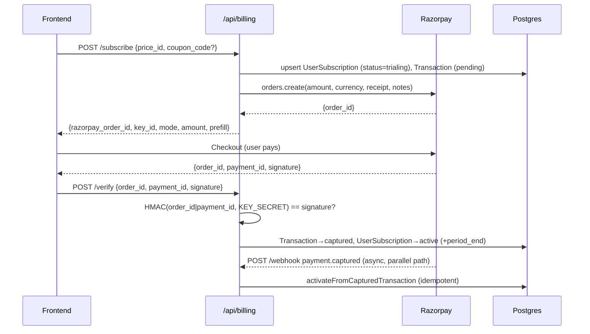

# Billing & Subscriptions (Razorpay)

QuantCase gates full access behind a paid subscription. Payments run through **Razorpay** using the one-time **Orders API** (not Razorpay's recurring Subscriptions product); QuantCase models the recurring plan, trial, and billing period entirely in its own database and rolls the period forward itself on each captured payment.

## Key files

| File | Role |
|------|------|
| [`services/billing.service.js`](../../services/billing.service.js) | Core logic: order creation, coupon validation, signature verification, activation, webhook handling |
| [`services/subscription.service.js`](../../services/subscription.service.js) | `computeAccessState()` — derives `active` / `trialing` / `expired` / `past_due` + `days_remaining` from a subscription row |
| [`controllers/billing.controller.js`](../../controllers/billing.controller.js) | HTTP handlers for the `/api/billing` routes |
| [`routes/billing.routes.js`](../../routes/billing.routes.js) | Route table; registers `express.raw()` on `/webhook` |
| [`middleware/requireActiveSubscription.js`](../../middleware/requireActiveSubscription.js) | Guard that 403s users without an active/trialing subscription |
| [`prisma/seedBilling.js`](../../prisma/seedBilling.js) | Seeds the `quantcase-pro` product + monthly/annual prices |
| [`config/env.js`](../../config/env.js) | Reads the `RAZORPAY_*` env vars |

## Prisma models

All billing tables are prefixed `qc_` ([`prisma/schema.prisma`](../../prisma/schema.prisma)).

| Model | Table | Notes |
|-------|-------|-------|
| `Product` | `qc_products` | Sellable product (one row: `quantcase-pro`) |
| `Price` | `qc_prices` | Plan variant: `amount` (paise), `interval_months`, `plan_type`, optional `razorpay_plan_id` |
| `Coupon` | `qc_coupons` | `code`, `discount_type`, `discount_value`, `max_uses`, `used_count`, `expires_at` |
| `Discount` | `qc_discounts` | One redemption per `(coupon_id, user_id)` — enforces "one coupon per account" |
| `PaymentMethod` | `qc_payment_methods` | Stored Razorpay token/customer id (defined, not yet written by the current flow) |
| `UserSubscription` | `qc_user_subscriptions` | One per user (`user_id` unique): `plan_type`, `status`, trial + period dates, `razorpay_subscription_id`/`razorpay_customer_id` |
| `Transaction` | `qc_transactions` | One per Razorpay order: `razorpay_order_id`, `razorpay_payment_id`, `amount`, `status`, `metadata` (price/coupon), `failure_reason` |

**Enums**: `SubscriptionPlan` (`trial`/`monthly`/`annual`), `SubscriptionStatus` (`trialing`/`active`/`expired`/`cancelled`/`past_due`), `TransactionStatus` (`pending`/`captured`/`failed`/`refunded`), `DiscountType` (`percentage`/`fixed`), `PaymentMethodType` (`card`/`upi`/`netbanking`/`wallet`).

Amounts are stored in **paise** (`amount: 249900` = ₹2,499). A `percentage` coupon scales `amount`; a `fixed` coupon subtracts `discount_value * 100` (rupees → paise), floored at 0.

## Environment & secrets

| Var | Purpose |
|-----|---------|
| `RAZORPAY_KEY_ID` | Publishable key id — **safe to expose**; returned by `GET /config` and used by the frontend checkout. `rzp_live_*` prefix ⇒ `mode: 'live'`, otherwise `'test'` (`getMode()`) |
| `RAZORPAY_KEY_SECRET` | Server-side secret. Signs Razorpay API calls **and** is the HMAC key for the `/verify` payment-signature check (`order_id \| payment_id`) |
| `RAZORPAY_WEBHOOK_SECRET` | HMAC key for verifying the `X-Razorpay-Signature` header on `/webhook` (distinct from the key secret) |
| `RAZORPAY_DEBUG` | Defaults on; set to `false` to silence the secret-safe `[razorpay …]` logs (`rzpLog` logs only presence/length/prefixes, never full secrets or signatures) |

Flipping `RAZORPAY_KEY_ID`/`RAZORPAY_KEY_SECRET` between `rzp_test_*` and `rzp_live_*` swaps the whole app between test and live — no code change. See [configuration](../configuration.md).

## Endpoints

Mounted at `/api/billing` ([`routes/index.js`](../../routes/index.js)).

| Method & path | Auth | Purpose |
|---------------|------|---------|
| `GET /config` | public | Returns `{ mode, razorpay_key_id }` so the frontend can render a "Test Mode" banner and init checkout |
| `GET /products` | public | Active products with their active prices |
| `GET /subscription` | user | Current subscription + computed access state (`status`, `is_access_blocked`, `days_remaining`) |
| `POST /subscribe` | user | Body `{ price_id, coupon_code? }` → creates a Razorpay **order** + a `pending` `Transaction`, returns `{ razorpay_order_id, razorpay_key_id, mode, amount, currency, subscription_id, prefill }` |
| `POST /coupons/validate` | user | Body `{ code, price_id }` → returns original vs discounted amount, or 4xx |
| `POST /verify` | user | Body `{ razorpay_order_id, razorpay_payment_id, razorpay_signature }` → verifies the checkout signature and **activates immediately** |
| `POST /webhook` | Razorpay (HMAC) | Raw-body server-to-server event handler |

## End-to-end flow



**Two activation paths, one function.** Both `POST /verify` (synchronous, driven by the checkout handler) and the `payment.captured` webhook (async, server-to-server) call `activateFromCapturedTransaction(txn, paymentId)`. It is **idempotent**: if the transaction is already `captured` it returns without re-activating or double-counting the coupon, so the two callers compose safely when both fire for the same payment.

On activation the function:
1. Marks the `Transaction` `captured` and records `razorpay_payment_id`.
2. Sets the `UserSubscription` to `active`, computes `current_period_end = now + interval_months`, and backfills `trial_ends_at` if absent.
3. If the transaction's `metadata.coupon_id` is set, creates the `Discount` redemption row and increments the coupon's `used_count` — in one `$transaction`.

### Coupon validation (`validateCoupon`)
Rejects with a typed `err.status` when the coupon is missing/inactive (404), expired, over its `max_uses`, or already redeemed by this user (422 — the `Discount` unique constraint). Percentage vs fixed math as above.

### Webhook handling (`handleWebhookEvent`)
| Event | Effect |
|-------|--------|
| `payment.captured` | Find `Transaction` by `order_id` → `activateFromCapturedTransaction` |
| `payment.failed` | Transaction → `failed` (+ `failure_reason`); subscription → `past_due` |
| `subscription.cancelled` | Find sub by `razorpay_subscription_id` → `cancelled` (+ `cancelled_at`) |

## Access gating

`computeAccessState(subscription, accountType)` in [`subscription.service.js`](../../services/subscription.service.js) is the single source of truth:
- `accountType === 'admin'` ⇒ always `active`, never blocked.
- `trialing` past `trial_ends_at` ⇒ `expired`, blocked.
- `active` past `current_period_end` ⇒ `past_due`, blocked.
- No subscription ⇒ blocked.

[`middleware/requireActiveSubscription.js`](../../middleware/requireActiveSubscription.js) wraps this and returns **403** `{ error: 'Subscription required', subscription_status, days_remaining }` when `is_access_blocked`. It is ready to drop in front of any subscription-only route.

> **Gotcha — middleware is defined but not yet mounted.** As of this writing no route file imports `requireActiveSubscription`; gating is currently surfaced to the frontend via the `is_access_blocked` field on `GET /subscription` rather than enforced server-side. Wire the middleware into a router to hard-gate an endpoint.

## Webhook raw-body handling

The HMAC signature is computed over the **exact raw request bytes**, so the global JSON parser must not touch this route first. [`server.js`](../../server.js) lists it in `WEBHOOK_PATHS` (alongside the smallcase webhook) and **skips `express.json()`** for those paths; [`routes/billing.routes.js`](../../routes/billing.routes.js) then attaches `express.raw({ type: 'application/json' })` on `/webhook`. The controller verifies `X-Razorpay-Signature` against `RAZORPAY_WEBHOOK_SECRET` before `JSON.parse`-ing the buffer — an invalid or missing signature returns 400 and the body is never parsed.

## Seeding

```bash
npm run db:seed:billing   # node prisma/seedBilling.js
```

Upserts one `Product` (`quantcase-pro`) and two `Price` rows: `quantcase-pro-monthly` (₹2,499/mo) and `quantcase-pro-annual` (₹19,999/yr). **Coupons are not seeded** — create them directly in the DB / Prisma Studio.

## Gotchas

- **One-time Orders, not Razorpay Subscriptions.** The flow uses `rzp.orders.create` per billing cycle; `Price.razorpay_plan_id` and `UserSubscription.razorpay_subscription_id` exist in the schema but are **not populated** by the current create path (the latter is only *read* in the `subscription.cancelled` webhook branch). Renewal is not automatic — a new order + capture is what extends `current_period_end`.
- **`/verify` and the webhook race is expected.** Because both fire for one payment, all activation must stay funnelled through the idempotent `activateFromCapturedTransaction` — don't add side effects to only one caller.
- **Amounts are paise everywhere.** UI-facing rupee values divide by 100; coupons and Razorpay both expect paise.
- **Key secret ≠ webhook secret.** `/verify` uses `RAZORPAY_KEY_SECRET`; `/webhook` uses `RAZORPAY_WEBHOOK_SECRET`. Swapping them silently fails signature checks.
- **`getMode()` is prefix-based.** Anything not starting with `rzp_live_` reports `test` — a misconfigured key id will happily report "test" while pointing at nothing.

## See also

- [Razorpay frontend integration guide](../frontend/razorpay-frontend-integration.md) — checkout SDK wiring on the client
- [Configuration](../configuration.md) — env var reference
- [Auth, invites & Google sign-in](./auth-invites-google.md) — where `req.user.sub` / `accountType` come from
- [Data model](../data-model.md) — full schema reference
- [Architecture](../architecture.md) — server/worker/scheduler split and raw-body webhook routing
