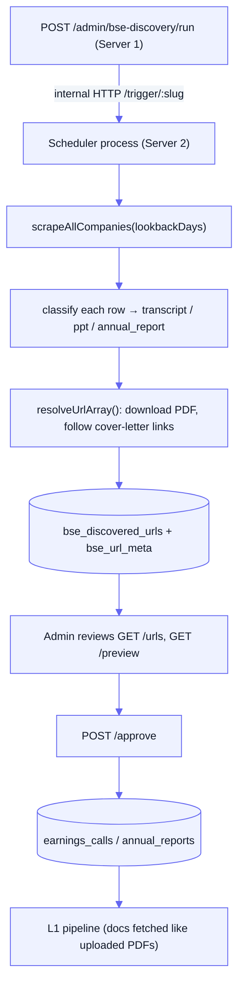

[Docs](../README.md) · [Subsystems](../README.md#subsystems) · BSE Document Discovery

# BSE Document Discovery

Crawls the **BSE corporate-announcements API** for newly filed earnings-call transcripts, investor presentations, and annual reports; resolves each candidate PDF (following cover-letter links); and stores the URLs for an admin to review and approve. Approved URLs become `earnings_calls` / `annual_reports` rows that feed the L1 pipeline.

## Key files

| File | Role |
|------|------|
| [`services/bseScraper.service.js`](../../services/bseScraper.service.js) | Fetches BSE announcements per day, classifies each into transcript/ppt/annual_report |
| [`services/bseResolver.service.js`](../../services/bseResolver.service.js) | Downloads each PDF, detects cover letters, extracts embedded document URLs, records per-URL metadata |
| [`scheduler/handlers/bseDiscovery.js`](../../scheduler/handlers/bseDiscovery.js) | Orchestrates scrape → resolve → upsert into `bse_discovered_urls` + `bse_url_meta` |
| [`controllers/admin.bseDiscovery.controller.js`](../../controllers/admin.bseDiscovery.controller.js) | Admin API: trigger run, list/preview candidates, approve/dismiss |
| [`services/bseDiscoveryApproval.service.js`](../../services/bseDiscoveryApproval.service.js) | Turns an approved candidate into a canonical `earnings_calls`/`annual_reports` row |
| [`routes/admin.bseDiscovery.routes.js`](../../routes/admin.bseDiscovery.routes.js) | Route table (mounted at `/admin/bse-discovery`) |
| [`scripts/createBseDiscoveredUrls.js`](../../scripts/createBseDiscoveredUrls.js) | Raw-SQL creator for the `bse_discovered_urls` table |

## Prisma models

| Model | Table | Notes |
|-------|-------|-------|
| `BseDiscoveredUrl` | `bse_discovered_urls` | One row per `(scrip_cd, scrape_date)`; three `text[]` columns: `transcript_urls`, `ppt_urls`, `annual_report_urls` |
| `BseUrlMeta` | `bse_url_meta` | Per-candidate-URL resolution metadata: `page_count`, `file_size`, `status` (`resolved`/`pending`/`non_pdf`) |
| `BseDismissedUrl` | `bse_dismissed_urls` | Soft-delete — a listed URL is hidden from the review UI unless `showDismissed=true` |

Approval writes into the canonical ingestion tables `earnings_calls` (transcript/ppt) and `annual_reports` (annual reports) — see [data model](../data-model.md).

## External API & secrets

The scraper hits BSE's **public** JSON API — **no auth, no secrets required**:

```
GET https://api.bseindia.com/BseIndiaAPI/api/AnnSubCategoryGetData/w
      ?pageno=<n>&strCat=-1&strPrevDate=<YYYYMMDD>&strToDate=<YYYYMMDD>
      &strScrip=&strSearch=P&strType=C&subcategory=-1
```

Quirks handled in [`bseScraper.service.js`](../../services/bseScraper.service.js):
- `strPrevDate` must equal `strToDate` — **one API call per calendar day** (date ranges return empty). The scraper loops one day at a time across the lookback window.
- 50 rows per page. Total page count comes from `Table1[0].ROWCNT` (always present) — `Table[0].TotalPageCnt` is only populated for today/yesterday and silently skipped older days on longer lookbacks.
- Browser-like `HEADERS` (origin/referer/user-agent) avoid 401/403.
- Attachment URLs are built against `AttachLive/`; the resolver falls back to `AttachHis/` (archive) for older docs.

## End-to-end flow



### 1. Scrape & classify
Each announcement is classified by a three-layer classifier: exact `SUBCATNAME` match first (`Reg. 34 (1) Annual Report`, `Investor Presentation`, `Analyst / Investor Meet`), then broad regex over headline + `NEWSSUB` (transcript / annual / ppt), else dropped. Plain "Intimation" notices with no document signal are excluded. Results are grouped per `(scrip_cd, scrape_date)` with attachment-name dedup.

### 2. Resolve ([`bseResolver.service.js`](../../services/bseResolver.service.js))
For each candidate URL — **the guiding principle is "never drop a URL"**:
- Download the PDF (20s timeout, follows redirects). 404/403 → try the `AttachLive/ ↔ AttachHis/` alternate; if both fail, keep the original URL with `status: pending` (BSE CDN has an hours-long propagation delay for same-day filings).
- Non-`%PDF-` body → keep URL, `status: non_pdf`.
- If the PDF text matches `COVER_LETTER_RE` (a letter pointing at the real document elsewhere), extract embedded URLs (with hyphen-wrap stitching, BSE self-references excluded), chain-resolve each, and **add** confirmed PDF links.
- Page count + file size are captured into `bse_url_meta` (free, since the PDF is already downloaded).

### 3. Upsert
[`bseDiscovery.js`](../../scheduler/handlers/bseDiscovery.js) upserts each group into `bse_discovered_urls` with **array-merge dedup** (`ARRAY(SELECT DISTINCT UNNEST(existing || new))`) so re-scrapes accumulate rather than overwrite. `bse_url_meta` upserts **never downgrade** a previously `resolved` row and `COALESCE` existing non-null counts — a transient CDN 404 on a later run can't wipe good data.

### 4. Review & approve
The admin lists flattened candidates (`GET /urls`), previews PDF text page-by-page (`GET /preview`), then approves. [`bseDiscoveryApproval.service.js`](../../services/bseDiscoveryApproval.service.js):
- Suggests `company` ticker (best-effort match of BSE company name against tickers already in `earnings_calls`/`annual_reports`, falling back to `osc_identity.csv`) and `fiscal_year`/`quarter` (Indian Apr–Mar FY derived from `scrape_date`) — the admin confirms/overrides.
- transcript/ppt → upsert `earnings_calls` keyed on `(company, fiscal_year, quarter)`, setting `transcript_url` or `ppt_url`.
- annual_report → check-then-write `annual_reports` on `(company, fiscal_year, document_type='annual_report')`.

Approved rows are then picked up by the L1 pipeline, which fetches the document like an uploaded PDF — see [pipeline](../pipeline.md).

## Endpoints (`/admin/bse-discovery`)

All under [`admin` middleware](../../routes/admin.routes.js) (`authenticate` + `requireAdmin`).

| Method & path | Purpose |
|---------------|---------|
| `POST /run` | Fire-and-forget trigger; relays to the scheduler process, does **not** scrape in-request |
| `GET /runs` | Run history from `scheduler_runs` for the `bse-discovery` job |
| `GET /urls` | Flattened candidates (one row per URL) with suggested company/FY/Q, `alreadyApproved`, `willOverwrite`, metadata, dismissed state. Filters: `days`, `hideApproved`, `showDismissed`, `min/maxPages`, `min/maxSize`, `status` |
| `GET /preview?url=&page=` | On-demand single-PDF text preview, paginated by real PDF page (bytes cached ~5 min) |
| `POST /approve` | Body `{ docType, url, company, fiscal_year, quarter?, call_date? }` → writes canonical row |
| `POST /dismiss` | Body `{ url, reason? }` → soft-delete (upsert into `bse_dismissed_urls`) |
| `POST /undismiss` | Body `{ url }` → restore |

## Scheduling hooks

`job_type: bse_discovery` is registered in [`scheduler/executor.js`](../../scheduler/executor.js) and seeded by [`scripts/seedSchedulerJobs.js`](../../scripts/seedSchedulerJobs.js) as slug `bse-discovery` with **`is_active: false`** — the retained cron (`0 9,18 * * 1-5`) is reference-only. Discovery is **manual/admin-triggered** because URLs now require admin approval before reaching `earnings_calls`/`annual_reports`.

`POST /run` does **not** run the scrape in the API process. Scraping + PDF resolution is heavy (network + pdf.js) and runs on the **scheduler process ("Server 2")**; the controller POSTs to that process's internal `POST /trigger/:slug` at `SCHEDULER_HOST:SCHEDULER_PORT` (default `127.0.0.1:8001`). See [scheduler](./scheduler.md).

## Setup

```bash
npm run db:create:bse   # node scripts/createBseDiscoveredUrls.js
```
Creates `bse_discovered_urls` (+ its indexes) via raw SQL. `bse_url_meta` and `bse_dismissed_urls` come from the Prisma schema (`npm run db:push`).

## Gotchas

- **Never scrapes in-request.** `POST /run` returns immediately after handing off to Server 2; if that process is unreachable the endpoint 502s with the host/port.
- **Propagation delay is normal.** Same-day filings routinely 404 on first scrape → stored `pending`; a later re-scrape resolves them without clobbering (metadata never downgrades from `resolved`).
- **`AttachLive/` vs `AttachHis/`.** URLs are built as Live; the resolver auto-falls-back to Archive and may store *both* working URLs for one document.
- **No ticker mapping from BSE.** BSE gives only `scrip_cd` + `company_name`; there's no built-in map to the `company` ticker convention, so approval always needs admin-confirmed `company`/`fiscal_year` (and `quarter` for transcript/ppt).
- **Approval can overwrite.** `GET /urls` surfaces `willOverwrite`/`existingUrl` because approving a transcript/ppt for an existing `(company, fiscal_year, quarter)` slot replaces the stored URL.
- **`annual_reports.id` is a BigInt.** The approve handler stringifies it for the JSON response.

## See also

- [Pipeline](../pipeline.md) — how approved URLs are ingested into L1
- [Scheduler](./scheduler.md) — the Server 2 process and internal `/trigger` API
- [Data model](../data-model.md) — `bse_discovered_urls`, `bse_url_meta`, `bse_dismissed_urls`, `earnings_calls`, `annual_reports`
- [Scheduler monitoring runbook](../runbooks/scheduler-monitoring.md) — reading run history
- [Architecture](../architecture.md) — the two-server split
