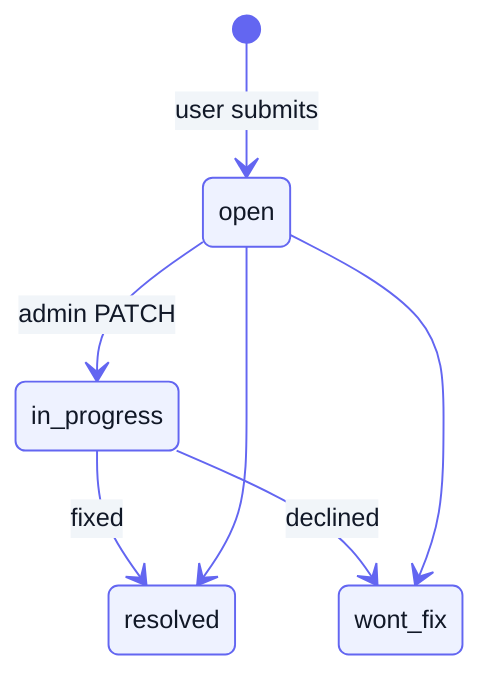
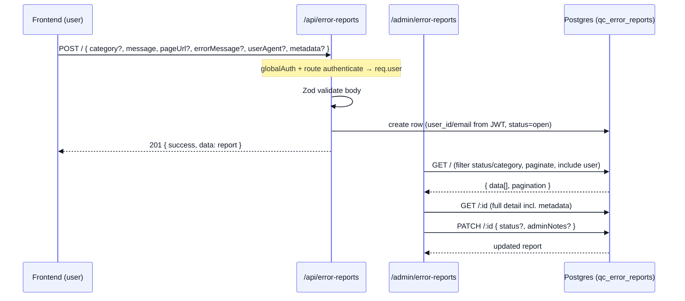

[Docs](../README.md) · [Subsystems](../README.md#subsystems) · Error Reporting

# Error Reporting

A lightweight in-app feedback channel: any signed-in user can submit a "Report Error" form from the frontend, the backend stores it verbatim (with the reporter's identity and free-form client context), and the single admin account triages it through an open → resolved lifecycle. There is no queue, no email, and no LLM — just a durable `qc_error_reports` table with a paginated admin surface on top.

## Purpose

- Let an authenticated user report a bug, data issue, or UX problem in one POST, capturing their own description plus optional client-side context (page URL, exception text, user agent, arbitrary metadata).
- Persist each report immutably with the reporter's `user_id` / `user_email` resolved from their JWT.
- Give the admin a filterable, paginated triage list plus per-report detail.
- Let the admin move a report through a status lifecycle and attach private admin notes.

## Key files

| Concern | File |
|---------|------|
| Public submit route (`/api/error-reports`) | [`routes/errorReports.routes.js`](../../routes/errorReports.routes.js) |
| Submit handler | [`controllers/errorReport.controller.js`](../../controllers/errorReport.controller.js) |
| Business logic + category/status constants | [`services/errorReport.service.js`](../../services/errorReport.service.js) |
| Admin triage routes (`/admin/error-reports`) | [`routes/admin.errorReports.routes.js`](../../routes/admin.errorReports.routes.js) |
| Admin triage handlers | [`controllers/admin.errorReports.controller.js`](../../controllers/admin.errorReports.controller.js) |
| Admin router mount (`authenticate` + `requireAdmin`) | [`routes/index.js`](../../routes/index.js) |
| Public router mount + global JWT gate | [`routes/index.js`](../../routes/index.js), [`middleware/globalAuth.js`](../../middleware/globalAuth.js) |

## Data model

One model, `ErrorReport` → table `qc_error_reports` ([`prisma/schema.prisma`](../../prisma/schema.prisma)):

| Field | Type | Notes |
|-------|------|-------|
| `id` | `String` (uuid) | Primary key |
| `category` | `ErrorReportCategory` | Defaults to `other` |
| `message` | `String` | Required — the user's own description of what went wrong |
| `page_url` | `String?` | Where the error happened (client-supplied) |
| `error_message` | `String?` | Client-captured exception message / stack, if any |
| `user_id` | `String?` | Reporter, resolved from the JWT `sub` claim |
| `user_email` | `String?` | Reporter email, resolved from the JWT `email` claim |
| `user_agent` | `String?` | Browser UA (client-supplied) |
| `metadata` | `Json?` | Free-form client context: viewport, app version, redux slice, etc. |
| `status` | `ErrorReportStatus` | Defaults to `open` |
| `admin_notes` | `String?` | Private triage notes, admin-only |
| `created_at` / `updated_at` | `DateTime` | `updated_at` maintained via `@updatedAt` |
| `user` | `User?` relation | `onDelete: SetNull` — deleting the user keeps the report, nulls `user_id` |

Indexed on `user_id`, `status`, `category`, and `created_at`.

**Enums.** `ErrorReportCategory`: `bug`, `data_issue`, `performance`, `ui_ux`, `login_auth`, `payment_billing`, `other`. `ErrorReportStatus`: `open`, `in_progress`, `resolved`, `wont_fix`. Both lists are re-exported from the service (`CATEGORIES`, `STATUSES`) so the Zod route schemas validate against exactly the enum values.

Status lifecycle (admin-driven, no automatic transitions):

## Flow

1. **Submit** — `POST /api/error-reports` → `createErrorReport`. The Zod schema requires `message` (1–5000 chars) and optionally accepts `category`, `pageUrl` (≤2048), `errorMessage` (≤10000), `userAgent` (≤1000), and `metadata` (any string-keyed object). The controller reads `user_id` / `user_email` **from the JWT** (`req.user.sub` / `req.user.email`), never from the body, and the service persists the row with empty optionals coerced to `null` (`metadata` left `undefined` so the DB default applies). Returns `201 { success: true, data: report }`.
2. **List** — `GET /admin/error-reports` → `listErrorReports`. Optional `status` / `category` filters (validated against the enums), `page` (default 1) and `size` (default 20, clamped 1–100). Orders by `created_at desc`, includes a trimmed `user` (`id`, `email`, `display_name`), and returns `{ data, pagination: { page, size, total, totalPages } }`.
3. **Detail** — `GET /admin/error-reports/:id` → `getErrorReport`. Returns the full row plus the joined reporter, or `404 "Error report not found"`.
4. **Triage** — `PATCH /admin/error-reports/:id` → `updateErrorReport`. Body accepts optional `status` (enum) and `adminNotes` (≤5000). It first re-fetches by id (throwing `404` if gone), then patches only the fields that were provided.

## Endpoints

| Method | Path | Auth | Purpose |
|--------|------|------|---------|
| `POST` | `/api/error-reports` | Bearer (JWT) | Submit an error report; reporter identity taken from the token |
| `GET` | `/admin/error-reports` | Admin | Paginated triage list, filterable by `status` / `category` |
| `GET` | `/admin/error-reports/:id` | Admin | Full report detail incl. `metadata` and reporter |
| `PATCH` | `/admin/error-reports/:id` | Admin | Update `status` and/or `adminNotes` |

> [!NOTE]
> The submit route is double-gated: the global `globalAuth` middleware already requires a valid JWT for `/api/error-reports` (it is **not** in the public allowlist in [`middleware/publicRoutes.js`](../../middleware/publicRoutes.js)), and the route also applies `authenticate` again. Both call the same middleware, so `req.user` is guaranteed. The `/admin/*` mount adds `requireAdmin` on top of `authenticate`, restricting triage to the single admin account.

## Gotchas

> [!IMPORTANT]
> **Reporter identity comes from the token, not the client.** Despite the schema comment describing `user_email` as "captured verbatim from client", the controller sets both `user_id` and `user_email` from the verified JWT (`req.user.sub` / `req.user.email`). The body has no `userId` / `userEmail` fields, so a client cannot spoof who filed the report. Because submission always requires a valid JWT, `user_id` is effectively never null on new rows.

- **No dedup.** Every POST creates a fresh row — rapid resubmits or a retry loop on the frontend will produce duplicates; the admin list has no grouping.
- **`metadata` is unvalidated shape.** It is `z.record(z.string(), z.unknown())` — any JSON object passes, so the admin detail view must treat it as untrusted free-form context.
- **`category` defaults twice.** Both the service (`category || 'other'`) and the Prisma column (`@default(other)`) default to `other`; an omitted or unknown-but-optional category lands as `other`.
- **Fire-and-forget.** Submitting sends no email/notification and enqueues no job — reports sit in the table until an admin polls the list. Contrast with invites, which email on create.
- **Deleting a user keeps their reports.** The `user` relation is `onDelete: SetNull`, so `user_id` is nulled but `user_email` (a plain string column) survives, preserving attribution for historical reports.
- **`admin_notes` is admin-only in practice.** There is no user-facing read endpoint, so notes and the triage `status` are never exposed back to the reporter.

## See also

- [../frontend/error-reporting-frontend-integration.md](../frontend/error-reporting-frontend-integration.md) — the "Report Error" form and submit contract on the client
- [../api-reference.md](../api-reference.md) — complete endpoint list
- [./auth-invites-google.md](./auth-invites-google.md) — the Bearer JWT and `requireAdmin` gating these routes
