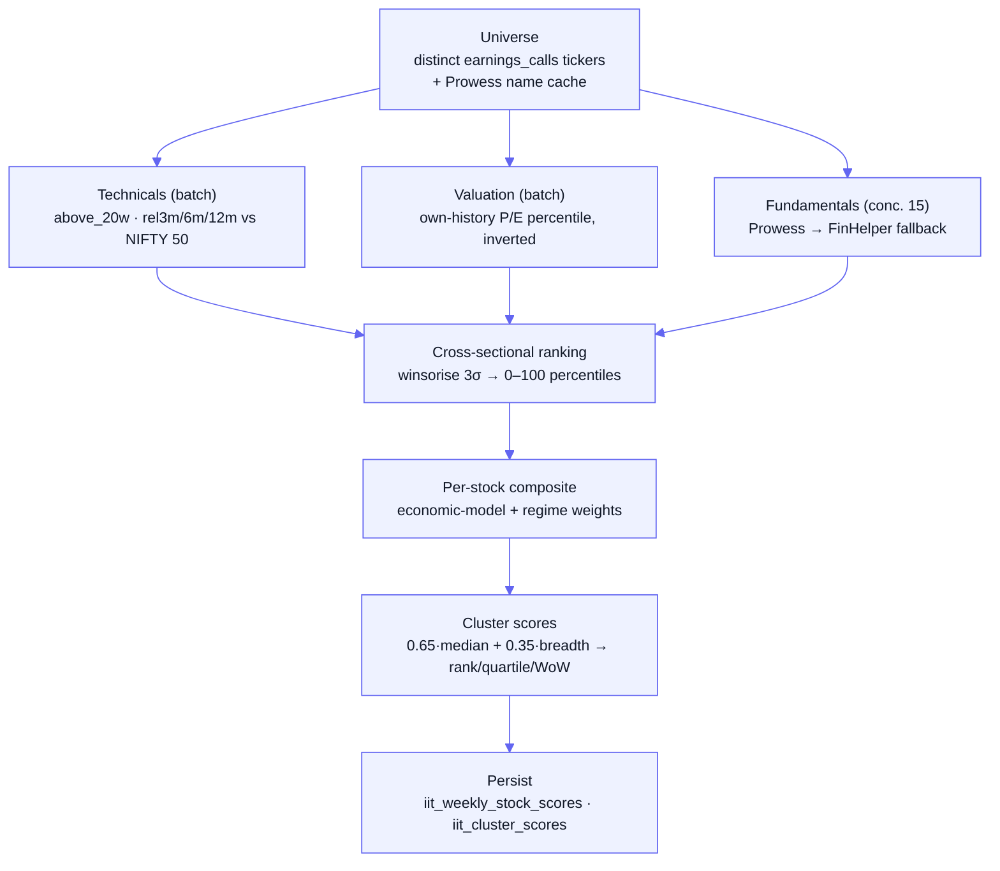

[Docs](../README.md) · [Subsystems](../README.md#subsystems) · Industry Intelligence

# Industry Intelligence (IIT)

The **Industry Intelligence Tracker** is a weekly, purely-quantitative scoring and ranking engine for the Indian equity universe. Each week it scores every covered stock across six factor dimensions (momentum, growth, profitability, balance sheet, breadth, valuation), aggregates those scores into **industry clusters** (NSE `basic_industry` groups), ranks the clusters, and tracks week-over-week rotation. The output feeds an industry-intelligence dashboard (`/api/industry-intelligence`) and a set of thematic industry baskets (`/api/industry-baskets`). It exists to answer "which industries are leading, which are rotating, and which stocks lead each industry" without any LLM in the hot path — all ranking is deterministic math over stored price and fundamental data.

## Contents

- [Purpose](#purpose)
- [Key files](#key-files)
- [Data model](#data-model)
- [How scoring works](#how-scoring-works)
- [Endpoints](#endpoints)
- [Gotchas](#gotchas)
- [See also](#see-also)

## Purpose

- Cross-sectionally rank the whole covered universe each week on momentum, growth, profitability, balance sheet, breadth and valuation, blended into one composite per stock.
- Weight factors by each stock's **economic model** (Capex / Consumption / Financial / Hybrid) and by the week's **market regime** (Risk-On / Neutral / Risk-Off), renormalised over only the factors that have data.
- Roll stock composites up into **cluster** (industry) scores, rank them, and attach WoW rank deltas, 3-week velocity, quartiles and score momentum.
- Detect rotation signals (ENTRY / EXIT / TRAP / emerging) from score and breadth alone — no LLM, no news.
- Serve a dashboard payload plus curated thematic baskets with BUY / WAIT / AVOID calls.

## Key files

| Concern | File |
|---------|------|
| Weekly pass orchestration | [`utils/industryIntelligence/index.js`](../../utils/industryIntelligence/index.js) |
| Universe selection + Prowess name cache | [`utils/industryIntelligence/universe.js`](../../utils/industryIntelligence/universe.js) |
| Technicals (20w-SMA breadth, relative returns) | [`utils/industryIntelligence/technicals.js`](../../utils/industryIntelligence/technicals.js) |
| Fundamentals (Prowess → FinHelper fallback) | [`utils/industryIntelligence/fundamentals.js`](../../utils/industryIntelligence/fundamentals.js) |
| Valuation (own-history P/E percentile) | [`utils/industryIntelligence/valuation.js`](../../utils/industryIntelligence/valuation.js) |
| Cross-sectional ranking + composite weights | [`utils/industryIntelligence/scoring.js`](../../utils/industryIntelligence/scoring.js) |
| Cluster aggregation, ranking, WoW deltas | [`utils/industryIntelligence/clusterScoring.js`](../../utils/industryIntelligence/clusterScoring.js) |
| Upsert persistence | [`utils/industryIntelligence/persist.js`](../../utils/industryIntelligence/persist.js) |
| Classification hierarchy + factor weights + regime deltas | [`config/iitClassification.json`](../../config/iitClassification.json) |
| BFSI classifier | [`utils/industryClassifier.js`](../../utils/industryClassifier.js) |
| Stock → NIFTY sector-index resolver | [`utils/sectorIndexMap.js`](../../utils/sectorIndexMap.js) |
| Dashboard controller / route | [`controllers/industryIntelligence.controller.js`](../../controllers/industryIntelligence.controller.js) · [`routes/industryIntelligence.routes.js`](../../routes/industryIntelligence.routes.js) |
| Industry baskets controller / route | [`controllers/industryBaskets.controller.js`](../../controllers/industryBaskets.controller.js) · [`routes/industryBaskets.routes.js`](../../routes/industryBaskets.routes.js) |
| On-demand CLI runner | [`scripts/runIitScoring.js`](../../scripts/runIitScoring.js) |
| Fundamentals LLM narrative worker (separate, not wired) | [`workers/fundamentalsIntelligence.js`](../../workers/fundamentalsIntelligence.js) · [`prompts/fundamentals_intelligence.js`](../../prompts/fundamentals_intelligence.js) |

## Data model

Two Prisma models, both keyed on the scoring `week_date` (a `DATE`, the Friday of the week). See [`prisma/schema.prisma`](../../prisma/schema.prisma) and [../data-model.md](../data-model.md).

| Model | Table | Holds |
|-------|-------|-------|
| `IitWeeklyStockScore` | `iit_weekly_stock_scores` | One row per `(week_date, ticker)`. The seven factor scores (`momentum_score`, `growth_score`, `profitability_score`, `balance_sheet_score`, `breadth_score`, `sentiment_score`, `valuation_score`), the blended `composite_score`, `economic_model`, `regime`, plus `factor_weights` (JSON, the renormalised weights actually used) and `data_flags` (JSON, missing-data markers). Unique `(week_date, ticker)`. |
| `IitClusterScore` | `iit_cluster_scores` | One row per `(week_date, basic_industry)`. `median_score`, `breadth_pct`, `composite_score`, `rank`, `rank_prev`, `wow_delta`, `velocity_3w`, `rank_trend`, `quartile`, `score_wow_delta`, `stock_count`, `scored_stock_count`, `regime`, `low_confidence`. Unique `(week_date, basic_industry)`. |

> [!NOTE]
> There are **no Prisma enums** here. `regime` (`Risk-On` / `Neutral` / `Risk-Off`), `economic_model` (`Capex` / `Consumption` / `Financial` / `Hybrid`) and `quartile` (`Q1`–`Q4`) are plain strings enforced only by convention and by [`config/iitClassification.json`](../../config/iitClassification.json). That JSON has three sections: `hierarchy` (141 `basic_industry` entries, each mapping to macro sector / sector / industry / `economic_model`), `factor_weights` (base weights per economic model), and `regime_adjustments` (additive per-factor deltas per regime).

## How scoring works

A run is triggered for one `weekDate` and `regime` and flows through eight stages in [`utils/industryIntelligence/index.js`](../../utils/industryIntelligence/index.js) `runIitScoring()`:

1. **Universe** — `loadUniverse()` returns the distinct `earnings_calls.company` where `basic_industry` is not null. `warmProwessCache()` fuzzy-matches each `company_name` to a `prowessValueNew.company` (≥ 0.5 word-overlap) so fundamentals can be fetched.
2. **Technicals** (single batch) — weekly bars are built from `nse_equity` daily closes; `above_20w` = latest close vs the 20-week SMA (1/0), and `rel3m/6m/12m` = the stock's 3/6/12-month return minus NIFTY 50's (`nse_index` where `sector = 'NIFTY 50'`).
3. **Valuation** (single batch) — for each ticker, the current P/E's percentile within its own 5-year `pe_data` history, **inverted** (`100 − percentile`) so cheaper = higher. Needs ≥ 4 valid points or the score is null. This is the one factor ranked against a stock's own history, not the cross-section.
4. **Fundamentals** (per ticker, concurrency 15) — `computeFundamentals()` pulls `REV_OP, PAT, ROCE, DE, CR, IC` time-series plus derived `EBIT_MARGIN, ROE, ROA` from `ProwessHelper`, falling back to `FinHelper` (`kpi_values`) when Prowess is empty or a specific metric is null. BFSI stocks (`economic_model === 'Financial'`, via the classification) skip current-ratio and interest-coverage.
5. **Cross-sectional ranking** — `buildRankMaps()` percentile-ranks every metric across the whole universe (winsorised at 3σ when ≥ 4 valid values). D/E is ranked inverted (lower = better); `above_20w` maps directly to 100/0 rather than being ranked.
6. **Per-stock composite** — `buildFactorScores()` averages the ranked sub-metrics into the seven factor scores (`sentiment_score` is always null — no analyst data), then `computeComposite()` applies the economic-model base weights plus the regime's additive deltas, **renormalised over only the factors that are present**.
7. **Cluster scores** — `computeClusterScores()` groups stocks by `basic_industry`; cluster composite = `0.65 × median(stock composites) + 0.35 × breadth_pct`, where breadth is the share of the cluster's stocks above their 20-week SMA. Clusters with fewer than 3 scored stocks (`MIN_CLUSTER_SZ`) are flagged `low_confidence` and get `rank = null`. `rankClusters()` sorts and assigns rank 1..N (median-momentum tie-break) and quartiles; `attachWoWDeltas()` reads the prior weeks (≤ 7d and ≤ 21d) to compute `wow_delta`, `velocity_3w`, `score_wow_delta` and the `rank_trend` arrow string.
8. **Persist** — `saveStockScores()` and `saveClusterScores()` upsert both tables inside a `$transaction`, keyed on the respective unique constraints.

The dashboard controller then reads the latest week back, derives **rotation signals** score-only (`ROTATION ENTRY` = velocity ≥ 5 & breadth ≥ 55; `ROTATION EXIT` = velocity ≤ −4 & breadth ≤ 35; `TRAP ALERT` = positive WoW but breadth < 35; emerging = `score_wow_delta` ≥ 15) and shapes the deep-dive / stock-ranking sections.

## Endpoints

All three routes are read-only and sit behind the global JWT gate ([`middleware/globalAuth.js`](../../middleware/globalAuth.js)) — they are **not** in the public allowlist and the routers add no extra middleware, so a valid Bearer token is required.

| Method | Path | Auth | Purpose |
|--------|------|------|---------|
| `GET` | `/api/industry-intelligence` | Bearer (global) | Full dashboard payload for the latest scored week. `?industry=<basic_industry>` fills `deep_dive.selected_industry`; `?cluster=<basic_industry>` fills `stock_ranking.selected_cluster`. Returns 404 if no IIT data exists yet. |
| `GET` | `/api/industry-baskets` | Bearer (global) | The 8 hard-coded thematic baskets, each enriched with the latest cluster metrics and a derived `BUY` / `WAIT` / `AVOID` signal (`deriveSignal`: BUY if composite ≥ 60 & velocity ≥ 0; AVOID if composite < 40 or velocity ≤ −4; else WAIT). |
| `GET` | `/api/industry-baskets/:basketId/stocks` | Bearer (global) | Paginated (`page`, `size`≤200, `sort`, `order`) constituent stock scores for one basket's `basic_industry` set. |

## Gotchas

> [!WARNING]
> **The scoring pass has no scheduler and no BullMQ queue — it is CLI-only.** `runIitScoring()` is invoked *only* by `node scripts/runIitScoring.js [YYYY-MM-DD] [Risk-On|Neutral|Risk-Off]`. Nothing in `scheduler.js` or `worker.js` runs it, so the dashboard is only as fresh as the last manual run. Both consuming endpoints resolve "latest week" with `iitClusterScore.findFirst({ orderBy: { week_date: 'desc' } })` and 404 when the table is empty.

> [!WARNING]
> **`workers/fundamentalsIntelligence.js` is NOT wired into `worker.js`.** The standing worker host requires eleven processors; this one is not among them. On `require` it constructs `new Worker('fundamentals_analysis', …)`, so the `fundamentals_analysis` queue has **no consumer** in the running system unless something else imports the module. It is also a *different feature* from IIT scoring: it calls an LLM to write a narrative into `AiInsight` (`type: 'fundamentals'`) and never touches the `iit_*` tables. Do not confuse it with [`utils/industryIntelligence/fundamentals.js`](../../utils/industryIntelligence/fundamentals.js), which is the numeric factor computation.

> [!IMPORTANT]
> **Regime is a manual input, not detected.** It is passed to `runIitScoring` (default `Neutral`) and stamped onto every row. The dashboard's `market_regime` tile just echoes the stored value; all regime-history fields (`regime_previous`, `regime_changed_weeks_ago`, "since" labels) are hard-coded `null` — there is no regime-history table.

> [!NOTE]
> **Universe is coupled to earnings-call coverage.** A ticker only enters scoring if it has an `earnings_calls` row with a non-null `basic_industry`. Fundamentals then depend on the fuzzy Prowess name match — a miss silently drops the fundamental factors and is recorded in `data_flags`, not raised as an error.

> [!NOTE]
> **`sentiment_score` is always null** (no analyst / sell-side feed), so its weight is renormalised away in the composite. Many dashboard fields — news tags, revisions, drivers, catalysts, narrative text — are hard-coded `null` placeholders marked `(static) LLM` in the controller, awaiting a future news/LLM layer.

> [!NOTE]
> **"Cluster" means `basic_industry`** throughout the code. The 8 industry baskets in [`controllers/industryBaskets.controller.js`](../../controllers/industryBaskets.controller.js) are a hard-coded list (not DB-driven) whose `industries` arrays must match `basic_industry` strings exactly — a typo yields an empty match and a `WAIT` signal. `utils/sectorIndexMap.js` and the BFSI classifier are supporting classification helpers used by the relative-strength and financials-vs-non-financials logic.

## See also

- [../pipeline.md](../pipeline.md) — the main L1/L2/L3 document pipeline (IIT is a separate, price/fundamentals-driven engine)
- [./screener-kpi-registry.md](./screener-kpi-registry.md) — the KPI / Prowess data the fundamentals leg draws on
- [../data-model.md](../data-model.md) — full `Iit*` and `earnings_calls` model reference
- [../api-reference.md](../api-reference.md) — complete endpoint list and auth matrix
- [../llm-integration.md](../llm-integration.md) — the LLM path used by the (separate) fundamentals-intelligence worker
