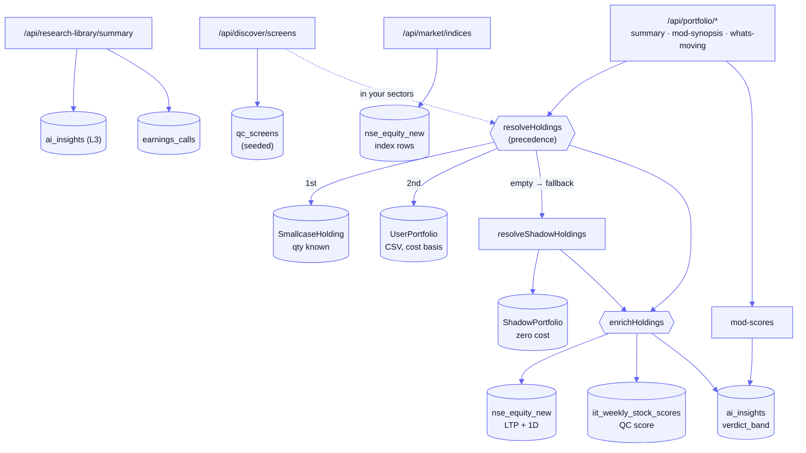

[Docs](../README.md) · [Subsystems](../README.md#subsystems) · Investor Dashboard & Portfolio

# Investor Dashboard & Portfolio

The read-only consumer surface of QuantCase: the **discover / research-library / market** dashboard cards plus the user's **portfolio** (uploaded book, smallcase-synced broker holdings, and a zero-cost shadow watchlist). Every panel is computed server-side from a single **holdings resolution** step so client and server always agree, then enriched at read time with live prices, IIT composite QC scores, and the L3 `ai_insights` MOD (Management / Opportunity / Deal) pillars. Nothing here writes to the pipeline — it is a projection over data other subsystems produce.

## Contents

- [Purpose](#purpose)
- [Key files](#key-files)
- [Data model](#data-model)
- [Dashboard surfaces](#dashboard-surfaces)
- [Endpoints](#endpoints)
- [Gotchas](#gotchas)
- [See also](#see-also)

## Purpose

- Serve the home dashboard cards: curated **discover** screens, a **research-library** counter, and a shared **market indices** ticker.
- Give a user one **portfolio** view across three holdings sources — smallcase-synced, first-party CSV upload, and shadow watchlist — under a single resolution precedence.
- Enrich every holding at read time with live LTP / 1-day move, the IIT composite QC score, and MOD verdicts, so stored cost-basis rows never masquerade as market value.
- Roll a whole book up into a book-weighted **mod-synopsis** and a personalised **what's-moving** feed that ties back to the L3 `ai_insights` (see [../pipeline.md](../pipeline.md)).
- Keep everything JWT-scoped to `req.user.sub`; there is no cross-user data on any route except the shared market indices.

## Key files

| Concern | File |
|---------|------|
| **Dashboard** — three mini-routers (`/api/discover`, `/api/research-library`, `/api/market`) | [`routes/dashboard.routes.js`](../../routes/dashboard.routes.js) |
| Dashboard HTTP handlers | [`controllers/dashboard.controller.js`](../../controllers/dashboard.controller.js) |
| Curated discover screens (reads `qc_screens`) | [`services/dashboard/discover-screens.service.js`](../../services/dashboard/discover-screens.service.js) |
| Research-library counters | [`services/dashboard/research-library.service.js`](../../services/dashboard/research-library.service.js) |
| NIFTY / SENSEX indices (cached 45s) | [`services/dashboard/market-indices.service.js`](../../services/dashboard/market-indices.service.js) |
| MOD pillar scores from L3 `ai_insights` | [`services/dashboard/mod-scores.js`](../../services/dashboard/mod-scores.js) |
| Book-weighted MOD synopsis | [`services/dashboard/mod-synopsis.service.js`](../../services/dashboard/mod-synopsis.service.js) |
| Top-line valuation + allocation | [`services/dashboard/holdings-summary.service.js`](../../services/dashboard/holdings-summary.service.js) |
| What's-moving feed (QC-score deltas + earnings) | [`services/dashboard/whats-moving.service.js`](../../services/dashboard/whats-moving.service.js) |
| **Holdings resolver** (smallcase → CSV precedence) | [`services/dashboard/resolve-holdings.service.js`](../../services/dashboard/resolve-holdings.service.js) |
| Shadow/tracker resolver (fallback source) | [`services/dashboard/resolve-shadow-holdings.service.js`](../../services/dashboard/resolve-shadow-holdings.service.js) |
| Symbol → name / industry / cap lookup | [`services/dashboard/identity.js`](../../services/dashboard/identity.js) |
| **Portfolio** routes (`/api/portfolio`, multer upload) | [`routes/portfolio.routes.js`](../../routes/portfolio.routes.js) |
| Portfolio HTTP handlers | [`controllers/portfolio.controller.js`](../../controllers/portfolio.controller.js) |
| Market enrichment (LTP, QC score, conviction, tags) | [`services/portfolio/market-data.service.js`](../../services/portfolio/market-data.service.js) |
| CSV/XLSX parse + atomic replace | [`services/portfolio/user-portfolio.service.js`](../../services/portfolio/user-portfolio.service.js) |
| Shadow portfolio + holdings CRUD | [`services/portfolio/shadow-portfolio.service.js`](../../services/portfolio/shadow-portfolio.service.js) |

> [!NOTE]
> Route mounting is asymmetric. The three dashboard cards mount at their own base paths in [`routes/index.js`](../../routes/index.js) (`/api/discover`, `/api/research-library`, `/api/market`), but `mod-synopsis`, `summary`, and `whats-moving` live under `/api/portfolio` even though their services sit in `services/dashboard/`. The `portfolio.controller` delegates those three to the dashboard services.

## Data model

Three Prisma models (see [`prisma/schema.prisma`](../../prisma/schema.prisma)); both portfolio containers are 1:1 with `User` (`user_id` unique) and cascade-delete their holdings.

| Model | Table | Holds |
|-------|-------|-------|
| `UserPortfolio` | `qc_user_portfolios` | First-party book — the target of CSV/XLSX upload. `user_id` (unique), `holdings[]` |
| `ShadowPortfolio` | `qc_shadow_portfolios` | Zero-cost watchlist ("trackers"). `user_id` (unique), `holdings[]` |
| `Holding` | `qc_holdings` | One row per position: `ticker`, `amount_invested` (Float, **cost basis only**), `invested_at`, plus a nullable `user_portfolio_id` **or** `shadow_portfolio_id` |

> [!IMPORTANT]
> `Holding` has **no share-quantity column** — only `amount_invested`. A holding belongs to exactly one of a `UserPortfolio` or a `ShadowPortfolio`. Smallcase broker holdings are **not** in this table — they live in `SmallcaseHolding` (`qc_smallcase_holdings`, quantity-bearing; see [./smallcase-gateway.md](./smallcase-gateway.md)) and are pulled through `prisma.smallcaseUser`.

**Where holdings come from**

| Source | Written by | Storage | Quantity? |
|--------|-----------|---------|-----------|
| CSV / XLSX upload | `POST /api/portfolio/user/upload` → `parsePortfolioBuffer` → `replaceUserPortfolio` (atomic delete-all + `createMany`) | `Holding` under `UserPortfolio` | No — cost basis only |
| smallcase broker sync | smallcase confirm / sync / webhook | `SmallcaseHolding` (separate) | Yes — exact |
| Shadow / watchlist | `POST /api/portfolio/shadow/add` (`amount_invested: 0`) | `Holding` under `ShadowPortfolio` | No — zero cost |

Read-time enrichment (`enrichHoldings`) joins three non-FK sources by ticker string: `nse_equity_new` (LTP + 1D move), `iit_weekly_stock_scores` (`composite_score` = QC score), and `ai_insights` (`verdict_band` → conviction `POSITIVE`/`NEUTRAL`/`WATCH`, and which of MANAGEMENT/OPPORTUNITY/DEAL exist → `thesis_tags`).

## Dashboard surfaces

| Surface | Endpoint | What it returns | Source |
|---------|----------|-----------------|--------|
| **Discover** | `GET /api/discover/screens` | Curated screener cards, each with NAMES / `QC SCORE >75` / IN YOUR SECTORS stats | Precomputed `qc_screens` + `qc_screen_tickers` (seeded by `prisma/seedScreens.js`); "in your sectors" intersects the screen's `basic_industry` with the user's held industries |
| **Research library** | `GET /api/research-library/summary` | `new_ic_notes`, `catalysts_next_30_days`, subtitle | `ai_insights` refreshed in last 7d + latest `earnings_calls` per held ticker (both documented proxies) |
| **Market** | `GET /api/market/indices` | NIFTY / SENSEX value + `change_pct` | `nse_equity_new` (index rows), shared across users, in-memory cached 45s |
| **MOD synopsis** | `GET /api/portfolio/mod-synopsis` | Book-weighted overall + per-pillar (management/opportunity/deal) score, weakest pillar, dragging symbols, per-holding breakdown | `mod-scores.js` → L3 `ai_insights` (`insight.score`, `verdict_band`) |
| **Holdings summary** | `GET /api/portfolio/summary` | `equity_value`, `invested_value`, today's change, 6m / YTD return, monthly `value_trend`, cap & industry allocation | `resolveHoldings` + market snapshots + monthly closes |
| **What's moving** | `GET /api/portfolio/whats-moving` | Feed of QC-score upgrades/downgrades + recent earnings for held symbols | Week-over-week delta in `iit_weekly_stock_scores` + `earnings_calls` |

The MOD **rating bands** (`mod-synopsis.service.js`): score `≥75` STRONG, `≥60` FAIR, `≥45` STRETCHED, else WEAK; `overall_score` is the mean of the three pillar scores. Book-weighting uses cost basis for a real book, but is forced **equal-weight** for shadow trackers (their `invested_value` is always 0).

## Endpoints

All routes require a QuantCase Bearer JWT (`authenticate`); every route is scoped to `req.user.sub`.

| Method | Path | Auth | Purpose |
|--------|------|------|---------|
| `GET` | `/api/discover/screens` | Bearer | Curated screener cards, personalised "in your sectors" stat |
| `GET` | `/api/research-library/summary` | Bearer | New IC-note + catalyst counters for the user's book |
| `GET` | `/api/market/indices` | Bearer | Shared NIFTY / SENSEX ticker (cached 45s) |
| `GET` | `/api/portfolio/user` | Bearer | First-party (uploaded) portfolio + enriched holdings |
| `POST` | `/api/portfolio/user/upload` | Bearer | Upload CSV/XLSX (multer, ≤10 MB) → replace book atomically |
| `GET` | `/api/portfolio/summary` | Bearer | Valuation + cap/industry allocation + value trend |
| `GET` | `/api/portfolio/mod-synopsis` | Bearer | Book-weighted Management/Opportunity/Deal scores |
| `GET` | `/api/portfolio/whats-moving` | Bearer | Movement feed (`?limit=`, default 10) |
| `GET` | `/api/portfolio/shadow` | Bearer | Shadow watchlist + live market data |
| `POST` | `/api/portfolio/shadow/add` | Bearer | Add a ticker to the shadow watchlist (`{ ticker }`) |
| `PATCH` | `/api/portfolio/holdings/:holdingId` | Bearer | Update a holding (ownership-checked) |
| `DELETE` | `/api/portfolio/holdings/:holdingId` | Bearer | Delete a holding (ownership-checked) |

> [!TIP]
> Holding **notes** are no longer here — they moved to the unified journal (`POST /api/journal/journals/:journalId/tickers/:ticker/entries`). See [./unified-journal.md](./unified-journal.md).

## Gotchas

- **Holdings precedence is fixed, not merged.** `resolveHoldings` returns smallcase holdings when the user `is_connected` **and** has ≥1 smallcase holding; otherwise it falls back to the first-party CSV portfolio. A user with both connected does **not** see a union — the CSV book is invisible while smallcase is live.
- **Shadow is a second-tier fallback, only for aggregates.** `summary`, `mod-synopsis`, and `whats-moving` fall back to shadow trackers **only when the invested portfolio is empty**, and flag it via `holdings_type: 'trackers'`. Trackers carry no cost basis, so those views switch to **equal-weighting** and null out value-based fields (`equity_value`, `today_change_value`, returns).
- **Stored cost basis is never market value.** Both `SmallcaseHolding.current_value` and `SmallcasePortfolio.total_value` sit at cost basis because smallcase's payload carries no price. Every dashboard read re-enriches through `enrichHoldings` and **recomputes totals** so the numbers are live, not what was paid.
- **First-party valuation is approximate.** With no share quantity, `current_value` is the cost basis grown by today's % move only; `value_trend` for a CSV book is an equal-weighted index of each holding's monthly close normalised to its cost basis — not a true mark. `source: 'firstparty'` in the payload signals this.
- **Missing-price holdings count at cost, not zero.** ETFs and recent listings absent from `nse_equity_new` contribute their invested value to totals (dropping them would understate P&L), but their per-row `current_value` stays `null` so the UI can flag them.
- **Discover is served offline, not live.** `getDiscoverScreens` reads precomputed `qc_screens` rather than running the live screeners (which cost ~40s+ over the full universe). Membership only refreshes when you re-run `prisma/seedScreens.js`.
- **Two proxy counters in research-library.** There is no per-user "last visit" tracking or forward earnings calendar, so `new_ic_notes` = AI insights refreshed in the last 7 days and `catalysts_next_30_days` = held tickers whose most recent call parses within 30 days (`call_date` is free-text `"MMM YYYY"`, parsed in JS).
- **What's-moving score history is a proxy.** There is no per-MOD score-history table, so upgrade/downgrade comes from the week-over-week `composite_score` delta in `iit_weekly_stock_scores`; `bestModTakeaway()` is a stub (returns `null`) since the bulk MOD query omits `insight.takeaway`.
- **Not subscription-gated.** These routes require only a valid JWT, not an active subscription.

## See also

- [./unified-journal.md](./unified-journal.md) — where holding notes moved; the Holdings journal that auto-populates from all holdings sources
- [./smallcase-gateway.md](./smallcase-gateway.md) — the broker-sync source of quantity-bearing `SmallcaseHolding` rows
- [./screener-kpi-registry.md](./screener-kpi-registry.md) — the KPI/screen universe behind discover cards and QC scores
- [../pipeline.md](../pipeline.md) — the L3 `ai_insights` (Management / Opportunity / Deal) the MOD scores read from
- [../api-reference.md](../api-reference.md) — complete endpoint list
