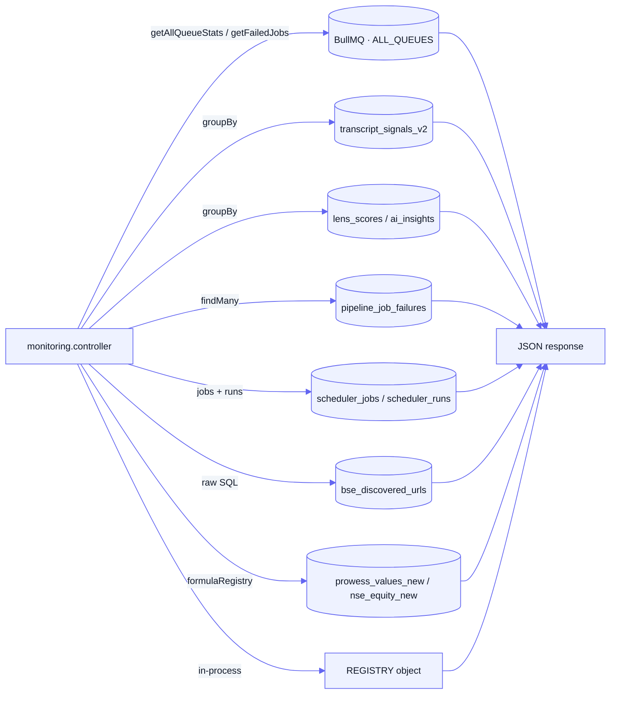

[Docs](../README.md) · [Subsystems](../README.md#subsystems) · Monitoring API

# Monitoring API

A read-only operational surface mounted at `/api/monitoring` that reports on the live state of the system — BullMQ queue depths, scheduler run history, three-layer pipeline coverage, terminal job failures, signal-store statistics, the in-process KPI registry, and market / OHLCV / PE data pulled straight from the market tables. Every route is a `GET` behind the global JWT gate; nothing here writes state. It exists to power admin and ops dashboards without giving them direct database or Redis access.

## Purpose

- Give ops dashboards one JSON API for queue health, scheduler runs, and pipeline coverage.
- Surface terminal pipeline failures (`pipeline_job_failures`) and per-queue recent failures for triage.
- Report L1/L2/L3 **coverage** and signal-store stats computed **live** (no cached rollup table).
- Expose ad-hoc KPI / market / OHLCV / PE lookups per ticker via the `formulaRegistry` fetchers.
- Read-only by design — it never enqueues, retries, or mutates. Retries live in `/admin/pipeline-jobs`.

## Key files

| Concern | File |
|---------|------|
| Routes (`/api/monitoring`) | [`routes/monitoring.routes.js`](../../routes/monitoring.routes.js) |
| HTTP handlers (all 15 endpoints) | [`controllers/monitoring.controller.js`](../../controllers/monitoring.controller.js) |
| Queue polling + `ALL_QUEUES` list | [`services/monitoring.service.js`](../../services/monitoring.service.js) |
| BullMQ queue singleton | [`lib/jobQueue.js`](../../lib/jobQueue.js) |
| KPI / market / timeseries fetchers + `REGISTRY` | [`utils/formulaRegistry/`](../../utils/formulaRegistry/) |
| Route mount (`/api/monitoring`) | [`routes/index.js`](../../routes/index.js) |
| Global auth gate | [`middleware/globalAuth.js`](../../middleware/globalAuth.js) |

## What it reads

The controller has two data backends: **BullMQ** (via `services/monitoring.service.js`) and **Postgres** (via Prisma / raw SQL and the `formulaRegistry` fetchers). It owns no tables of its own.

**BullMQ queues** — `getQueueStats` / `getAllQueueStats` / `getFailedJobs` poll `ALL_QUEUES` in [`services/monitoring.service.js`](../../services/monitoring.service.js):

`summarization_v2`, `summarization_v2_ppt`, `summarization_v2_annual_report`, `html_skill`, `html_skill_preview`, `ai_insight_synthesis`, `overview_synthesis`, `lens_computation`, `technicals_analysis`, `fundamentals_analysis`, `wealthos_suggestion`, `wealthos_message`.

**Postgres tables** (all reads, never writes):

| Concern | Model / table | How |
|---------|---------------|-----|
| Pipeline coverage L1 | `TranscriptSignalV2` / `transcript_signals_v2` | `groupBy(ticker)` filtered by `source_doc_type`, `is_invalidated:false` |
| Pipeline coverage L2 | `LensScore` / `lens_scores` | `groupBy(ticker)` |
| Pipeline coverage L3 | `AiInsight` / `ai_insights` | `groupBy(ticker)` |
| Terminal failures | `PipelineJobFailure` / `pipeline_job_failures` | `findMany` ordered by `failed_at` desc |
| Signal stats | `TranscriptSignalV2` / `transcript_signals_v2` | `groupBy(signal_type)` + `groupBy(source_doc_type)` |
| Scheduler runs | `SchedulerJob` + `SchedulerRun` | jobs + latest run each, `next_run` via `cron-parser` (`Asia/Kolkata`) |
| BSE discovery | `bse_discovered_urls` | raw `$queryRaw` (written by the Server-2 scraper) |
| KPI maps | `prowess_values_new` | `fetchKpiMaps` raw SQL (`call_id LIKE prowess_new_%` / `prowess_qtr_%`) |
| KPI timeseries | `ProwessValueNew` / `prowess_values_new` | `fetchTimeSeries` |
| Market snapshot / OHLCV / PE | `nse_equity_new` | `fetchMarketSnapshot` / `fetchOhlcvBars` / `fetchPeTimeSeries` |

## Endpoints

All under `/api/monitoring`, all `GET`, all gated by the global JWT (`middleware/globalAuth.js`) — a valid Bearer token, **not** admin-only.

| Method | Path | Purpose | Auth |
|--------|------|---------|------|
| `GET` | `/overview` | Dashboard rollup: queue totals, per-scheduler-job last run, L1/L2/L3 company counts | JWT |
| `GET` | `/queues` | Per-queue counts for all `ALL_QUEUES` + summed `waiting/active/failed/delayed` totals | JWT |
| `GET` | `/queues/:name` | One queue's counts + last 20 failed jobs; `404` if `:name` ∉ `ALL_QUEUES` | JWT |
| `GET` | `/scheduler` | All `SchedulerJob`s with latest run and computed `next_run` (cron-parser, IST) | JWT |
| `GET` | `/pipeline/coverage` | Live company counts per layer: L1 by `transcript`/`ppt`/`annual_report`, L2, L3 | JWT |
| `GET` | `/pipeline/failures` | Recent `pipeline_job_failures` (`?limit` default 50, max 200) | JWT |
| `GET` | `/signals/stats` | Signal-store totals grouped by `signal_type` and `source_doc_type` | JWT |
| `GET` | `/bse/discovered` | BSE-discovered URLs in the last `?days` (default 7, max 90) + doc-count stats | JWT |
| `GET` | `/bse/discovered/:scripCd` | Last 30 discovery rows for one BSE scrip code; `404` if none | JWT |
| `GET` | `/kpis/registry` | Registry KPI definitions (`id`, `name`, `unit`, `computationType`) | JWT |
| `GET` | `/kpis/:ticker` | Current + previous-period KPI maps (`?source=annual`\|`quarterly`) | JWT |
| `GET` | `/kpis/:ticker/:kpiAbbr/timeseries` | One KPI's time series from `prowess_values_new` | JWT |
| `GET` | `/market/:ticker` | Latest market snapshot (close, PE, EPS, mcap, volume) from `nse_equity_new` | JWT |
| `GET` | `/market/:ticker/ohlcv` | OHLCV bars (`?since`), plus ATH/ATL derived over 3 yrs | JWT |
| `GET` | `/market/:ticker/pe` | PE time series (`?months` window) | JWT |

## Gotchas

> [!WARNING]
> **`GET /kpis/registry` currently returns an empty list.** The controller destructures `REGISTRY` from `utils/formulaRegistry`, but that module exports no `REGISTRY` symbol (it exports `getRegistrySnapshot`, `getDefinition`, `TECHNICAL_REGISTRY`, …). `REGISTRY` is therefore `undefined`, and `Object.entries(REGISTRY ?? {})` yields `{ count: 0, entries: [] }`. Use `getRegistrySnapshot()` if you need the live definitions.

> [!NOTE]
> **Bull Board (`:9000`) is a separate dashboard.** This API is not the queue GUI — Bull Board runs as its own process (`lib/admin.js`) and is where you inspect / retry individual jobs. See the [job-queue runbook](../runbooks/JOB_QUEUE_GUIDE.md).

> [!IMPORTANT]
> **`fundamentals_analysis` is polled but has no running worker.** It is listed in `ALL_QUEUES`, so `/queues` and `/overview` report its depth, but `worker.js` does **not** require `workers/fundamentalsIntelligence.js` — jobs on that queue accumulate without being processed. Treat a non-zero `waiting` count there as expected, not a backlog to chase.

> [!TIP]
> **Coverage and stats are computed live.** `/pipeline/coverage`, `/signals/stats`, and `/overview` run `groupBy` aggregations against `transcript_signals_v2` / `lens_scores` / `ai_insights` on every call — there is no materialized rollup. They can be heavy on large tables; cache at the caller if you poll frequently.

> [!NOTE]
> **Not admin-gated.** Unlike `/admin/*`, these routes only require a valid JWT (any authenticated user), not `requireAdmin`. They are also absent from the public allowlist, so an anonymous request is rejected by the global gate.

- **`bse_discovered_urls` is cross-server.** Those rows are written by the Server-2 BSE scraper; this API only reads them via raw SQL. See [./bse-discovery.md](./bse-discovery.md).
- **`next_run` is best-effort.** It is derived from `cron_expression` with `cron-parser` inside a `try/catch`; a malformed expression yields `next_run: null`, not an error.
- **KPI / market tables are Prowess / NSE ingestion tables**, not pipeline outputs — coverage and KPI/market endpoints read entirely different data stores.

## See also

- [../runbooks/JOB_QUEUE_GUIDE.md](../runbooks/JOB_QUEUE_GUIDE.md) — BullMQ queues, Bull Board, and job retries
- [./scheduler.md](./scheduler.md) — the cron process behind `scheduler_jobs` / `scheduler_runs`
- [../pipeline.md](../pipeline.md) — the L1/L2/L3 layers whose coverage this API reports
- [../architecture.md](../architecture.md) — the four-process (API / worker / scheduler / admin) split
- [../api-reference.md](../api-reference.md) — complete endpoint list across the whole API
