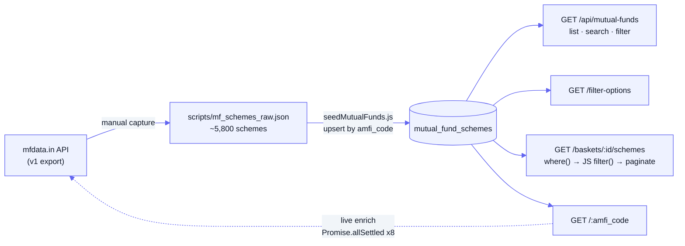

[Docs](../README.md) · [Subsystems](../README.md#subsystems) · Mutual Funds

# Mutual Funds

The Mutual Funds surface turns a snapshot of ~5,800 Indian MF schemes into a searchable, filterable catalogue plus a set of curated **baskets** (thematic screens). Bulk scheme data is seeded from a static [mfdata.in](https://mfdata.in) export into the `mutual_fund_schemes` table; list / filter / basket endpoints read straight from Postgres, while the single-scheme detail view fans out to the live mfdata.in API for NAV history, holdings, managers, and risk metrics.

## Purpose

- Serve a paginated, filterable list of MF schemes (search by name, filter by category / risk / rating / AMC / plan type).
- Expose distinct filter values for building dropdowns (`/filter-options`).
- Run curated **basket** screens (e.g. "Conservative Debt", "Five Star Rated") that combine a DB query with JS-level category matching.
- Provide a rich per-scheme detail view enriched live from mfdata.in (holdings, sectors, NAV history, fund managers, risk ratios).

## Key files

| Concern | File |
|---------|------|
| Routes (`/api/mutual-funds`) | [`routes/mutualFunds.routes.js`](../../routes/mutualFunds.routes.js) |
| List / filter-options / detail handlers | [`controllers/mutualFunds.controller.js`](../../controllers/mutualFunds.controller.js) |
| Basket definitions + screeners + handlers | [`controllers/mutualFundsBaskets.controller.js`](../../controllers/mutualFundsBaskets.controller.js) |
| DB queries + live mfdata.in enrichment | [`services/mutualFunds.service.js`](../../services/mutualFunds.service.js) |
| One-shot seeder (static JSON → DB) | [`scripts/seedMutualFunds.js`](../../scripts/seedMutualFunds.js) |
| Static scheme export (~5,800 rows) | [`scripts/mf_schemes_raw.json`](../../scripts/mf_schemes_raw.json) |
| Model | [`prisma/schema.prisma`](../../prisma/schema.prisma) (`MutualFundScheme`) |

## Data model

One Prisma model backs the whole surface. **Baskets are not persisted** — they are a hard-coded array in the controller.

`MutualFundScheme` → table **`mutual_fund_schemes`** (see [../data-model.md](../data-model.md)):

| Field | Type | Notes |
|-------|------|-------|
| `amfi_code` | `String` **@id** | AMFI scheme code — primary key, used everywhere as the string identifier |
| `name` | `String` | Scheme name; substring-searched by `?q=` |
| `isin`, `plan_type`, `option_type` | `String?` | `plan_type` is `direct` / `regular` (lowercase in data) |
| `category` | `String?` | e.g. `Large-Cap`, `Flexi Cap`, `Liquid`; **indexed** |
| `risk_label` | `String?` | e.g. `Very High Risk`, `Low to Moderate Risk` |
| `morningstar` | `Int?` | Star rating 1–5 |
| `expense_ratio`, `aum` | `Float?` | **`aum` is raw rupees** (e.g. `2133943400000`), not crore |
| `nav`, `nav_date`, `day_change`, `day_change_pct` | `Float?`/`String?` | Snapshot NAV fields |
| `family_name`, `family_id` | `String?`/`Int?` | mfdata.in family id — drives live family API calls; **indexed** |
| `amc_name`, `amc_slug` | `String?` | AMC (fund house); `amc_slug` **indexed** |
| `returns_1y` / `returns_3y` / `returns_5y` | `Float?` | Present in schema, **not populated by the seeder** (see Gotchas) |
| `created_at` / `updated_at` | `DateTime` | |

**Basket definitions** live entirely in code: a `BASKETS` array (id, title, description, `conditions`, display `columns`, a frontend `filter_params` hint) plus a parallel `SCREENERS` map keyed by basket id. Each screener is `{ where(), filter(s) }` — a Prisma `where` clause plus a JS predicate for LIKE-style category matching. 13 baskets are grouped into 5 categories (Investor Fit, Performance & Consistency, Risk & Cost Efficiency, Portfolio Construction, Track Record & Validation).

## Data source & ingestion

> [!NOTE]
> Bulk catalogue data is **not fetched live**. It is a static snapshot committed to the repo and loaded by a one-shot seeder. There is no scheduler job or in-repo generator that refreshes `mf_schemes_raw.json`.

- **Source**: [mfdata.in](https://mfdata.in) — its `v1` REST API (`MF_BASE = https://mfdata.in/api/v1`). The bulk export was captured into [`scripts/mf_schemes_raw.json`](../../scripts/mf_schemes_raw.json) (~5,800 schemes; NAV dates in the file reflect the capture day).
- **Seeder**: [`scripts/seedMutualFunds.js`](../../scripts/seedMutualFunds.js) reads that JSON and `upsert`s each scheme keyed by `amfi_code`, in batches of 20 (`Promise.all` per batch). Re-running it is idempotent — existing rows are updated, new ones created.
- **Live enrichment (detail only)**: `getSchemeDetails` calls mfdata.in at request time via `https.get`, running up to **8 endpoints in parallel** with `Promise.allSettled`:
  - `schemes/:amfi_code` and `schemes/:amfi_code/nav/history?period=5y&group_by=monthly` (by AMFI code)
  - `families/:family_id/{holdings, sectors, holdings/history, people, performance, risk-detail}` (only when `family_id` is set)
  - Failed calls degrade gracefully — scalar fields fall back to the DB snapshot (`detail?.x ?? scheme.x`); array sections resolve to `null`.

## Screening & baskets

A basket screen is a **two-stage filter**: a DB query (`screener.where()`) narrows on numeric / exact fields (aum, morningstar, plan_type, expense_ratio), then a JS predicate (`screener.filter`) applies substring category / risk matching that Prisma can't express cleanly. Pagination is applied **in JS after** the filter, so `total` reflects the filtered count.

`getMFBasketSchemes` sorting: `sort` is validated against `ALLOWED_SORT = {aum, expense_ratio, morningstar, nav, nav_date, name}` (defaults to `aum`), `order` is `asc`/`desc` (default `desc`), `size` is capped at 200.

## Endpoints

All under `/api/mutual-funds` ([`routes/mutualFunds.routes.js`](../../routes/mutualFunds.routes.js)). The whole surface is behind the **global auth gate** — a valid Bearer JWT is required on every route; none of these paths are in the public allowlist. No subscription gating.

| Method | Path | Auth | Purpose |
|--------|------|------|---------|
| `GET` | `/` | Bearer | List / search / filter schemes — `?page&size&q&category&risk&rating&amc_slug&plan_type&sort&order` |
| `GET` | `/filter-options` | Bearer | Distinct `categories`, `risks` (severity-sorted), `amcs` (slug+name), `plan_types` for dropdowns |
| `GET` | `/baskets` | Bearer | All basket definitions (metadata only, no scheme data) — flat `baskets[]` + `grouped` by category |
| `GET` | `/baskets/:basketId/schemes` | Bearer | Run a basket screen — `?page&size&sort&order`; returns basket meta + pagination + `schemes[]` |
| `GET` | `/:amfi_code` | Bearer | Single-scheme detail, enriched live from mfdata.in (holdings, sectors, NAV history, managers, risk) |

> [!IMPORTANT]
> The two `/baskets…` routes are declared **before** `/:amfi_code` on purpose. `/:amfi_code` is a catch-all param — if it came first it would shadow `baskets` and treat it as an AMFI code.

`?category` and `?risk` on the list endpoint accept **comma-separated** multi-values (mapped to Prisma `{ in: [...] }`); `?rating` is a floor (`morningstar >= n`); `amc_slug` and `plan_type` are exact matches.

## Gotchas

> [!WARNING]
> **`returns_1y/3y/5y` are never seeded.** The columns exist and `getSchemeDetails` returns them, but `mf_schemes_raw.json` has no `returns_*` keys and `seedMutualFunds.js` doesn't set them — so after a fresh seed they are `null` until backfilled elsewhere.

- **`sort=returns_1y` is silently ignored.** The route comment advertises it, but `ALLOWED_SORT` in the service excludes `returns_*`, so any unknown sort key falls back to `aum` with no error.
- **Basket `filter_params` ≠ the actual screen.** `filter_params` is only a frontend hint (a list-endpoint querystring); the real screen is the `SCREENERS[id]` `where()`+`filter()`. The two can drift — treat `SCREENERS` as source of truth for what `/baskets/:id/schemes` returns.
- **Basket screens pull all candidates into memory.** `getMFBasketSchemes` does `findMany({ where })` with **no DB `take`**, then filters and paginates in JS. Loose `where` clauses (e.g. `direct-plan-advantage`) can load large result sets per request.
- **AUM thresholds use raw rupees.** Screeners multiply crore thresholds by `CR = 1e7` (e.g. `1000 * CR`), because `aum` is stored in rupees, not crore — easy to get wrong when adding a basket.
- **`plan_type` is case-sensitive.** Screeners hard-code `plan_type: 'direct'` (lowercase); the list endpoint also matches exactly, so `Direct` would return nothing.
- **`morningstar` null-handling differs by path.** The list endpoint sorts morningstar with explicit `nulls` placement; the basket screener sorts plainly — null ratings can order differently between the two.
- **`getMFBaskets` is not wrapped in `asyncHandler`.** It's a synchronous handler (unlike `getMFBasketSchemes`), so it can't rely on the async error funnel — fine today because it only reads in-memory constants.
- **Detail view depends on a third-party API.** `/:amfi_code` makes live mfdata.in calls on every request; if mfdata.in is slow or down, the array sections come back `null` and scalars fall back to the (possibly stale) DB snapshot.

## See also

- [../api-reference.md](../api-reference.md) — complete endpoint list
- [../data-model.md](../data-model.md) — full `MutualFundScheme` reference
- [./screener-kpi-registry.md](./screener-kpi-registry.md) — the equities screener (analogous filter/rank surface)
