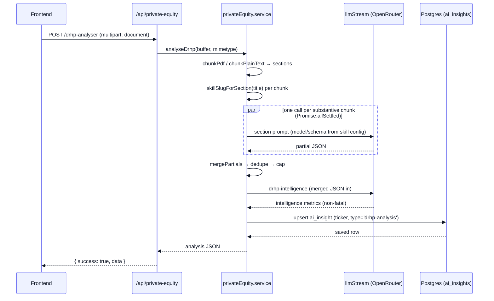

[Docs](../README.md) · [Subsystems](../README.md#subsystems) · Private Equity / DRHP

# Private Equity — DRHP Analyser

A synchronous LLM feature that turns an uploaded **DRHP** (Draft Red Herring Prospectus) PDF into a structured, forensic IPO analysis. The backend chunks the document by its bookmark outline, routes each section to the section-specific analyst skill, runs all section LLM calls in parallel, merges the partials into one JSON verdict, synthesises flat "intelligence" metrics, and persists the result. Unlike the L1/L2/L3 document pipeline, this runs **entirely inside the HTTP request** — no BullMQ queue is involved.

## Purpose

- Let a user upload one DRHP (PDF or plain text) and receive a complete IPO forensic analysis in a single response.
- Split the prospectus into meaningful sections (financials, legal/offer, company overview, general/risk) and analyse each with a purpose-built skill.
- Merge, deduplicate, and cap the per-section partials into one coherent verdict, then derive flat intelligence metrics from the merged whole.
- Persist each analysis so it can be listed/read back later without re-running the LLM.

## Key files

| Concern | File |
|---------|------|
| Routes + multer upload config (`/api/private-equity`) | [`routes/privateEquity.routes.js`](../../routes/privateEquity.routes.js) |
| HTTP handlers | [`controllers/privateEquity.controller.js`](../../controllers/privateEquity.controller.js) |
| Chunking, section→skill mapping, LLM calls, merge, persist | [`services/privateEquity.service.js`](../../services/privateEquity.service.js) |
| Section prompt builders (thin DB-template wrappers) | [`prompts/drhp_section_prompts.js`](../../prompts/drhp_section_prompts.js) |
| PDF outline chunker (pdfjs-dist) | [`utils/pdfChunker.js`](../../utils/pdfChunker.js) |
| Prompt-key → builder registry | [`lib/skillsRegistry.js`](../../lib/skillsRegistry.js) |
| Per-skill config loader (model/tokens/template/schema) | [`utils/skillConfig.js`](../../utils/skillConfig.js) |
| LLM choke point (`llmStream`) | [`utils/workerUtils.js`](../../utils/workerUtils.js) |
| Route mount | [`routes/index.js`](../../routes/index.js) (`/api/private-equity`) |

## Upload handling

The upload route uses **multer with in-memory storage** — the PDF is never written to disk; the raw bytes flow straight into `req.file.buffer` and on to the service.

| Setting | Value |
|---------|-------|
| Field name | `document` (single file — `upload.single('document')`) |
| Storage | `multer.memoryStorage()` (buffer in RAM) |
| Size limit | `50 * 1024 * 1024` → **50 MB** |
| Allowed MIME types | `application/pdf`, `text/plain` |
| Rejected upload | `fileFilter` calls back with `Unsupported file type: <mime>. Upload a PDF or plain-text file.` |
| Missing file | Controller returns `400` `No document file uploaded...` |

> [!NOTE]
> The controller passes only `buffer` and `mimetype` to the service. The MIME type is what selects the PDF path (outline chunking) vs. the plain-text path (character chunking) — the filename/extension is not inspected.

## Analysis flow

`analyseDrhp(fileBuffer, mimeType)` in the service is the whole pipeline. Steps:

1. **Chunk** — PDF (`application/pdf`) → `chunkPdf()` walks the bookmark **outline**, builds one chunk per top-level heading, merges any chunk shorter than 20 pages, and falls back to fixed 80-page chunks when there is no usable outline. Plain text → `chunkPlainText()` slices at **120,000 chars** per chunk. Each chunk is `{ title, startPage, endPage, text }`.
2. **Validate** — text under 100 chars, zero chunks, or all chunks under 200 chars each raise a `422` (likely a scanned/image-only PDF). Chunks under 200 chars are dropped as non-substantive.
3. **Route + call (parallel)** — every substantive chunk runs concurrently via `Promise.allSettled(analyseChunk)`. `analyseChunk` maps the chunk **title → skill slug** (`skillSlugForSection`, first keyword match wins, catch-all `drhp-section-general-risk`), loads that skill's config (cached per slug), resolves its prompt builder via `getPromptFn(promptKey)`, and calls **`llmStream`**. A chunk that throws is logged and skipped; siblings still complete. If *every* chunk fails → hard error.
4. **Merge → dedupe → cap** — partials are folded with `mergePartials` (arrays concatenate, objects merge recursively, scalars are last-write-wins), then `dedupeArraysInResult` removes duplicate array items by JSON fingerprint, then `capArraysInResult` truncates named arrays to the `ARRAY_CAPS` limits (e.g. `keyRisks` 4, `verdictBullets` 5).
5. **Intelligence synthesis** — the `drhp-intelligence` skill runs one more `llmStream` call, fed `JSON.stringify(mergedResult)`, and its parsed output is attached as `result.intelligence`. This step is wrapped in try/catch and is **non-fatal**.
6. **Persist** — the merged result is upserted into `ai_insights` and returned.

### Section → skill map

| Skill slug | Matches section titles containing (case-insensitive) |
|------------|------------------------------------------------------|
| `drhp-section-financials` | financial, restated, balance sheet, cash flow, capitalisation, dividend, indebtedness, management discussion, md&a, results of operation |
| `drhp-section-legal-offer` | legal, litigation, government approval, regulatory, statutory, group compan, offer information, terms/structure/procedure of the offer, equity shares, articles of association, declaration, material contract, other information |
| `drhp-section-company-overview` | introduction, the offer, summary of financial, general information, capital structure, objects of the offer, basis for offer price, industry overview, our business, key regulation, history, our management, principal shareholder, about our company |
| `drhp-section-general-risk` | **catch-all** (empty keyword list) — anything unmatched, e.g. risk factors, definitions |

> [!IMPORTANT]
> Every LLM call — the section skills **and** the intelligence pass — goes through the single choke point `llmStream(params)` in [`utils/workerUtils.js`](../../utils/workerUtils.js). No `{ vertex: true }` opt-in is passed, so DRHP analysis always routes through **OpenRouter** (never the Vertex L1 path). Model, `max_tokens`, prompt template, and `response_format` schema all come from each skill's DB row via `loadSkillConfig(slug)`.

### Persistence — no dedicated DRHP table

There is **no** DRHP-specific Prisma model. Results are stored in the shared L3 **`AiInsight`** model (`ai_insights` table) with `type = 'drhp-analysis'`, upserted on the `@@unique([ticker, type])` constraint. The ticker is pulled from `result.core.heroHeader.ticker`, falling back to `companyName`, then the literal `'UNKNOWN'`. A save failure is caught and logged; the service still returns the in-memory `result`.

## Endpoints

Both mounted under `/api/private-equity` and covered by the global Bearer-JWT gate (neither is on the public allowlist, and neither is admin-gated).

| Method | Path | Auth | Purpose |
|--------|------|------|---------|
| `POST` | `/api/private-equity/drhp-analyser` | Bearer JWT | Upload one DRHP (`document` field) and get the full analysis synchronously |
| `GET`  | `/api/private-equity/drhp-analyses` | Bearer JWT | List all `drhp-analysis` insights (newest first), or fetch one by `?id=<uuid>` |

`GET /drhp-analyses` with no `id` returns **every** `drhp-analysis` row ordered by `created_at desc` (no pagination). With `?id=` it does a `findUnique` and returns `404` if the row is missing or its `type` is not `drhp-analysis`.

## Gotchas

> [!WARNING]
> **Fully synchronous, unbounded fan-out.** The entire analysis runs inside the HTTP request with no queue. A large DRHP with a rich outline produces many sections, and all of them fire `llmStream` concurrently via `Promise.allSettled`. A single upload can spawn dozens of simultaneous OpenRouter calls and keep the request open for the length of the slowest section (plus the intelligence pass). Expect long-lived requests and watch upstream proxy/load-balancer timeouts.

- **Whole file lives in RAM.** `memoryStorage` holds the entire upload (up to 50 MB) in memory, and pdfjs parses it in memory on top of that. Concurrent uploads multiply the pressure — there is no streaming to disk.
- **`(ticker, type)` uniqueness overwrites.** Because storage keys on `(ticker, 'drhp-analysis')`, re-analysing the **same** company overwrites its previous analysis. Worse, any upload whose ticker resolves to `'UNKNOWN'` collides with every other `UNKNOWN` upload — each new one clobbers the last.
- **Scanned/image-only PDFs fail.** There is no OCR. If pdfjs extracts under 200 chars from every chunk, the service throws `422` ("document may be image-only").
- **Partial-success is intentional.** A section whose LLM call throws (rate limit, truncated output, bad JSON) is logged and dropped; the analysis proceeds with the remaining sections. Only an all-sections-failed case aborts. The merged JSON can therefore be missing whole sections silently.
- **Section routing is keyword-only.** `skillSlugForSection` matches the chunk **title** (bookmark text) against fixed keyword lists — first match wins. When the outline is missing, fallback chunk titles are `Pages N–M`, which match nothing and all fall through to the catch-all `drhp-section-general-risk` skill.
- **Intelligence pass can be absent.** If `drhp-intelligence` fails, the analysis still returns — just without the `intelligence` block. Don't assume it is always present.
- **Stale comment in prompts file.** `prompts/drhp_section_prompts.js` claims "the service currently only passes three" arguments; the service actually passes four (`text, title, template, defaultInstructions`). The `defaultInstructions` substitution does work.

## See also

- [../llm-integration.md](../llm-integration.md) — `llmStream`, skill config, prompt/schema loading
- [../api-reference.md](../api-reference.md) — complete endpoint list and auth requirements
- [../pipeline.md](../pipeline.md) — the asynchronous L1/L2/L3 document pipeline this feature deliberately bypasses
- [../configuration.md](../configuration.md) — `OPENROUTER_API_KEY` and related LLM env vars
