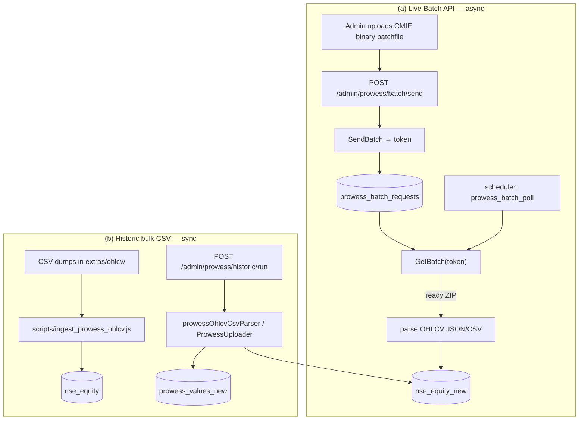

# Prowess (CMIE) Ingestion

Ingests financial data from **CMIE Prowess** — daily stock OHLCV/valuation and quarterly/annual company financials (KPIs). Two independent ingestion paths feed two destination tables: price data lands in `nse_equity_new`, and filing KPIs land in `prowess_values_new`.

## The two paths at a glance



## Key files

| File | Role |
|------|------|
| [`lib/prowess.js`](../../lib/prowess.js) | Loads `osc_identity.csv` (name↔symbol, industry) + fundamental/shareholding OSC sheets; the shared symbol-resolution layer |
| [`services/prowess/prowessBatchApiClient.js`](../../services/prowess/prowessBatchApiClient.js) | Low-level CMIE Batch API client: `sendBatch` / `getBatch` / `abortAll` / `getReport` (multipart form-data) |
| [`services/prowess/prowessBatchOrchestrator.service.js`](../../services/prowess/prowessBatchOrchestrator.service.js) | `sendBatchAndTrack` + `pollAndResolve` — the single place "what happens when a batch resolves" lives |
| [`services/prowess/prowessBatchRequests.service.js`](../../services/prowess/prowessBatchRequests.service.js) | Pure DB bookkeeping for the `ProwessBatchRequest` lifecycle |
| [`services/prowess/prowessOhlcvCsvParser.js`](../../services/prowess/prowessOhlcvCsvParser.js) | Parses the 6-row Prowess header (CSV **and** batch-API JSON) into OHLCV / valuation records |
| [`services/prowess/prowessOhlcvIngester.js`](../../services/prowess/prowessOhlcvIngester.js) | Upserts price rows into **`nse_equity_new`** |
| [`services/prowess/prowessFilingsIngester.js`](../../services/prowess/prowessFilingsIngester.js) | Upserts KPI filing rows into **`prowess_values_new`** |
| [`services/prowess/prowessApiClient.js`](../../services/prowess/prowessApiClient.js) | **STUB** REST client (`fetchOhlcv` / `fetchQuarterlyFilings` / `fetchAnnualFilings`) — throws "not implemented" |
| [`services/prowessHistoric.service.js`](../../services/prowessHistoric.service.js) | Admin CSV-upload preview/run wrapper (daily / index / annual / quarterly) |
| [`scripts/ingest_prowess_ohlcv.js`](../../scripts/ingest_prowess_ohlcv.js) | Standalone bulk historic OHLCV loader (reads `extras/ohlcv/`) |
| [`scheduler/handlers/prowessBatchPoll.js`](../../scheduler/handlers/prowessBatchPoll.js) | Polls GetBatch for every pending batch each tick |
| [`scheduler/handlers/prowessOhlcv.js`](../../scheduler/handlers/prowessOhlcv.js) · [`prowessFilings.js`](../../scheduler/handlers/prowessFilings.js) | Cron handlers that call the **stub** REST client (inactive) |

## Prisma models

| Model | Table | Notes |
|-------|-------|-------|
| `nse_equity_new` | `nse_equity_new` | Daily price/valuation. PK `(symbol, datetime)`; cols `open/high/low/close/volume/pe/eps/market_cap_cr/pct_change/company_name`. ~1.2M pre-existing rows |
| `nse_equity` | `nse_equity` | **Deprecated** predecessor (autoincrement PK, no `eps`/`company_name`). The standalone script still writes here |
| `ProwessValueNew` | `prowess_values_new` | KPI values. Unique `(call_id, kpi_abbr)`; FK `kpi_abbr → Kpi.abbr`; `source_type` default `'C'` (CMIE) |
| `prowess_kpi_values` | `prowess_kpi_values` | **Deprecated** intermediate import table, superseded by `prowess_values_new` |
| `ProwessBatchRequest` | `prowess_batch_requests` | Tracks the SendBatch→GetBatch lifecycle: `token`, `mode`, `status`, `requestMeta`, `result`, `error` |
| `Kpi` | `kpis`* | KPI registry; `prowess_name` resolves raw CSV/API column names to a KPI without a code deploy |

*See [screener & KPI registry](./screener-kpi-registry.md) for the `Kpi` model.

## Environment & secrets

| Var | Purpose |
|-----|---------|
| `PROWESS_API_KEY` | API key sent as the `apikey` form field on every Batch API call. Missing ⇒ client throws before any HTTP |
| `PROWESS_API_BASE_URL` | Batch API base, default `https://prowess.cmie.com/api` |

Read in [`config/env.js`](../../config/env.js) as `env.prowessApiKey` / `env.prowessApiBaseUrl`. No secret is needed for the historic-CSV path (files are supplied directly).

Symbol resolution uses [`lib/osc_identity.csv`](../../lib/osc_identity.csv) (`Company Name` → `NSE symbol`), **not** an env value.

---

## Path (a) — Live Batch API (async SendBatch → GetBatch)

CMIE's Batch API is asynchronous. The admin uploads a **proprietary CMIE binary batch file** (built with Prowess's own tooling — QuantCase never constructs it) and QuantCase relays it as-is.

1. `POST /admin/prowess/batch/send` (multipart: `batchfile`, `mode`, `note?`) → `sendBatchAndTrack` calls `sendBatch`. For `mode: 'daily'` it requests `format=json` (meta/head/data, far more reliably parseable than CMIE's default pipe-delimited `.txt`).
2. SendBatch returns `{ errcode, errdesc, token }`. A row is written to `prowess_batch_requests` (`status: pending`). **SendBatch is expensive and never auto-retried** — that's why the token is persisted rather than kept in memory.
3. The scheduler job `prowess_batch_poll` (`pollAndResolve`) runs each tick over every `pending` row:
   - GetBatch is **Content-Type gated**: `application/json` ⇒ still processing (`errcode 0` status messages like `IN_QUEUE`/`PROCESSING`), any other type ⇒ the raw result **ZIP**.
   - A resolved ZIP is checked for a `TOKEN.err` entry first — CMIE reports query-level failures as a normal 200 ZIP containing an `.err` file, **not** a GetBatch error → `markFailed`.
   - `mode: 'daily'` ZIPs are parsed (`.json`/`.csv` entries) and upserted into `nse_equity_new`, then `markCompleted` with a per-file summary.
   - `annual`/`quarterly` (or any other mode) ZIPs are **captured but not auto-ingested** — the file list is stored in `result`, `ingested: false`. That parse path was never format-confirmed against a real response.

The batch table is deliberately **not BullMQ**: it just needs to survive a restart and be readable from both the API server and the scheduler process ([scheduler](./scheduler.md)).

### Admin batch endpoints (`/admin/prowess/batch`)
| Method & path | Purpose |
|---------------|---------|
| `POST /send` | Submit a batchfile (`mode` ∈ `daily`/`annual`/`quarterly`) |
| `POST /:token/check` | On-demand poll (don't wait for the scheduler tick) |
| `GET /:token` | Current DB state of one batch |
| `GET /?status=pending` | List batches, newest first |
| `POST /abort-all` | `AbortAll` on CMIE + mark every pending row `aborted` |

### Coverage preview (`/admin/prowess/coverage`)
`GET /options` and `POST /preview` (in [`admin.prowessCoverage.controller.js`](../../controllers/admin.prowessCoverage.controller.js)) report which tickers/KPIs already have data, mirroring the L1/L2 `groupSlug | tickers | all` selector — used to decide what to request before spending a SendBatch.

---

## Path (b) — Historic bulk CSV

For back-loading years of price/KPI history from Prowess CSV exports.

**Standalone script** — [`scripts/ingest_prowess_ohlcv.js`](../../scripts/ingest_prowess_ohlcv.js):
```bash
node scripts/ingest_prowess_ohlcv.js                 # dry run (parse only)
node scripts/ingest_prowess_ohlcv.js --dispatch      # ingest all files in extras/ohlcv/
node scripts/ingest_prowess_ohlcv.js --dispatch --file osc_sheet_63.csv
```
- Reads `OHLCV_DIR = extras/ohlcv/` (**recently moved from `docs/ohlcv/`**).
- Auto-detects two formats from the row-6 field names: **OHLCV** (`INSERT … ON CONFLICT DO NOTHING`, price is authoritative) vs **valuation** (P/E + Enterprise value only, `ON CONFLICT DO UPDATE` to enrich existing rows).
- Resolves company name → NSE symbol via `osc_identity.csv`.
- **Writes to the legacy `nse_equity` table** (not `nse_equity_new`).

**Admin CSV upload** — [`prowessHistoric.service.js`](../../services/prowessHistoric.service.js), routes `/admin/prowess/historic/{preview,run}` (multipart, `mode` ∈ `annual`/`quarterly`/`daily`/`index`):
- `daily`/`index` → `nse_equity_new` via `prowessOhlcvCsvParser` / `prowessIndexCsvParser` + `prowessOhlcvIngester`.
- `annual`/`quarterly` → `prowess_values_new` via `prowess_mappers/ProwessUploader`. The preview report's `unmatchedColumns` tells the admin which CSV columns need a new `Kpi` + `prowess_name` before they'll ingest.
- `preview` parses/validates only; `run` actually inserts. Uploaded files are temp-only and deleted after processing.

### The 6-row Prowess header
Both CSV and batch-JSON share it: row 1 source (`CMIE Expr`), row 2 exchange (`NSE`), row 3 type, row 4 units, row 5 dates (repeated once per field), row 6 field names, row 7+ data (col 0 = company name for CSV; col 0 = company code, col 1 = name for batch JSON).

---

## Scheduling hooks

Registered in [`scheduler/executor.js`](../../scheduler/executor.js):

| `job_type` | Handler | Seeded? | State |
|------------|---------|---------|-------|
| `prowess_batch_poll` | `prowessBatchPoll` | **No** (not in `seedSchedulerJobs.js`) | The working live path — needs a `SchedulerJob` row created manually |
| `prowess_ohlcv` | `prowessOhlcv` | Yes | `is_active: false` — calls the **stub** REST client |
| `prowess_quarterly` / `prowess_annual` | `prowessFilings` | Yes | `is_active: false` — calls the **stub** REST client |

The three cron jobs seeded by [`scripts/seedSchedulerJobs.js`](../../scripts/seedSchedulerJobs.js) target the not-yet-implemented REST `prowessApiClient` and are inactive by design. See [scheduler](./scheduler.md) for the register/fire model.

## Gotchas

- **The REST `prowessApiClient` is a stub.** `fetchOhlcv`/`fetchQuarterlyFilings`/`fetchAnnualFilings` throw "not implemented — awaiting API credentials". Only the **Batch API** (SendBatch/GetBatch) and the **CSV** paths actually move data today.
- **Two OHLCV destinations.** The standalone script writes `nse_equity` (legacy); the service ingester + admin upload + batch-API path write `nse_equity_new`. Don't assume one table.
- **Historic service claims the batch API was "abandoned."** The docblock in `prowessHistoric.service.js` says CSV upload is now the only ingestion route, yet the batch-API code and its admin endpoints are still present and functional. Treat CSV upload as the primary supported path; the batch flow is retained but lightly used.
- **Byte-identical duplicate CSV.** `extras/ohlcv/` contains both `osc_sheet_60.csv` and `osc_sheet_60 (1).csv` (both 3,068,196 bytes). The standalone script hard-codes a filter skipping `osc_sheet_60 (1).csv` so it isn't double-ingested — a fragile name-based guard (renaming the file re-exposes the duplicate). The admin single-file upload has no such guard.
- **`annual`/`quarterly` batches are not auto-parsed.** A resolved filings ZIP is only catalogued (`ingested: false`); ingest those via the CSV upload path instead.
- **KPI resolution needs `prowess_name`.** A Prowess column with no matching `Kpi.prowess_name` is reported as unmatched and dropped, not guessed.

## See also

- [Scheduler](./scheduler.md) — how `prowess_batch_poll` and the cron jobs fire
- [Screener & KPI registry](./screener-kpi-registry.md) — the `Kpi` model and `prowess_name` mapping
- [Data model](../data-model.md) — `nse_equity_new`, `prowess_values_new`, `prowess_batch_requests`
- [Configuration](../configuration.md) — `PROWESS_*` env vars
- [Architecture](../architecture.md) — API server vs scheduler process split
