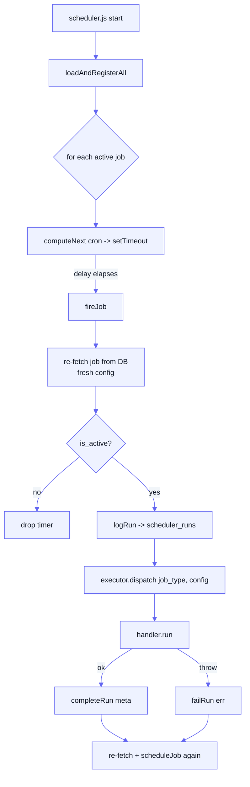

[Docs](../README.md) · [Subsystems](../README.md#subsystems) · Scheduler

# Scheduler

A standalone, DB-driven cron process (`scheduler.js`) — separate from the BullMQ
worker — that fires recurring pipeline jobs (BSE discovery, L1/L2/L3 dispatch,
Prowess ingestion) on cron schedules stored in Postgres and logs every run.

## At a glance

| | |
|---|---|
| Entry point | [`scheduler.js`](../../scheduler.js) (own process, run via `npm run scheduler`) |
| Internal HTTP | `SCHEDULER_BIND_HOST:SCHEDULER_PORT` (default `127.0.0.1:8001`, **unauthenticated**) |
| Timezone | `Asia/Kolkata` for every cron expression |
| Job registry | [`SchedulerJob`](../../prisma/schema.prisma) (`scheduler_jobs`) |
| Run log | [`SchedulerRun`](../../prisma/schema.prisma) (`scheduler_runs`) |
| Admin API | `/admin/scheduler-jobs` (CRUD + `/runs` + `/run`) |
| Seed | `npm run db:seed:scheduler` → [`scripts/seedSchedulerJobs.js`](../../scripts/seedSchedulerJobs.js) |

It is one of three processes in the deployment: `server.js` (API),
`worker.js` (BullMQ processors), and `scheduler.js`. See
[architecture](../architecture.md) for how they split across hosts. In the
two-server layout, the scheduler runs on Server 2 alongside the worker and Redis,
and dispatches work back to Server 1's API over HTTP (`API_URL`).

## Why a separate process (not BullMQ)

BullMQ handles *ad-hoc* async work enqueued by API requests. The scheduler
handles *time-driven* work: "every weekday at 09:30 IST, look for new documents
and enqueue L1 jobs." Rather than a polling loop, it uses a **startup-register**
pattern — each job is registered once as a `setTimeout` computed from its cron
expression, and self-reschedules after firing. No second-by-second polling.

Many handlers ultimately *feed* BullMQ: `pipeline_dispatch` POSTs to the API's
`summarize-v2` endpoints, which enqueue the actual L1 chunk jobs the worker runs.
The scheduler decides *when* and *what*; the worker does the heavy LLM work.

## Key files

| File | Role |
|------|------|
| [`scheduler.js`](../../scheduler.js) | Process entry; internal HTTP server; startup + graceful shutdown |
| [`scheduler/index.js`](../../scheduler/index.js) | Core timer engine: `loadAndRegisterAll`, `reregisterJob`, `fireJob`, `getStatus` |
| [`scheduler/executor.js`](../../scheduler/executor.js) | Maps `job_type` string → handler module (`dispatch()`) |
| [`scheduler/registry.js`](../../scheduler/registry.js) | Run bookkeeping: `logRun`, `completeRun`, `failRun`, `findRecentRun` |
| [`scheduler/handlers/*.js`](../../scheduler/handlers/) | One `run(config, jobType)` per job kind |
| [`controllers/admin.scheduler.controller.js`](../../controllers/admin.scheduler.controller.js) | Admin CRUD + `notifyScheduler(slug)` + manual trigger |
| [`routes/admin.routes.js`](../../routes/admin.routes.js) | Mounts `/admin/scheduler-jobs` routes |
| [`scripts/seedSchedulerJobs.js`](../../scripts/seedSchedulerJobs.js) | Seeds the canonical job rows |

## Data model

**`SchedulerJob`** (`scheduler_jobs`) — one row per recurring job.

| Field | Notes |
|-------|-------|
| `slug` | Unique human id (e.g. `bse-discovery`); used by all admin/HTTP endpoints |
| `job_type` | Routing key into `executor.js`'s handler map |
| `cron_expression` | Standard 5-field cron, parsed in `Asia/Kolkata` |
| `is_active` | Gates **cron auto-registration only** — manual triggers work regardless |
| `config` | JSON passed to the handler; re-read fresh from DB right before each fire |

**`SchedulerRun`** (`scheduler_runs`) — one row per execution.

| Field | Notes |
|-------|-------|
| `status` | `running` → `completed` \| `failed` |
| `started_at` / `ended_at` | Timestamps |
| `records_processed` | Pulled off the handler's return `meta.records_processed` |
| `error` | Failure message |
| `metadata` | Remaining keys of the handler's return (e.g. `queued`, `skipped`, `companies`) |

Both tables are created via raw SQL rather than `db:push` in some environments —
they are plain Prisma models, but treat migrations for them with care.

## Execution flow

Key behaviours:

- **Fresh config every fire** — `fireJob` re-reads the `SchedulerJob` from the DB
  immediately before running, so edits to `config` JSON take effect on the next
  fire without any re-registration.
- **Self-rescheduling** — after a run, the job re-fetches (to pick up a changed
  `cron_expression`) and schedules its next `setTimeout`. An `is_active:false`
  toggle observed at fire time simply drops the timer.
- **Invalid cron** is logged and skipped (no timer registered).

## Internal HTTP endpoints

Served by `scheduler.js` on `127.0.0.1:8001` (loopback by default).
**Unauthenticated** — keep it on localhost, or bind to a private IP and restrict
at the network layer (see the `SCHEDULER_BIND_HOST` comment in `scheduler.js`).

| Method + path | Purpose |
|---------------|---------|
| `POST /reload` | Re-register **all** active jobs (full reload) |
| `POST /reload/:slug` | Re-register (or cancel) one job after a cron/`is_active` change |
| `POST /trigger/:slug` | Fire a job **now**, regardless of `is_active`/cron; fire-and-forget, returns `run_id` |
| `GET /status` | Current in-memory timer state (`slug`, `jobId`, `nextFire`) |

The admin API talks to this server via `notifyScheduler(slug)` in
`admin.scheduler.controller.js`: whenever an admin PUT changes `cron_expression`
or `is_active`, it POSTs `/reload/:slug` so the change takes effect live. The
notify is best-effort — if the scheduler is unreachable, the DB is still updated
and the change lands on the next scheduler restart.

## Admin API

Mounted at `/admin/scheduler-jobs` (behind `authenticate` + `requireAdmin`).

| Method + path | Action |
|---------------|--------|
| `GET /admin/scheduler-jobs` | List (add `?includeInactive=true` for all) |
| `POST /admin/scheduler-jobs` | Create (requires `slug`, `name`, `job_type`, `cron_expression`) |
| `GET /admin/scheduler-jobs/:slug` | Fetch one |
| `PUT /admin/scheduler-jobs/:slug` | Update; re-notifies scheduler if schedule fields change |
| `DELETE /admin/scheduler-jobs/:slug` | **Soft** delete (sets `is_active:false`, cancels timer) |
| `GET /admin/scheduler-jobs/:slug/runs` | Recent `scheduler_runs` (`?limit`, max 100) |
| `POST /admin/scheduler-jobs/:slug/run` | Manual trigger; optional `{ config }` override merged over the stored config (never persisted) |

Manual trigger (`/run` and the internal `/trigger/:slug`) works even for
`is_active:false` jobs — this is exactly how the **manual-only** dispatch jobs
below are run on demand.

## Job types & handlers

`executor.js` maps `job_type` → handler. Each handler exports
`run(config, jobType)` and returns a `meta` object (with an optional
`records_processed`).

| `job_type` | Handler | What it does |
|------------|---------|--------------|
| `bse_discovery` | [`bseDiscovery.js`](../../scheduler/handlers/bseDiscovery.js) | Scrapes BSE, resolves URLs, upserts `bse_discovered_urls` / `bse_url_meta`. See [BSE discovery](./bse-discovery.md) |
| `pipeline_dispatch` | [`pipelineDispatch.js`](../../scheduler/handlers/pipelineDispatch.js) | Finds `earnings_calls`/`annual_reports` with a URL but no `transcript_signals_v2` rows, POSTs the API's `summarize-v2` endpoints to enqueue L1 |
| `pipeline_dispatch_l1_multi` | [`pipelineDispatchL1Multi.js`](../../scheduler/handlers/pipelineDispatchL1Multi.js) | Thin wrapper over `runL1MultiDispatch` — admin-triggered L1 for a chosen ticker set |
| `pipeline_dispatch_l2_multi` | [`pipelineDispatchL2Multi.js`](../../scheduler/handlers/pipelineDispatchL2Multi.js) | `runL2MultiDispatch` — html-incremental-skill dispatch, one run per ticker |
| `pipeline_dispatch_l3_multi` | [`pipelineDispatchL3Multi.js`](../../scheduler/handlers/pipelineDispatchL3Multi.js) | `runL3MultiDispatch` — post-html L3/L4 narrative dispatch per ticker |
| `prowess_batch_poll` | [`prowessBatchPoll.js`](../../scheduler/handlers/prowessBatchPoll.js) | Polls `GetBatch` for every pending `ProwessBatchRequest` |
| `prowess_daily_batch` | [`prowessDailyBatch.js`](../../scheduler/handlers/prowessDailyBatch.js) | Submits the checked-in `daily_ohlcv.bt` template via SendBatch (same call as `POST /admin/prowess/batch/daily/run`), then polls `GetBatch` in-process (15s interval, up to 8 min) and ingests once ready — all within this one job run. No separate poll cron; the admin frontend's per-batch refresh is the fallback if CMIE is slower than 8 min |
| `prowess_quarterly` / `prowess_annual` | [`prowessFilings.js`](../../scheduler/handlers/prowessFilings.js) | Fetches + upserts Prowess quarterly/annual filings (branches on `jobType`) |
| `prowess_ohlcv` | [`prowessOhlcv.js`](../../scheduler/handlers/prowessOhlcv.js) | Fetches + upserts daily OHLCV |

The multi-dispatch handlers delegate to
[`services/pipelineDispatch/`](../../services/pipelineDispatch/). The Prowess
handlers wrap [`services/prowess/`](../../services/prowess/) — see
[Prowess ingestion](./prowess-ingestion.md).

## Seeded jobs

`scripts/seedSchedulerJobs.js` upserts (skip-if-exists) the canonical set:

| Slug | `is_active` | Cron (IST) | Notes |
|------|-------------|-----------|-------|
| `pipeline-dispatch` | **true** | `30 9,18 * * 1-5` | 30 min after discovery; the one live cron job |
| `bse-discovery` | false | `0 9,18 * * 1-5` | Now admin-triggered (needs approval before URLs reach `earnings_calls`) |
| `prowess-daily-batch` | false | `0 16 * * 1-5` | Submits + resolves + ingests `daily_ohlcv.bt` in one run (see job type table above); admin toggles `is_active`/`cron_expression` via `/admin/scheduler-jobs/prowess-daily-batch` for manual↔auto and run time |
| `prowess-ohlcv-daily` | false | `0 16 * * 1-5` | Off until Prowess API wired |
| `prowess-quarterly-filings` | false | `0 6 * * *` | Off |
| `prowess-annual-filings` | false | `0 7 * * 0` | Off |
| `pipeline-dispatch-l1-multi` | false | placeholder | **Manual-only**, admin-triggered |
| `pipeline-dispatch-l2-multi` | false | placeholder | **Manual-only** |
| `pipeline-dispatch-l3-multi` | false | placeholder | **Manual-only** |

The `*-multi` jobs carry an inert placeholder cron (`0 0 1 1 *`) because
`is_active:false` means they are never cron-registered — they exist purely to be
fired via the admin trigger with a per-request `config` body.

## Company groups (ticker selection)

The L1/L2/L3 multi-dispatch flows target a set of tickers. Beyond an explicit
`tickers` array or the built-in `DEFAULT_TARGET_TICKERS`
([`services/pipelineDispatch/targetTickers.js`](../../services/pipelineDispatch/targetTickers.js)),
a run can pass `groupSlug` to resolve tickers from a reusable **`CompanyGroup`**
(`company_groups`). A group's `filter_type` is:

- `manual` — an explicit `{ tickers: [...] }` list.
- `dynamic` — resolved fresh each use from coverage / pending-extraction /
  market-cap / industry filters.
- `kpi_filter` — membership materialized into `company_group_members` via
  `POST /admin/company-groups/:slug/recompute` (AND-combined `KpiFilter`s).

Managed under `/admin/company-groups`. See the
[company groups admin guide](../admin-guides/company-groups-admin-guide.md) and
[L1 multi-dispatch admin guide](../admin-guides/pipeline-dispatch-l1-multi-admin-guide.md).

## Configuration

| Env var | Default | Used by |
|---------|---------|---------|
| `SCHEDULER_PORT` | `8001` | scheduler HTTP server + admin notify |
| `SCHEDULER_BIND_HOST` | `127.0.0.1` | interface the scheduler listens on |
| `SCHEDULER_HOST` | `127.0.0.1` | host the **admin API** notifies (set to scheduler's IP when split) |
| `API_URL` | `http://localhost:8000` | `pipelineDispatch` target for `summarize-v2` calls (set to Server 1 on split) |

See [configuration](../configuration.md) for the full env reference.

## Gotchas

- **Unauthenticated internal HTTP.** Anyone who can reach `:8001` can trigger any
  job. Keep it on loopback; if split across hosts, firewall it to the API host.
- **`is_active` only gates *cron*, not *manual*.** `false` jobs never
  auto-fire but can always be admin-triggered — by design for the `*-multi` jobs.
- **Config edits need no reload; schedule edits do.** `config` JSON is re-read
  every fire. `cron_expression`/`is_active` changes only go live if the scheduler
  gets the `/reload/:slug` notify (or on next restart).
- **`notifyScheduler` fails silently.** If the scheduler is down or
  `SCHEDULER_HOST`/`PORT` is wrong, the DB update still succeeds but the live
  timer won't change until the next scheduler start.
- **Delete is a soft delete.** `DELETE` sets `is_active:false`; the row stays.
- **Long triggers don't hold the request open.** `/trigger` and `/run` are
  fire-and-forget; poll `scheduler_runs` (via `/runs`) for status — BSE
  discovery can take minutes.

## See also

- [Scheduler & monitoring runbook](../runbooks/scheduler-monitoring.md) — change log, two-server env, monitoring endpoints
- [Pipeline](../pipeline.md) — the L1/L2/L3 stages the dispatch jobs feed
- [BSE discovery](./bse-discovery.md) — the `bse_discovery` handler in depth
- [Prowess ingestion](./prowess-ingestion.md) — the `prowess_*` handlers
- [Company groups admin guide](../admin-guides/company-groups-admin-guide.md)
- [Pipeline dispatch L1 multi admin guide](../admin-guides/pipeline-dispatch-l1-multi-admin-guide.md)
- [Architecture](../architecture.md) — server/worker/scheduler process split
