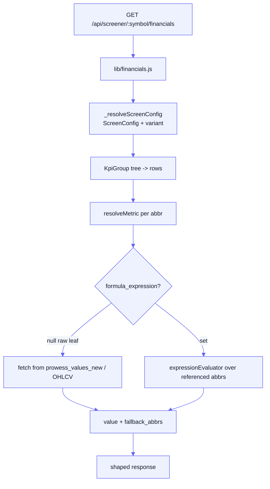

[Docs](../README.md) · [Subsystems](../README.md#subsystems) · Screener & KPI Registry

# Screener & KPI Registry

The per-company research surface (`/api/screener/:symbol`) — financials,
technicals, Wyckoff, charts, shareholding, peers — powered by an admin-editable
**KPI / formula registry** that resolves canonical metrics (raw *and* computed)
without a code deploy.

## At a glance

| | |
|---|---|
| API prefix | `/api/screener` → [`routes/screener.routes.js`](../../routes/screener.routes.js) |
| Controller | [`controllers/screener.controller.js`](../../controllers/screener.controller.js) |
| Formula registry | [`utils/formulaRegistry/`](../../utils/formulaRegistry/) |
| Financials | [`lib/financials.js`](../../lib/financials.js) |
| Technicals | [`lib/technicalAnalysis.js`](../../lib/technicalAnalysis.js) (+ `utils/ta*.js`, [`lib/wyckoff.js`](../../lib/wyckoff.js)) |
| KPI source data | `prowess_values_new`, `kpi_values` |
| Admin KPI mgmt | `/admin/kpis`, `/admin/kpi-groups`, `/admin/kpi-filters`, `/admin/kpi-dedup`, `/admin/company-groups`, `/admin/screen-configs` |

The screener reads the Prowess-ingested fundamentals (see
[Prowess ingestion](./prowess-ingestion.md)) and daily OHLCV, resolves them
through the registry, and shapes the result via admin-defined **ScreenConfig**
layouts. The KPI values themselves come from the [pipeline](../pipeline.md) and
Prowess.

## Endpoints

Mounted at `/api/screener` (`:symbol` is an uppercased NSE symbol).

| Method + path | Returns |
|---------------|---------|
| `GET /:symbol` | Ticker overview (`getTickerInfo`) |
| `GET /:symbol/financials` | P&L, balance sheet, cash flow, TTM, metrics, valuation |
| `GET /:symbol/technicals` | Full TA payload + AI `decisionIntelligence` (enqueues/serves an `ai_insights` row) |
| `GET /:symbol/technicals/status` | Cheap poll target for a pending technicals insight |
| `GET /:symbol/prices` | Day-wise OHLCV (`?from`/`?to` = `YYYY-MM-DD`) |
| `GET /:symbol/wyckoff` | Server-side Wyckoff phase analysis |
| `GET /:symbol/charts` | Chart-ready series (Price, PE, Sales & Margin) — served by `prowess.controller` |
| `GET /:symbol/shareholding` | Historical quarterly shareholding — `prowess.controller` |
| `GET /:symbol/peers` | Peer comparison table with all metrics |

Frontend contracts:
[technicals](../frontend/FRONTEND_TECHNICALS_API.md),
[Wyckoff](../frontend/FRONTEND_WYCKOFF_API.md).

### Technicals AI insight lifecycle

`GET /:symbol/technicals` always returns the computed TA immediately. The
narrative `decisionIntelligence` is an `ai_insights` row (`type: 'technicals'`):
if present it's attached with `insightStatus: 'ready'`; if not, a BullMQ job on
the `technicals_analysis` queue ([`lib/technicalsQueue.js`](../../lib/technicalsQueue.js))
is enqueued and status becomes `generating` (or `failed`). Clients then poll the
cheap `/technicals/status` endpoint — which reads only the stored insight + job
state, never re-running `analyze()`. `?refresh=1` forces regeneration. See the
[technicals guide](../specs/technicals-guide.md).

## KPI / formula registry

A canonical KPI is a [`Kpi`](../../prisma/schema.prisma) row (`kpis` table),
keyed by a unique `abbr`. A KPI is either:

- a **raw leaf** (`formula_expression` null) — read directly from the
  frequency-appropriate source table (`prowess_values_new` etc.) for its `abbr`;
  or
- an **admin-defined computed KPI** (`formula_expression` set) — an arithmetic
  expression over other KPI abbrs, evaluated by the registry.

Because `abbr` is a shared namespace with an unrelated ~23k-row transcript-metric
dedup pipeline (`source: transcript`), the registry only loads rows with
`registry_enabled: true` (`source: QE`).

Key `Kpi` fields: `frequency` (`annual`/`quarterly`/`daily`), `prowess_name`
(maps a raw Prowess CSV/API column to this abbr with no deploy),
`fallback_abbrs` (ordered abbrs to try if resolution is null), `unit_label`,
`denomination`.

### formulaRegistry internals

[`utils/formulaRegistry/index.js`](../../utils/formulaRegistry/) re-exports:

| Module | Responsibility |
|--------|----------------|
| [`registryCache.js`](../../utils/formulaRegistry/registryCache.js) | In-memory, DB-backed cache of `Kpi` defs — `warmRegistryCache`, `getDefinition`, TTL refresh |
| [`financial.js`](../../utils/formulaRegistry/financial.js) | `resolveMetric`, `resolveFormulaSeries`, `previewMetric` |
| [`expressionEvaluator.js`](../../utils/formulaRegistry/expressionEvaluator.js) | Tokenize/parse/validate/evaluate `formula_expression`; `ExpressionError` |
| [`resolutionContext.js`](../../utils/formulaRegistry/resolutionContext.js) | Build the value context a metric resolves against |
| [`technical.js`](../../utils/formulaRegistry/technical.js) | `TECHNICAL_REGISTRY`, `resolveTechnicalIndicators`, `resolveIndicatorSeries` |
| [`dataFetcher*.js`](../../utils/formulaRegistry/) | Fetch raw KPI maps / time series / market snapshots from Prowess + OHLCV tables |

**Cache warm-up:** [`server.js`](../../server.js) calls `warmRegistryCache()` on
boot so the first screener request isn't cold. It is **non-fatal** — a failed
warm-up is logged and the cache lazy-loads on first use (TTL-refreshed
thereafter). Scripts that write `Kpi` rows call `invalidateRegistryCache()` to
see them immediately.

## Relevant Prisma models

| Model | Table | Role |
|-------|-------|------|
| `Kpi` | `kpis` | Canonical KPI defs (raw or `formula_expression`), `prowess_name`, `fallback_abbrs`, `registry_enabled` |
| `KpiGroup` | `kpi_groups` | Admin display **tree** — container or leaf (`kpi_abbr`); powers statement/section layout |
| `KpiFilter` | `kpi_filters` | Reusable threshold condition on a KPI (`operator`, `value`, `value_max`) |
| `KpiValue` | `kpi_values` | Resolved per-call value, unique `(call_id, kpi_abbr)` |
| `ProwessValueNew` | `prowess_values_new` | Prowess-ingested KPI values (FK to `Kpi.abbr`) — main fundamentals source |
| `SubstituteKpi` | `substitute_kpis` | Fallback abbrs for a primary abbr |
| `KpiRelationship` | `kpi_relationships` | Legacy generic KPI relationships (kept for reference; no consumer today) |
| `CompanyGroupFilter` | `company_group_filters` | Attaches `KpiFilter`s to a `CompanyGroup` (AND-combined) |
| `CompanyGroupMember` | `company_group_members` | Materialized membership for `kpi_filter` groups |

### Curated screens (precomputed cards)

Live screeners scan the full universe (5yr × ~76 KPIs × ~2900 companies) and are
slow, so dashboard cards are precomputed:

| Model | Table | Role |
|-------|-------|------|
| `Screen` | `qc_screens` | Precomputed screener card (slug, title, category, `computed_at`) |
| `ScreenTicker` | `qc_screen_tickers` | Denormalized members per screen (market cap, PE, qc_score, industry) |

Served as indexed reads to the dashboard/discover surface
([`services/dashboard/`](../../services/dashboard/)).

### ScreenConfig (response shaping)

`ScreenConfig` (`screen_configs`) + `ScreenConfigItem` (`screen_config_items`)
let admins control **which** KPIs/rows/series a response section shows, in what
order and precision — decoupled from `KpiGroup`. A config keys off a stable
`key` (e.g. `financials.pnl.annual`), points at a `kpi_group_slug` branch for its
rows, and can be a **company-group-scoped variant** of another config
(`variant_of_key` + `company_group_slug`, e.g. a BFSI-specific P&L). Resolved by
`lib/financials.js#_resolveScreenConfig`.

## Financials & technicals libs

- [`lib/financials.js`](../../lib/financials.js) — assembles P&L / balance sheet /
  cash flow tables, TTM, windowed CAGR/averages, valuation metrics; resolves each
  row via `resolveMetric` under a ScreenConfig layout.
- [`lib/technicalAnalysis.js`](../../lib/technicalAnalysis.js) — `analyze(symbol)`
  fetches OHLCV bars and runs the indicator/rule engines
  (`utils/taIndicators.js`, `utils/taRuleEngine.js`, `utils/taScoring.js`,
  `utils/taStockType.js`, `utils/technicalsShape.js`), plus relative strength
  ([`lib/crs.js`](../../lib/crs.js)).
- [`lib/wyckoff.js`](../../lib/wyckoff.js) — server-side Wyckoff phase detection.

## Baskets, batch tickers & models

Three read surfaces sit on top of the same registry-resolved metrics.

### Stock baskets — `/api/baskets`

Pre-defined **screens** ([`controllers/baskets.controller.js`](../../controllers/baskets.controller.js))
— 11 baskets across three categories (Value & Quality, Growth & Turnaround, Technical Signals). Each
basket is a hard-coded definition (`id`, a `conditions` string shown to the UI verbatim, and the
`columns` to display). Running one is a three-stage funnel that keeps DB fan-out bounded:

1. **Stage 1 — cheap bulk filter.** `buildMarketMap()` pulls one market snapshot for the whole
   universe (`fetchMarketSnapshots`, values already in `nse_equity_new`) and applies the cheap
   conditions (market cap, PE) in memory.
2. **Stage 2 — fundamentals for survivors only.** `fetchKpiMapsMultiBatch` / `fetchPeTimeSeriesBatch`
   batch-fetch annual/quarterly series for the candidates in 1–2 queries, then each is filtered
   in-process (ROE, D/E, CAGR, PEG, historical PE, industry PE, …).
3. **Stage 3 — price bars only where needed.** `fetchOhlcvBars` + `resolveTechnicalIndicators` for the
   technical screens (golden crossover, RSI, SMA confluence, power candle).

| Method | Path | Auth | Purpose |
|--------|------|------|---------|
| `GET` | `/api/baskets` | Bearer | List basket definitions (grouped by category; no stock data) |
| `GET` | `/api/baskets/:basketId/stocks` | Bearer | Run the screen (`page`, `size`≤200, `sort`, `order`) |

> [!NOTE]
> The same `runScreener()` is reused by the investor dashboard's discover cards
> ([investor-dashboard.md](./investor-dashboard.md)), which precompute results offline to avoid the
> live screen's ~40s cost. **Industry** baskets (`/api/industry-baskets`) are a *different* surface
> driven by IIT scores — see [industry-intelligence.md](./industry-intelligence.md).

### Batch tickers — `/api/tickers`

`GET /api/tickers?tickers=TCS,INFY` (or `POST { tickers: [...] }` for long lists) returns the same
row shape as the screener's peers table for a caller-supplied set, up to **100 tickers** per request
([`services/tickerMetrics.service.js`](../../services/tickerMetrics.service.js)). Responses are cached
until midnight IST.

### Portfolio models — `/api/models`

`PortfolioModel` CRUD — named model portfolios with a risk profile, capital, asset classes, and
positions ([`controllers/models.controller.js`](../../controllers/models.controller.js)).

| Method | Path | Auth | Purpose |
|--------|------|------|---------|
| `GET` | `/api/models` | Bearer | List models (newest first) |
| `POST` | `/api/models` | Bearer | Create a model (`name`, `riskProfile`, `capital`, `assetClasses` required) |

## Admin KPI management

All under `/admin/*` (behind `authenticate` + `requireAdmin`).

| Mount | Controller | Manages |
|-------|-----------|---------|
| `/admin/kpis` | `admin.kpis.controller.js` | KPI CRUD, `POST /validate-formula`, `GET /:abbr/preview`, relationships |
| `/admin/kpi-groups` | `admin.kpiGroups.controller.js` | Display tree (`GET /tree`) CRUD |
| `/admin/kpi-filters` | `admin.kpiFilters.controller.js` | Reusable threshold filters |
| `/admin/kpi-dedup` | `admin.kpiDedup.controller.js` | Per-industry KPI cap dedup (Phase 6) |
| `/admin/company-groups` | `admin.companyGroups.controller.js` | Named ticker sets + attach filters + `POST /:slug/recompute` |
| `/admin/screen-configs` | `admin.screenConfig.controller.js` | ScreenConfig + items CRUD |

`CompanyGroup` (`company_groups`) is a reusable named ticker set
(`filter_type`: `manual` / `dynamic` / `kpi_filter`) shared with the
[scheduler](./scheduler.md)'s L1/L2/L3 dispatch. See the
[company groups admin guide](../admin-guides/company-groups-admin-guide.md).

## Gotchas

- **`registry_enabled` / `source: QE` gate.** Only these `Kpi` rows load into the
  registry; abbr collisions with the transcript-dedup pipeline (`source:
  transcript`) are otherwise ambiguous. A new KPI won't resolve until it's
  enabled.
- **`prowess_name` is the ingestion bridge.** New Prowess columns map to a KPI by
  `prowess_name` (defaults to `abbr`) — set it, don't hardcode column parsing.
- **Registry cache is TTL'd + non-fatal on warm-up.** Edits to `Kpi` rows appear
  after the TTL refresh (or `invalidateRegistryCache()`); a boot-time warm-up
  failure only logs.
- **Curated screens are stale by design.** `qc_screens` reflect the last
  `computed_at`; membership only changes when fundamentals refresh (quarterly).
- **ScreenConfig variants are explicit.** BFSI-style differences are authored as a
  separate `variant_of_key` config + `KpiGroup` tree — there is no silent per-row
  formula swap (the old `variant_for_group` mechanism was removed).
- **Technicals `/status` must stay cheap.** Never call `analyze()` from the poll
  path — it re-fetches bars and recomputes every indicator.

## See also

- [Prowess ingestion](./prowess-ingestion.md) — where `prowess_values_new` comes from
- [Pipeline](../pipeline.md) — L1/L2/L3 that produces `kpi_values` / `ai_insights`
- [Data model](../data-model.md) — full schema reference
- [Technicals frontend API](../frontend/FRONTEND_TECHNICALS_API.md)
- [Wyckoff frontend API](../frontend/FRONTEND_WYCKOFF_API.md)
- [Technicals guide](../specs/technicals-guide.md)
- [Company groups admin guide](../admin-guides/company-groups-admin-guide.md)
