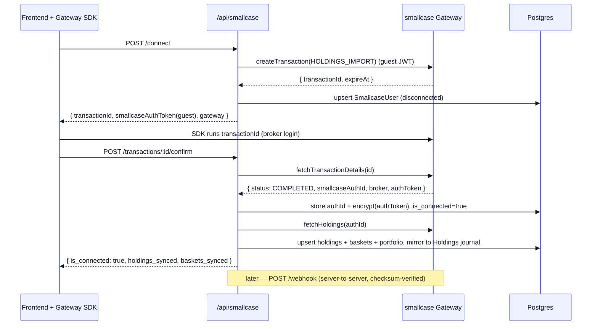

[Docs](../README.md) · [Subsystems](../README.md#subsystems) · Smallcase Gateway Integration

# Smallcase Gateway Integration

Connects a user's broker account through [smallcase Gateway](https://developers.gateway.smallcase.com) to import holdings, track baskets, and place BUY / SELL / rebalance orders — all driven server-to-server, with the frontend SDK only running short-lived transactions.

## Purpose

- Let a user link their broker (HOLDINGS_IMPORT) and pull real holdings + smallcase baskets.
- Persist and periodically re-sync holdings / portfolio totals, enriched with live prices.
- Place orders via Gateway transactions and reconcile them via a signed webhook.
- Mirror synced holdings into the user's default **Holdings** journal (see [./unified-journal.md](./unified-journal.md)).

## Key files

| Concern | File |
|---------|------|
| JWT signing + Gateway HTTP client + webhook checksum | [`lib/smallcaseGateway.js`](../../lib/smallcaseGateway.js) |
| Business logic (connect, sync, orders, webhook) | [`services/smallcase.service.js`](../../services/smallcase.service.js) |
| HTTP handlers | [`controllers/smallcase.controller.js`](../../controllers/smallcase.controller.js) |
| Routes (`/api/smallcase`) | [`routes/smallcase.routes.js`](../../routes/smallcase.routes.js) |
| Auth-token encryption at rest (AES-256-GCM) | [`utils/crypto.js`](../../utils/crypto.js) |
| Raw-body webhook exemption | [`server.js`](../../server.js) (`WEBHOOK_PATHS`) |
| Holdings → journal bridge | [`services/journal/holdings-sync.service.js`](../../services/journal/holdings-sync.service.js) |

## Data model

Prisma models (all cascade off `SmallcaseUser`; see [`prisma/schema.prisma`](../../prisma/schema.prisma) and [../data-model.md](../data-model.md)):

| Model | Table | Holds |
|-------|-------|-------|
| `SmallcaseUser` | `qc_smallcase_users` | 1:1 with `User`. `smallcase_user_id` (the `smallcaseAuthId`), encrypted `auth_token`, `broker`, `is_connected`, `last_synced_at` |
| `SmallcasePortfolio` | `qc_smallcase_portfolios` | Aggregate `total_value` / `total_invested` / `total_pnl` / `total_pnl_pct`, `synced_at` |
| `SmallcaseHolding` | `qc_smallcase_holdings` | Per-ticker qty, avg price, ISIN, NSE/BSE positions; unique on `(smallcase_user_id, ticker)` |
| `SmallcaseBasket` | `qc_smallcase_baskets` | Smallcase baskets by `scid`, `constituents` JSON; unique on `(smallcase_user_id, scid)` |
| `SmallcaseOrder` | `qc_smallcase_orders` | One row per order transaction, keyed by `order_id` (the Gateway `transactionId`) |

Enums: `SmallcaseOrderStatus` (`pending` / `placed` / `completed` / `failed` / `cancelled`), `SmallcaseOrderType` (`buy` / `sell` / `rebalance` / `sip`).

## Credentials & secrets

Two server-side credentials with **distinct roles** (both wired in [`config/env.js`](../../config/env.js); neither is ever sent to the frontend):

| Env var | Role |
|---------|------|
| `SMALLCASE_SECRET` | **Shared secret** — signs the HS256 JWT placed in the `x-gateway-authtoken` header |
| `SMALLCASE_API_SECRET` | **API secret** — sent verbatim as the `x-gateway-secret` header **and** used as the HMAC key to verify webhook checksums |
| `SMALLCASE_GATEWAY_NAME` | Gateway name in the URL path (default `quantcase`) |
| `SMALLCASE_API_BASE_URL` | Default `https://gatewayapi.smallcase.com` |
| `SMALLCASE_ENCRYPTION_KEY` | 32-byte hex AES-256-GCM key encrypting the stored `auth_token` at rest ([`utils/crypto.js`](../../utils/crypto.js)) |

Every outbound Gateway request carries **both** headers. `signAuthToken()` builds the JWT payload from context:
- `{ guest: true }` — connect / holdings-import, before the user is linked.
- `{ smallcaseAuthId }` — a connected user's holdings fetch or order.

## End-to-end flow

1. **Connect** — `POST /api/smallcase/connect` → `createConnect` creates a `HOLDINGS_IMPORT` transaction (with `assetConfig.mfHoldings = true`), upserts a still-disconnected `SmallcaseUser`, and returns `{ transactionId, smallcaseAuthToken (guest), gateway, expireAt, intent }`. The frontend SDK runs the `transactionId`.
2. **Confirm** — `POST /api/smallcase/transactions/:id/confirm` → `confirmTransaction` calls `fetchTransactionDetails`. On `PROCESSING` / `INITIALIZED` it returns early; `ERRORED` → `422`; only `COMPLETED` proceeds. It stores `smallcaseAuthId` (+ encrypted `authToken`, `broker`), marks `is_connected`, then calls `syncHoldings`.
3. **Sync** — `syncHoldings` fetches v2 holdings, maps securities → `SmallcaseHolding` (upsert per ticker), maps `smallcases.public[]` / `private[]` → `SmallcaseBasket`, recomputes `SmallcasePortfolio` totals, stamps `last_synced_at`, then bridges into the Holdings journal (non-fatal).
4. **Read** — `GET /api/smallcase/holdings` → `getHoldings` enriches stored holdings with **live LTP** (`enrichHoldings`, the same market-data path the uploaded portfolio uses) and recomputes portfolio totals so amounts are real, not zero.
5. **Order** — `POST /api/smallcase/orders` → `createOrder` builds an `orderConfig` (`type: SECURITIES`) transaction (connected JWT), records a `pending` `SmallcaseOrder` keyed by the returned `transactionId`, and returns that id for the SDK to run.
6. **Webhook** — smallcase calls `POST /api/smallcase/webhook` on completion; `handleWebhook` verifies the checksum, updates the matching order status, and (on completed / holdings-import events) re-syncs the user's holdings.

## Endpoints

All under `/api/smallcase` ([`routes/smallcase.routes.js`](../../routes/smallcase.routes.js)). Every route except the webhook requires a QuantCase Bearer JWT (`authenticate`).

| Method | Path | Auth | Purpose |
|--------|------|------|---------|
| `POST` | `/webhook` | **checksum** (raw body) | Server-to-server completion callback |
| `POST` | `/connect` | Bearer | Create a HOLDINGS_IMPORT transaction |
| `POST` | `/transactions/:id/confirm` | Bearer | Confirm a completed transaction, persist + sync |
| `POST` | `/sync` | Bearer | Manual holdings re-sync |
| `GET`  | `/holdings` | Bearer | Live-enriched holdings, portfolio, baskets |
| `GET`  | `/orders` | Bearer | Paginated order history (`?status=&page=&limit=`) |
| `POST` | `/orders` | Bearer | Create a BUY / SELL / rebalance / SIP order |

## Webhook: raw body + checksum

The webhook is **not** JWT-authenticated — it is authenticated by an HMAC **checksum**, so it must see the raw request bytes:

- In [`server.js`](../../server.js), `WEBHOOK_PATHS = ['/api/billing/webhook', '/api/smallcase/webhook']` are **excluded** from the global `express.json()` parser.
- The route attaches `express.raw({ type: 'application/json' })` and is registered **before** `router.use(authenticate)`.
- The controller `JSON.parse`s `req.body` itself, then `verifyWebhookChecksum` recomputes `SHA256-HMAC(message, SMALLCASE_API_SECRET)` and compares with `crypto.timingSafeEqual`. Message is `` `${timestamp}${smallcaseAuthId}` `` for securities/holdings-import, or `` `${timestamp}${transactionId}` `` for `MF_HOLDINGS_IMPORT`. Bad checksum → `400`, no state change.

## Gotchas

- **Two secrets, easy to swap.** `SMALLCASE_SECRET` signs the JWT; `SMALLCASE_API_SECRET` is the header value **and** webhook HMAC key. Crossing them breaks auth on one side silently.
- **Stored `auth_token` is currently write-only.** `confirmTransaction` encrypts and stores `authToken`, but outbound requests re-derive auth from `smallcase_user_id` (the `smallcaseAuthId`) — `utils/crypto.js#decrypt` is exported but not called anywhere yet.
- **Holdings endpoint carries no live price.** The v2 payload has no LTP, so `current_price` / `current_value` / `pnl` are stored `null`; `getHoldings` fills them via `enrichHoldings`. `display_value` falls back to invested value so the UI never shows a bogus `-100%`.
- **Debug logging is verbose.** `lib/smallcaseGateway.js` logs every request/response; it masks `x-gateway-secret` but prints the signed `x-gateway-authtoken` in full — scrub before shipping noisy logs.
- **Sync is a single chokepoint.** Connect-confirm, `POST /sync`, and the webhook all funnel through `syncHoldings`, which always mirrors into the Holdings journal. A journal failure is caught and logged — it never breaks the smallcase flow.
- **Holdings journal is add-only.** Removing a still-held ticker from the Holdings journal re-adds it on the next sync — see [./unified-journal.md](./unified-journal.md).
- **Not subscription-gated.** These routes require only a valid JWT, not an active subscription.

## See also

- [../frontend/smallcase-frontend-integration.md](../frontend/smallcase-frontend-integration.md) — the SDK-side transaction flow
- [./unified-journal.md](./unified-journal.md) — how synced holdings populate the Holdings journal
- [./auth-invites-google.md](./auth-invites-google.md) — the Bearer JWT that gates these routes
- [../data-model.md](../data-model.md) — full `Smallcase*` model reference
- [../api-reference.md](../api-reference.md) — complete endpoint list
- [../configuration.md](../configuration.md) — `SMALLCASE_*` env vars
