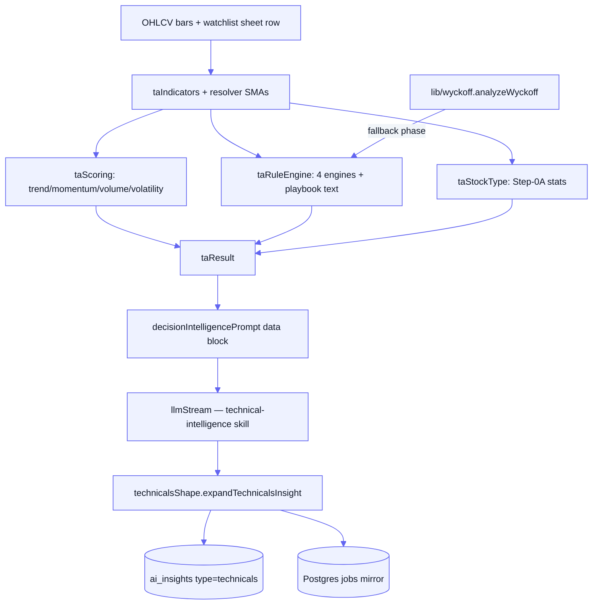

[Docs](../README.md) · [Subsystems](../README.md#subsystems) · Technicals & Wyckoff

# Technicals & Wyckoff

The backend deep-dive for the **decision-intelligence** stack: everything that turns a
symbol's raw OHLCV into the `ai_insights` row of `type = "technicals"` (the "Decision
Intelligence" card) and the standalone server-side Wyckoff phase read. This page documents
the compute engines, the L3 worker, the queue plumbing, and the read/serve endpoints. The
wire shapes the frontend consumes are **not** repeated here — those contracts live in the
[frontend docs](#see-also); this is the source of truth for how they are produced.

## Contents

- [Purpose](#purpose)
- [Key files](#key-files)
- [How it works](#how-it-works)
- [Serving & endpoints](#serving--endpoints)
- [Gotchas](#gotchas)
- [See also](#see-also)

## Purpose

- Compute a full technical-analysis snapshot for a symbol (indicators, scores, rule-engine
  playbook, stock-type stats) deterministically, off the LLM path.
- Run a pure, side-effect-free **Wyckoff phase engine** server-side so the browser and API
  agree on one analysis instead of two drifting copies.
- Feed a single LLM stage (`technical-intelligence` skill) that classifies the stock and
  writes narrative decision intelligence into `ai_insights` (`type = technicals`).
- Serve per-symbol reads (`/technicals`, `/technicals/status`, `/wyckoff`) on the screener,
  and admin bulk (re)generation across up to 500 tickers.
- Cache the LLM insight so most reads are DB fetches; regeneration is an explicit
  enqueue-then-poll flow, never on the hot request path.

## Key files

| Concern | File |
|---------|------|
| TA orchestrator — `analyze(symbol)`, the compute entry point | [`lib/technicalAnalysis.js`](../../lib/technicalAnalysis.js) |
| Indicator math (SMA/EMA/RSI/MACD/ADX/CMF/BB/ATR + series) | [`utils/taIndicators.js`](../../utils/taIndicators.js) |
| Component 0–100 scores, timeframes, deterministic insights | [`utils/taScoring.js`](../../utils/taScoring.js) |
| Stock-type Step-0A stats + confirmed SMA_200 cross | [`utils/taStockType.js`](../../utils/taStockType.js) |
| Frozen bucket / indicator / rule vocabulary | [`utils/taEnums.js`](../../utils/taEnums.js) |
| Rule engine — categorical state → growth/value playbook text | [`utils/taRuleEngine.js`](../../utils/taRuleEngine.js) |
| Wyckoff phase engine (pure, no I/O) | [`lib/wyckoff.js`](../../lib/wyckoff.js) |
| L3 worker — composes the `ai_insights.technicals` row | [`workers/technicals.js`](../../workers/technicals.js) |
| Idempotent enqueue plumbing for `technicals_analysis` | [`lib/technicalsQueue.js`](../../lib/technicalsQueue.js) |
| LLM prompt builder + raw-indicator data block | [`prompts/decision_intelligence.js`](../../prompts/decision_intelligence.js) |
| Compact LLM output → documented nested insight | [`utils/technicalsShape.js`](../../utils/technicalsShape.js) |
| Admin bulk (re)generate + batch-poll service | [`services/admin.technicals.service.js`](../../services/admin.technicals.service.js) |
| Admin bulk HTTP handlers | [`controllers/admin.technicals.controller.js`](../../controllers/admin.technicals.controller.js) |
| Admin routes (`/admin/technicals`) | [`routes/admin.technicals.routes.js`](../../routes/admin.technicals.routes.js) |
| Screener read/serve handlers (`/technicals`, `/status`, `/wyckoff`) | [`controllers/screener.controller.js`](../../controllers/screener.controller.js) |
| DB-owned prompt + output schema for the skill | [`scripts/updateTechnicalIntelligenceSkill.js`](../../scripts/updateTechnicalIntelligenceSkill.js) |

## How it works

The `technicals_analysis` queue holds one job per symbol. Its worker composes the insight in
a fixed sequence — a deterministic TA computation, one LLM call, then a reshape/persist:

1. **Raw → indicators.** `technicalAnalysis.analyze(symbol)` fetches daily/weekly/monthly OHLCV,
   the watchlist row (a hard-coded Google Sheet, 15-minute cache), and a price-derived Wyckoff
   phase — in parallel. It resolves all indicators, then `_applyResolverAverages` overwrites
   SMA_20/50/100/200 and AVG_VOL_20/30 with the KPI-resolver's values so `/technicals` and
   `/prices` report identical averages.
2. **Rule engine + scoring + stock-type.** `taScoring` produces the 0–100 trend / momentum /
   volume / volatility components and the weighted final signal. `computeRuleEngine`
   ([`utils/taRuleEngine.js`](../../utils/taRuleEngine.js)) maps each categorical state
   (RSI band, ADX band, S/R zone, Wyckoff phase, CRS leg, …) onto CSV-sourced growth/value
   playbook text across four engines (structure, trend, timing, dominance).
   `computeStockTypeStats` computes the Step-0A aggregations over the full ~3y series.
3. **Wyckoff phases.** The pure engine detects a trading range (zone/density), the prior trend,
   the phase (`classifyRange`) and sub-phase, plus event detectors (SC/BC/Spring/Upthrust/…).
   Here it is used only as a **fallback** phase for the rule engine when the sheet has no
   `PHASE`; the same engine also powers the standalone `/wyckoff` endpoint.
4. **LLM decision intelligence.** The worker loads the `technical-intelligence` skill config
   (model, max tokens, DB prompt template, output schema), reads the prior `final_score` for
   the direction flag, builds the prompt via `decisionIntelligencePrompt` (which injects a raw
   data block using framework-vocabulary enums), and calls `llmStream` (OpenRouter).
5. **Shape → persist.** `expandTechnicalsInsight` re-nests the deliberately flat LLM JSON back
   into the documented shape and echoes `ruleEngine`/`scores` from the TA result. The worker
   upserts `ai_insights` keyed by `(ticker, type='technicals')` and mirrors the job status into
   the Postgres `jobs` table.

## Serving & endpoints

Screener reads sit under the global Bearer-JWT gate; the admin bulk routes are additionally
gated by `requireAdmin` (`router.use('/admin', authenticate, requireAdmin, …)`).

| Method | Path | Auth | Purpose |
|--------|------|------|---------|
| `GET`  | `/api/screener/:symbol/technicals` | Bearer JWT | Full TA snapshot; attaches the stored insight or **enqueues** one and reports `insightStatus` (`ready`/`generating`/`failed`). `?refresh=1` forces regen |
| `GET`  | `/api/screener/:symbol/technicals/status` | Bearer JWT | Cheap poll target — reads only the stored insight + BullMQ job state, never recomputes. Status: `generating`/`failed`/`ready`/`absent` |
| `GET`  | `/api/screener/:symbol/wyckoff` | Bearer JWT | Standalone server-side Wyckoff analysis (`?chartYears`, `?includeBars`, `?minPct`). Insufficient history → `200` + `meta.insufficientData`; no bars → `404` |
| `POST` | `/admin/technicals/bulk-analyze` | Admin | Enqueue regeneration for up to 500 tickers (`{ tickers, force? }`); skips tickers with a cached insight unless `force`. Returns `202` |
| `POST` | `/admin/technicals/bulk-status` | Admin | Batch-poll insight/job state for many tickers without recomputing. Per-ticker `processing`/`queued`/`ready`/`failed`/`missing` |

> [!NOTE]
> `GET /technicals` is the only screener read that starts work — it enqueues via
> `ensureTechnicalsJob`. `GET /technicals/status` is a pure read, so a frontend polls
> `/status` (every few seconds) after the first `/technicals` call, not `/technicals` itself.

## Gotchas

> [!IMPORTANT]
> **The technicals worker mirrors status into the Postgres `jobs` table.** It is one of the
> four synthesis workers that `prisma.job.upsert` keyed by `bullmqId` (create/processing/
> completed/failed). L1/L2/HTML workers do not — so a technicals job appears in the `jobs`
> mirror while a `summarization_v2` chunk never will.

- **Enqueue is idempotent by a deterministic jobId** `technicals-<symbol>` (`-`, not `:` —
  BullMQ rejects `:` in custom ids). A frontend polling `/technicals` every few seconds will
  not spawn duplicate jobs; a `failed` state is reported as-is (stop polling) rather than
  silently retried, and `?refresh=1` / `force` clears a terminal job to start fresh.
- **`/status` checks job state before the stored row.** After `?refresh=1` the previous
  insight is still in `ai_insights` (the worker overwrites only on success), so keying off the
  row alone would report `ready` mid-regeneration. `insightUpdatedAt` is always returned so a
  stale-but-renderable insight can stay on screen while its replacement is generated.
- **Two decision-intelligence code paths — one is dead.** The live path is
  [`prompts/decision_intelligence.js`](../../prompts/decision_intelligence.js) +
  `workers/technicals.js` (DB skill config + `llmStream`). [`utils/decisionIntelligence.js`](../../utils/decisionIntelligence.js)
  (`generateDecisionIntelligence`, hard-coded `anthropic/claude-haiku-4-5`) is exported but
  **imported nowhere** — legacy, do not extend it.
- **Prompt & output schema are DB-owned.** They come from the `technical-intelligence` skill
  row via `loadSkillConfig`, edited with `scripts/updateTechnicalIntelligenceSkill.js`. The
  in-code `PROMPT_TEMPLATE` is only a fallback when the DB template is null. Setting the skill
  `isActive:false` makes runs throw.
- **The LLM output is deliberately flat.** A nested schema was rejected ("compiled grammar too
  large"), so the model emits scalars/collapsed arrays and `technicalsShape` reconstructs the
  documented nesting; `ruleEngine`/`scores` are echoed from the TA result, not retyped by the
  model (saves grammar budget, avoids transcription drift).
- **`analyze()` requires the symbol on the watchlist sheet.** Support / Resistance / `PHASE` /
  `PATTERN` come from a hard-coded Google Sheet (15-min cache); a missing symbol raises `404`,
  not a partial result. The Wyckoff engine's phase only fills the rule engine when the sheet
  `PHASE` is absent — the hand-maintained sheet value wins where it exists.
- **Wyckoff data hygiene.** `nse_equity_new` is not uniformly daily (weekly-sampled pre-2025),
  so `selectContiguousDailyEra` keeps the most recent contiguous daily run (≥20 bars). Prices
  are not split-adjusted upstream, so `backAdjustSplits` corrects only corporate actions
  corroborated by market-cap continuity — an uncorroborated gap is reported (`suspectedSplit`)
  but left raw, and the phase call there is unreliable.
- **No auto-retry.** The worker sets no `attempts` override, so the queue default (`attempts:1`)
  applies — a failed job stays failed until a `?refresh=1` / `force` clears it. Concurrency is
  intentionally low (`concurrency:3`, `limiter 5/s`) since each job runs a full recompute plus
  an LLM call.
- **Routing.** Technicals calls `llmStream` **without** `{ vertex:true }`, so this stage always
  runs on OpenRouter even when the L1 Vertex path is enabled.

## See also

- [../frontend/FRONTEND_TECHNICALS_API.md](../frontend/FRONTEND_TECHNICALS_API.md) — `/technicals` + `/status` wire shapes
- [../frontend/FRONTEND_WYCKOFF_API.md](../frontend/FRONTEND_WYCKOFF_API.md) — `/wyckoff` response contract
- [../frontend/TECHNICALS_MANAGEMENT_API.md](../frontend/TECHNICALS_MANAGEMENT_API.md) — admin skill config + bulk endpoints
- [../specs/technicals-guide.md](../specs/technicals-guide.md) — the analyst framework the prompt implements
- [../pipeline.md](../pipeline.md) — where L3 technicals fits in the three-layer pipeline
- [./screener-kpi-registry.md](./screener-kpi-registry.md) — the resolver that supplies SMA/volume averages
- [../llm-integration.md](../llm-integration.md) — `loadSkillConfig`, `llmStream`, skill-driven model selection
