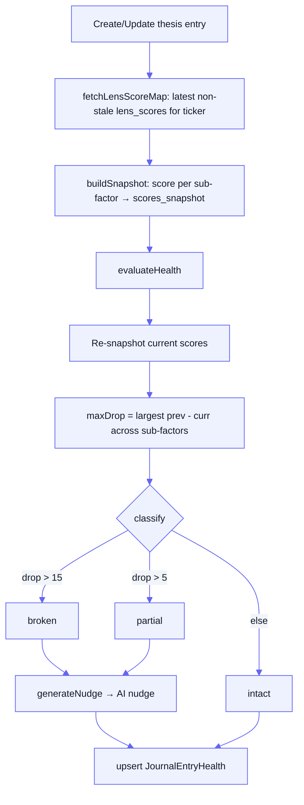

[Docs](../README.md) · [Subsystems](../README.md#subsystems) · Unified Journal

# Unified Journal

One `/api/journal` flow that collapses the old **Watchlist + HoldingNotes + InvestmentJournal** into a single model: named ticker containers ("journals"), the tickers inside them, timestamped notes/theses per ticker, and AI-evaluated thesis health.

## Purpose

- Give each user named **journals** (watchlists) of tickers, with two auto-provisioned defaults.
- Attach two kinds of entries to a ticker: plain **notes** and structured **theses** (MOD dimension + sub-factors + conviction).
- Snapshot lens scores when a thesis is written, then **re-evaluate** it against current scores to classify health (`intact` / `partial` / `broken`) and generate an AI nudge.
- Auto-mirror the user's real holdings (smallcase + portfolio) into a default Holdings journal.

## Key files

| Concern | File |
|---------|------|
| Journals/tickers/entries CRUD | [`services/journal/journal.service.js`](../../services/journal/journal.service.js) |
| Lens snapshot + health evaluation | [`services/journal/journal.health.js`](../../services/journal/journal.health.js) |
| AI nudge generation | [`services/journal/journal.nudge.js`](../../services/journal/journal.nudge.js) |
| Holdings → Holdings-journal sync | [`services/journal/holdings-sync.service.js`](../../services/journal/holdings-sync.service.js) |
| HTTP handlers | [`controllers/journal.controller.js`](../../controllers/journal.controller.js) |
| Routes (`/api/journal`) | [`routes/journal.routes.js`](../../routes/journal.routes.js) |

## Data model

Prisma models (see [`prisma/schema.prisma`](../../prisma/schema.prisma), [../data-model.md](../data-model.md)):

| Model | Table | Holds |
|-------|-------|-------|
| `Journal` | `qc_journals` | Named container per user. `kind` (`holdings` / `tracking` / `custom`), `is_default`, `default_kind`. `@@unique([user_id, default_kind])` guarantees exactly one holdings + one tracking default per user |
| `JournalTicker` | `qc_journal_tickers` | A tracked ticker (canonical UPPERCASE) in a journal. `source` (`manual` / `holdings_sync`). Unique on `(journal_id, ticker)` |
| `JournalEntry` | `qc_journal_entries` | A **note** (`note_text`) or a **thesis** (`dimension`, `sub_factors`, `thesis`, `conviction`, `scores_snapshot`). Entry type is derived: `dimension != null` ⇒ thesis, else note |
| `JournalEntryHealth` | `qc_journal_entry_health` | 1:1 AI eval of a thesis entry: `thesis_health`, `ai_nudge`, `evaluated_at` |

All relations cascade-delete (delete a journal → its tickers → their entries → their health).

### MOD dimensions & sub-factors

A thesis has a primary **dimension** (`M` Management / `O` Opportunity / `D` Deal) and one or more **sub-factors**. `VALID_SUB_FACTORS` (in [`journal.health.js`](../../services/journal/journal.health.js), re-exported by `journal.service.js` and enforced by the route Zod schema) maps each dimension to its allowed sub-factors, and `SUB_FACTOR_LENS` maps each sub-factor to the lens slug whose score it snapshots:

| Dimension | Sub-factors |
|-----------|-------------|
| `M` | Guidance Accuracy, Capital Allocation, Disclosure Honesty |
| `O` | Industry Tailwind, Distribution Strength, Competitive Edge, TAM Expansion |
| `D` | Valuation, Earnings Growth/Quality, P/E Re-rating Potential, Risk-Reward |

## Default journals & holdings sync

`ensureDefaultJournals(userId)` idempotently upserts a **Holdings** journal (`kind: holdings`) and a **Tracking** journal (`kind: tracking`) — safe under concurrency via the `@@unique([user_id, default_kind])` constraint. It runs at the top of the list/detail reads and the holdings sync.

`syncHoldingsJournal(userId)` ([`holdings-sync.service.js`](../../services/journal/holdings-sync.service.js)) gathers tickers from **three sources** — smallcase holdings, smallcase basket constituents, and user/shadow portfolio holdings — deduped by uppercased ticker, and **add-only** inserts new ones into the Holdings journal with `source: 'holdings_sync'`. Each gatherer is wrapped so a missing source yields `[]` rather than throwing.

> **Add-only means exited tickers are never removed, and a manually-removed still-held ticker reappears on the next sync.** Existing tickers and all their notes/theses are never touched.

This sync is invoked from:
- `POST /api/journal/sync-holdings` (explicit),
- `listJournals` and the Holdings `getJournalDetail` (best-effort, non-fatal),
- and the smallcase connect / webhook / `POST /sync` paths (see [./smallcase-gateway.md](./smallcase-gateway.md)).

## Thesis health evaluation

- **Snapshot on write** — when a thesis is created/edited, `fetchLensScoreMap(ticker)` reads the latest non-stale `lens_scores` for the ticker's most recent `call_id`, and `buildSnapshot` records the score per selected sub-factor into `scores_snapshot`.
- **Evaluate** — `evaluateHealth(entryId)` re-snapshots current scores, finds the **largest per-sub-factor drop** (`prev - curr`), and classifies: `> 15` → `broken`, `> 5` → `partial`, else `intact`. Plain notes have no dimension → health `none`.
- **AI nudge** — on `partial` / `broken`, `generateNudge` ([`journal.nudge.js`](../../services/journal/journal.nudge.js)) asks an LLM (`anthropic/claude-haiku-4-5` via `llmStream` → OpenRouter) for a 2-3 sentence nudge naming the changed sub-score, referencing the user's thesis wording, and ending with a concrete action. Nudge failure is caught and logged (health still upserts). Also pulls the ticker's `ai_insights` M/O/D scores for context.
- Result is upserted into `JournalEntryHealth`.

## Endpoints

All under `/api/journal` ([`routes/journal.routes.js`](../../routes/journal.routes.js)), all behind `authenticate`. Request bodies are camelCase and Zod-validated; ownership is enforced by scoping every query to `req.user.sub` (mismatches return `404`, never `403`, so another user's journal existence never leaks).

| Method | Path | Purpose |
|--------|------|---------|
| `GET`    | `/journals` | All journals, fully expanded (tickers + market data + every entry). Ensures defaults & syncs Holdings first |
| `POST`   | `/journals` | Create a custom journal (`{ name }`) |
| `GET`    | `/journals/:journalId` | Journal detail (tickers, market data, latest entry + latest thesis health). Holdings journal syncs first |
| `PATCH`  | `/journals/:journalId` | Rename a custom journal (defaults can't be renamed → `400`) |
| `DELETE` | `/journals/:journalId` | Delete a custom journal, cascade (defaults can't be deleted → `400`) |
| `POST`   | `/journals/:journalId/tickers` | Add tickers (`{ tickers: [...] }`, `source: manual`, idempotent) |
| `DELETE` | `/journals/:journalId/tickers/:ticker` | Remove a ticker (cascades entries) |
| `GET`    | `/journals/:journalId/tickers/:ticker/entries` | List a ticker's entries, newest first |
| `POST`   | `/journals/:journalId/tickers/:ticker/entries` | Add a note or thesis (auto-creates the ticker if absent) |
| `PATCH`  | `/entries/:entryId` | Edit an entry (thesis fields re-snapshot + re-evaluate) |
| `DELETE` | `/entries/:entryId` | Delete an entry (cascades health) |
| `POST`   | `/entries/:entryId/evaluate` | Manually re-run thesis health (thesis-only → `400` otherwise) |
| `POST`   | `/sync-holdings` | Explicitly mirror holdings into the Holdings journal |

### Entry payloads

A `POST .../entries` body is validated as **either**:
- a **note**: `{ noteText }` (1–2000 chars), or
- a **thesis**: `{ dimension, subFactors, thesis, conviction }` — all four required together (`dimension` ∈ `M|O|D`, each `subFactor` must be in `VALID_SUB_FACTORS`, `thesis` ≤ 300 chars, `conviction` an int 1–5).

Market enrichment (`enrichHoldings`) is done in **one pass** across all tickers in a read, so the same symbol appearing in two journals is priced once.

## Gotchas

- **Reads have side effects.** `GET /journals` and the Holdings `GET /journals/:id` run an add-only holdings sync before returning — a plain read can add tickers. Failures are swallowed and logged.
- **Ticker ordering is stabilized.** Holdings-sync inserts share one `added_at`, so ordering is `added_at desc, ticker asc` to keep paging/refreshes stable.
- **`sub_factors` is JSON, not an enum** — validation lives in the Zod route schema (sourced from `VALID_SUB_FACTORS`), not the DB.
- **Health depends on lens data.** If a ticker has no non-stale `lens_scores`, the snapshot is empty and drops can't be measured → thesis reads as `intact`.
- **Nudge is best-effort** — LLM failure never blocks entry creation or the health upsert; `ai_nudge` is simply `null`.
- **Defaults are protected** — the Holdings/Tracking journals can't be renamed or deleted (`400 DEFAULT_JOURNAL`).

## See also

- [../specs/journal-backend-spec.md](../specs/journal-backend-spec.md) — the design spec this implements
- [../frontend/JOURNAL_FRONTEND_INTEGRATION.md](../frontend/JOURNAL_FRONTEND_INTEGRATION.md) — frontend API contract
- [./smallcase-gateway.md](./smallcase-gateway.md) — the holdings source that feeds `sync-holdings`
- [./auth-invites-google.md](./auth-invites-google.md) — the Bearer JWT gating these routes
- [../data-model.md](../data-model.md) — `Journal*` model reference
- [../api-reference.md](../api-reference.md) — complete endpoint list
