[Docs](../README.md) · [Subsystems](../README.md#subsystems) · WealthOS

# WealthOS

An advisory / relationship-manager (RM) module: a separate domain where RMs manage
wealth clients, and an LLM generates compliance-validated **next-best-action**
suggestions and per-client outreach messages asynchronously.

## At a glance

| | |
|---|---|
| API prefix | `/api/wealthos` → [`routes/wealthos.routes.js`](../../routes/wealthos.routes.js) |
| Services | [`services/wealthos/`](../../services/wealthos/) |
| Controllers | [`controllers/wealthos/`](../../controllers/wealthos/) |
| Async workers | `wealthos_suggestion`, `wealthos_message` (BullMQ) |
| Prompts | [`prompts/wealthos/`](../../prompts/wealthos/) |
| LLM | `llmStream` on OpenRouter (per-skill model from the DB skill config) |
| Models | `wealth_*` tables (see below) |

WealthOS is its own vertical, distinct from the earnings-call/screener product.
Its two AI jobs reuse the shared BullMQ + `llmStream` plumbing but stay on
OpenRouter (they are **not** L1 workers, so no Vertex routing — see
[LLM integration](../llm-integration.md)).

## Data model

Ten Prisma models, all mapped to `wealth_*` tables in
[`prisma/schema.prisma`](../../prisma/schema.prisma).

| Model | Table | Purpose |
|-------|-------|---------|
| `WealthRmUser` | `wealth_rm_users` | Relationship managers; `performance_score`, `team` |
| `WealthClient` | `wealth_clients` | Client + `segment`, `risk_profile`, `engagement_score`, `churn_probability`, `last_contact_at` |
| `WealthPortfolio` | `wealth_portfolios` | 1:1 with client — `total_value`, `risk_score`, `holdings` (JSON) |
| `WealthInteraction` | `wealth_interactions` | Logged touchpoints — `type`, `sentiment`, `summary` |
| `WealthSuggestion` | `wealth_suggestions` | AI next-best-action — `priority`, `reason`, `suggested_action`, `talking_points`, `message`, `status`, `score` |
| `WealthAction` | `wealth_actions` | Actions taken by RMs — `action_type`, `content`, `outcome` |
| `WealthApprovedModel` | `wealth_approved_models` | Approved investment models (`model_type`, `data`) |
| `WealthClientModelMapping` | `wealth_client_model_mappings` | Which models a client is mapped to |
| `WealthAuditLog` | `wealth_audit_logs` | Append-only audit trail (`entity_type`, `action`, `payload`) |
| `WealthFeatureStore` | `wealth_feature_store` | Per-client ML features (`feature_name` → `value`, unique per client) |

### Enums

| Enum | Values |
|------|--------|
| `WealthClientSegment` | `HNI`, `UHNI`, `Retail`, `Institutional`, `Private` |
| `WealthRiskProfile` | `conservative`, `moderate`, `aggressive` |
| `WealthInteractionType` | `call`, `email`, `whatsapp`, `meeting`, `sms` |
| `WealthSuggestionPriority` | `HIGH`, `MEDIUM`, `LOW` |
| `WealthSuggestionStatus` | `pending`, `used`, `ignored` |
| `WealthModelType` | `equity`, `debt`, `hybrid`, `structured`, `pms`, `aif` |

See [data model](../data-model.md) for the wider schema.

## Endpoints

Mounted at `/api/wealthos` via nested routers. Request bodies/queries are
validated with `zod` schemas ([`middleware/validate`](../../middleware/validate.js)).

| Method + path | Purpose |
|---------------|---------|
| `GET /dashboard/today?rm_id=` | RM's prioritized client list for today |
| `GET /clients` | List (paginated; `segment`, `rm_id`, `search` filters) |
| `POST /clients` | Create client |
| `GET /clients/:clientId` | Fetch one |
| `PUT /clients/:clientId` | Update |
| `GET \| POST /clients/:clientId/portfolio` | Read / upsert portfolio |
| `GET \| POST /clients/:clientId/interactions` | List / log interactions |
| `GET /clients/:clientId/suggestions` | Suggestions for a client (`status`, `priority` filters) |
| `GET /clients/:clientId/actions` | Actions for a client |
| `POST \| DELETE /clients/:clientId/models/:modelId` | Assign / remove approved model |
| `POST /clients/:clientId/message/generate` | Enqueue a `wealthos_message` job (`channel` ∈ call/email/whatsapp) |
| `POST /suggestions/generate` | Enqueue `wealthos_suggestion` jobs (`client_ids[]` or `rm_id`) |
| `PUT /suggestions/:suggestionId/status` | Mark `used`/`ignored` |
| `POST /actions` | Log an action taken |
| `GET \| POST /rm`, `GET /rm/:rmId` | RM CRUD-lite |
| `GET \| POST /models` | Approved-model list/create |
| `GET /analytics/rm/:rmId` | RM performance metrics |
| `GET /analytics/clients` | Client segmentation analytics |

The frontend contract is documented in
[wealthos-api.md](../frontend/wealthos-api.md).

## Priority scoring

Suggestion generation is seeded by a deterministic priority score computed in
[`scoring.service.js`](../../services/wealthos/scoring.service.js) — no LLM
involved. From the [PRD](../specs/prd.md):

```
score = 0.3·drawdown + 0.2·daysSinceContact + 0.2·churnProbability + 0.3·riskMismatch
```

Each component is normalized to `[0, 1]` before weighting:

- **drawdown** — portfolio `risk_score` above the client's segment baseline.
- **daysSinceContact** — days since `last_contact_at`, capped at 90 (never
  contacted = `1`, max urgency).
- **churnProbability** — the client's stored `churn_probability`, clamped.
- **riskMismatch** — distance between portfolio `risk_score` and the expected
  band for the client's `risk_profile`.

Buckets: `score ≥ 0.6` → `HIGH`, `≥ 0.35` → `MEDIUM`, else `LOW`. The score and
its component breakdown ride along in the job payload so the LLM has the context,
and the score is persisted on each `WealthSuggestion.score`.

## Async AI flow

Both AI features are enqueued by the API and processed by dedicated BullMQ
workers registered in [`worker.js`](../../worker.js).

```mermaid
%%{init: {'theme':'base','themeVariables':{'primaryColor':'#eef2ff','primaryBorderColor':'#6366f1','primaryTextColor':'#111827','lineColor':'#6366f1','secondaryColor':'#f1f5f9','tertiaryColor':'#f8fafc','fontSize':'13px'}}}%%
flowchart LR
  A[POST /suggestions/generate] --> B[enqueueSuggestionGeneration]
  B --> C[score each client<br/>scoring.service]
  C --> D[chunk into batches of 20<br/>jobQueue.addJob wealthos_suggestion]
  D --> E[[wealthos.suggestion worker]]
  E --> F[loadSkillConfig wealthos-suggestion]
  F --> G[llmStream OpenRouter]
  G --> H[parseJson -> validateSuggestionOutput]
  H -->|clean| I[write WealthSuggestion rows]
  H -->|violation| X[throw -> job fails, nothing saved]
```



| | Suggestion | Message |
|---|-----------|---------|
| Queue | `wealthos_suggestion` | `wealthos_message` |
| Worker | [`workers/wealthos.suggestion.js`](../../workers/wealthos.suggestion.js) | [`workers/wealthos.message.js`](../../workers/wealthos.message.js) |
| Skill config | `loadSkillConfig('wealthos-suggestion')` | `loadSkillConfig('wealthos-message')` |
| Prompt | [`suggestion_generation.js`](../../prompts/wealthos/suggestion_generation.js) | [`message_generation.js`](../../prompts/wealthos/message_generation.js) |
| Concurrency / limiter | 2 / 5-per-sec | 3 / 10-per-sec |
| Persists to | `wealth_suggestions` (one row per client) | `wealth_actions` (`generated_message`) |

- **Batching** — `enqueueSuggestionGeneration` resolves clients (explicit
  `client_ids` or all of an `rm_id`'s clients), scores each, and splits into
  batches of `MAX_CLIENTS_PER_JOB` (20), enqueuing one job per batch.
- **Skill config is DB-driven** — `model`, `maxTokens`, `outputSchema`, and
  `promptTemplate` come from the analysis-skill config, not hardcoded. The prompt
  builders accept the DB template as an override.
- **Structured output** — when the skill config has an `outputSchema`, it is
  passed as `response_format`; the worker `parseJson`s the response.

## Compliance guardrails

[`compliance.service.js`](../../services/wealthos/compliance.service.js) runs a
regex denylist over every generated suggestion/message *before* anything is
persisted. Forbidden patterns include `guaranteed returns`, `sure profit`,
`insider`, `confidential tip`, `risk-free`, `guaranteed profit`.

- Suggestions: `validateSuggestionOutput` scans `reason`, `message`, and every
  `talking_points` entry.
- Messages: `validateMessageOutput` scans `body` + `subject`.

Any violation **throws**, failing the whole job so no non-compliant text ever
reaches the DB (the suggestion worker rejects the entire batch on one violation).

## Audit trail

`clients.service.js#writeAuditLog` appends a `WealthAuditLog` row on every
mutating operation (client create/update, portfolio upsert, model assign/remove,
suggestion status change). RM actions on a `used` suggestion also auto-create a
`WealthAction` row.

## Gotchas

- **Suggestion validation is all-or-nothing per batch.** One forbidden phrase in
  one client's suggestion fails the whole batch job — nothing in it is saved.
  BullMQ retry semantics then apply.
- **Workers must be running.** `/suggestions/generate` and
  `/message/generate` only *enqueue*; the `worker.js` process must be up to
  produce results.
- **OpenRouter, not Vertex.** These workers are not L1 workers, so the Vertex
  Gemini routing never applies — they always use the OpenRouter model from the
  skill config.
- **`last_contact_at` drives urgency.** A `null` value scores maximum on the
  days-since-contact component; keep it fresh via logged interactions.
- **`WealthFeatureStore` is a stub surface.** The per-client feature rows exist
  for future ML use; the scoring formula today is deterministic and does not
  read from it.

## See also

- [WealthOS frontend API](../frontend/wealthos-api.md) — request/response contract
- [PRD](../specs/prd.md) — product spec incl. the priority-score formula
- [Pipeline](../pipeline.md) — the async BullMQ pattern WealthOS reuses
- [LLM integration](../llm-integration.md) — `llmStream`, skill configs, OpenRouter vs Vertex
- [Data model](../data-model.md) — full schema reference
